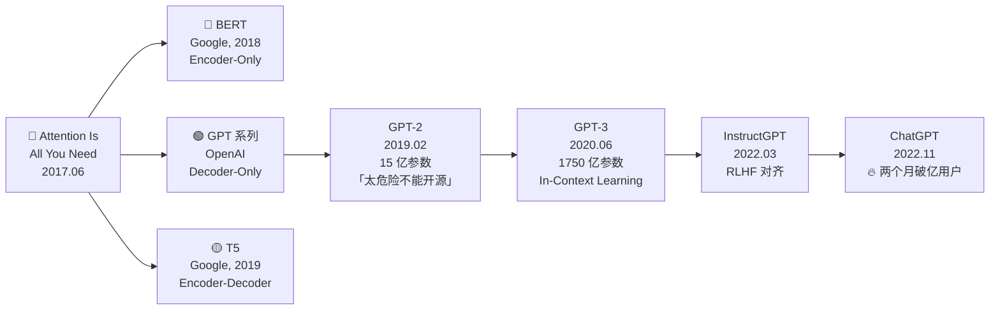
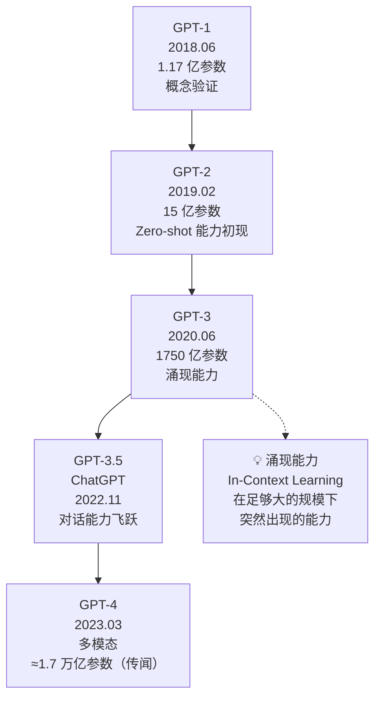
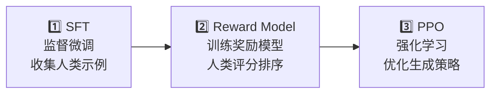

# 1.4 大模型时代的开启（2017 - 2022）

> 一篇论文 + 海量数据 + 疯狂堆算力 = AI 能力涌现。

---

## 一切的起点：Attention Is All You Need

2017 年 6 月，Google 的 8 位研究员发表了一篇后来改变世界的论文。

---

## 为什么是 Transformer？

| 特性 | RNN/LSTM | Transformer |
|------|----------|-------------|
| 并行计算 | ❌ 必须串行 | ✅ 完全并行 |
| 长距离依赖 | ❌ 梯度消失 | ✅ Self-Attention 直接建模 |
| 训练速度 | 慢 | 快（GPU 友好） |
| 可扩展性 | 差 | ✅ **Scaling Law 成立** |

> 📐 Self-Attention 的数学原理见 [[../03.数学补给站/线性代数核心]] 和 [[../04.深度学习/4.5 Transformer详解]]

---

## Scaling Law — 大模型的理论基石

OpenAI 在 2020 年发现了一个简单但深刻的规律：

$$L(N, D) = \left(\frac{A}{N}\right)^{\alpha} + \left(\frac{B}{D}\right)^{\beta} + L_0$$

> **模型的 Loss 随参数数量 $N$ 和数据量 $D$ 的增加而规律性下降。**

这意味着：**你不需要发明更好的算法，只需要更大的模型和更多的数据。**

---

## GPT 家族的进化

---

## 涌现（Emergence）— 量变引起质变

当模型参数超过某个临界点（约 100 亿），模型突然展现出训练时从未显式教过的能力：

| 涌现能力 | 说明 |
|---------|------|
| **In-Context Learning** | 无需微调，给几个示例就能完成新任务 |
| **Chain-of-Thought** | 能展示推理步骤，而非直接给答案 |
| **代码生成** | 理解自然语言描述并生成代码 |
| **多语言** | 即使用非英语训练，也能理解和生成其他语言 |

---

## RLHF — 让模型「对齐」人类偏好

2022 年初，OpenAI 公布 InstructGPT，核心创新是 RLHF（Reinforcement Learning from Human Feedback）：

> 📌 详细流程见 [[../06.大语言模型/6.4 RLHF与偏好对齐]]

这个技术让模型不仅能「说人话」，还能「说人愿意听的话」。**ChatGPT 的成功，RLHF 功不可没。**

---

## ChatGPT 的「iPhone 时刻」

- 2022 年 11 月 30 日发布
- **5 天**达到 100 万用户
- **2 个月**达到 1 亿用户（史上最快）
- 让全世界（不只是技术人员）第一次感受到 AI 的力量

---

## 这个时代留给我们的

| 遗产 | 现状 |
|------|------|
| **Scaling Law** | 继续有效，但边际收益在递减 |
| **Transformer** | 一统天下，几乎所有 LLM 都在用它 |
| **Prompt 工程** | 成为 AI 交互的核心技能 |
| **开源大模型生态** | Llama、Mistral、DeepSeek 等百花齐放 |
| **AI 民主化** | 普通人也能使用、微调、部署大模型 |

---

## → 下一站

[[1.5 Agent与AGI探索]] — 大模型不只是聊天，它们正在学会使用工具和自主行动。
