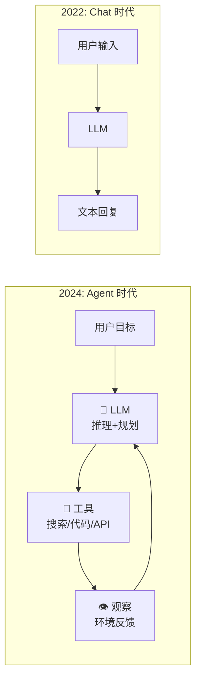
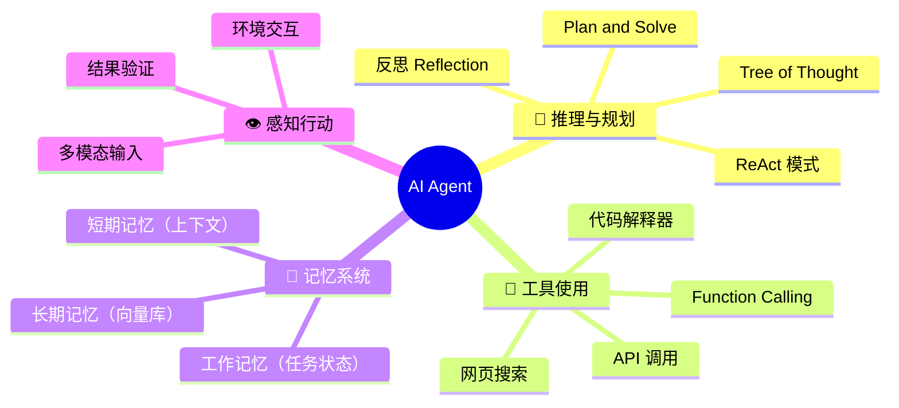
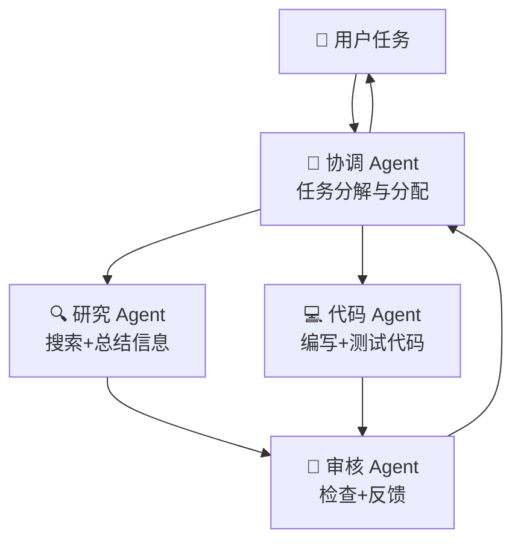
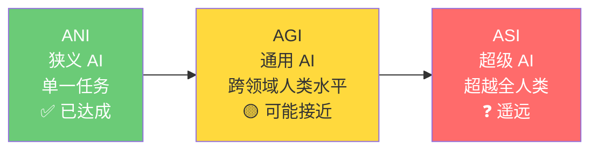

# 1.5 Agent 与 AGI 探索（2023 - 至今）

> LLM 不只是聊天机器人的大脑——它是一个可以思考、规划、使用工具、自主行动的智能体核心。

---

## 从 Chat 到 Act 的范式转变

核心变化：**LLM 从被动的问答机器变成了主动的规划与执行引擎。**

---

## Agent 的关键里程碑

| 时间 | 事件 | 意义 |
|------|------|------|
| 2023.03 | **AutoGPT** 横空出世 | 首次展示 LLM 自主规划执行 |
| 2023.03 | **GPT-4 发布** | 多模态 + 工具使用能力飞跃 |
| 2023.06 | **Function Calling** | OpenAI 原生支持工具调用 |
| 2023.10 | **LangGraph** | 支持有状态的 Agent 工作流 |
| 2023.11 | **OpenAI Assistants API** | Agent 即服务 |
| 2024 | **Multi-Agent 生态爆发** | AutoGen, CrewAI, Swarm |
| 2025-26 | **Agent 落地规模化** | 企业级 Agent 框架成熟 |

---

## Agent 的四要素框架

---

## 多智能体协作

单个 Agent 能力有限，多个 Agent 可以：

| 协作模式 | 说明 | 类比 |
|---------|------|------|
| 辩论模式 | 多个 Agent 互相质疑，达成共识 | 论文评审 |
| 分工模式 | 各自负责子任务，汇总结果 | 软件开发团队 |
| 层级模式 | 管理 Agent 分配任务，子 Agent 执行 | 公司组织 |
| 反思模式 | 一个执行，另一个审查反馈 | 结对编程 |

---

## 主要 Agent 框架

| 框架 | 特点 | 适用场景 |
|------|------|---------|
| **LangGraph** | 有向图工作流、状态管理强 | 复杂企业级 Agent |
| **AutoGen (微软)** | Multi-Agent 对话原生支持 | 多智能体协作 |
| **CrewAI** | 角色分工清晰、上手简单 | 团队模拟 |
| **OpenAI Assistants** | 托管式、无需自己部署 | 快速原型 |
| **Dify / Coze** | 低代码 Agent 搭建 | 非程序员也能用 |

> 📌 详细对比见 [[../08.AI智能体/8.5 Agent框架对比]]

---

## 现实中的 Agent 应用

| 领域 | 应用 | 代表产品 |
|------|------|---------|
| 编程 | AI 软件工程师 | Devin, Cursor, Claude Code |
| 客服 | 智能客服机器人 | Intercom Fin, Zendesk AI |
| 数据分析 | 自然语言查询数据 | ChatGPT Code Interpreter |
| 办公自动化 | 自动处理邮件/文档 | Microsoft Copilot |
| 科学研究 | 辅助实验设计/文献综述 | ChemCrow, PaperQA2 |
| 个人助理 | 日程管理/信息整理 | 你即将构建的项目 🚀 |

---

## 我们正处在什么位置？

> 💬 争议：有人认为 GPT-4 已经展现出 AGI 的「火花」，有人认为真正的 AGI 还远。无论如何，**Agent 是通往 AGI 的关键路径之一。**

---

## 你的学习目标

学完这条路径后，你将能够：
1. 🏗️ 理解 Agent 的底层运作机制
2. 🔧 使用 Function Calling 让 LLM 调用工具
3. 🤖 构建自己的 AI 助手 Agent
4. 👥 设计多 Agent 协作系统

> 📌 开始实践：[[../08.AI智能体/8.1 Agent核心概念]]

---

## → 继续学习

历史脉络到此结束。接下来进入技术核心：

→ [[../02.机器学习基础/2.1 什么是机器学习|开始机器学习基础]]
