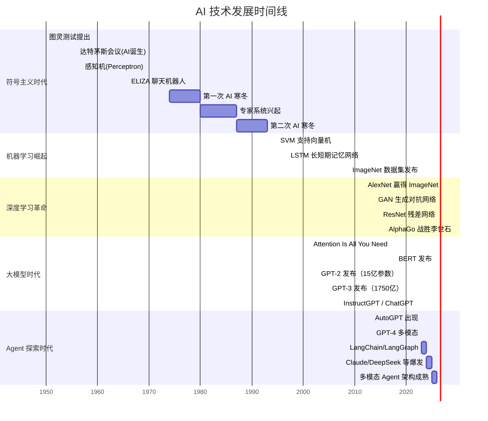
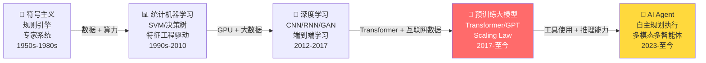

# 📜 AI 发展时间线

> 从图灵测试到 GPT-4，一张图看尽 AI 七十年的技术演进。

---

## 完整时间线

---

## 技术范式演进

---

## 各时代速览

| 时代 | 时间 | 核心技术 | 代表成果 | 详细笔记 |
|------|------|---------|---------|---------|
| 符号主义 | 1950s-1980s | 逻辑推理、专家系统、感知机 | ELIZA、MYCIN | [[1.1 符号主义时代]] |
| 机器学习崛起 | 1990s-2010 | SVM、决策树、集成学习 | IBM Watson、推荐系统 | [[1.2 机器学习的崛起]] |
| 深度学习革命 | 2012-2017 | CNN、RNN、GAN、ResNet | AlexNet、AlphaGo | [[1.3 深度学习的革命]] |
| 大模型时代 | 2017-2022 | Transformer、BERT、GPT | GPT-3、ChatGPT | [[1.4 大模型时代的开启]] |
| Agent 探索 | 2023-至今 | LLM Agent、多模态、多智能体 | AutoGPT、GPT-4 | [[1.5 Agent与AGI探索]] |

---

## 关键转折点

| 年份   | 事件                  | 意义                              |
| ---- | ------------------- | ------------------------------- |
| 1956 | 达特茅斯会议              | AI 概念正式诞生                       |
| 2012 | AlexNet 赢得 ImageNet | 深度学习革命的起点                       |
| 2017 | Transformer 论文发表    | **改变一切的架构**，现代 LLM 基石           |
| 2020 | GPT-3 发布            | 证明 Scaling Law，大模型的 "iPhone 时刻" |
| 2022 | ChatGPT 发布          | AI 走入大众视野，两个月破亿用户               |
| 2023 | LLM Agent 元年        | 从"聊天"到"行动"的质变                   |

---

## 学习建议

> 💡 历史不是孤立的知识点。理解「为什么 Transformer 会在 2017 年出现」、理解「为什么 RLHF 在 2022 年才成为标配」，能帮你建立技术取舍的直觉。

建议学习顺序：
1. 先读完这篇时间线总览
2. 逐个时代深入阅读详细笔记
3. 带着「每个时代解决了什么问题、留下了什么局限」的问题进入 ML 基础学习
