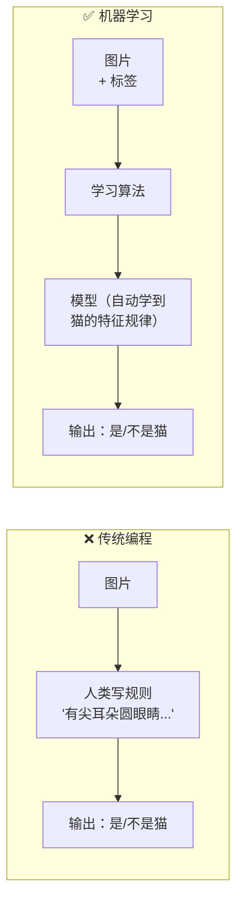
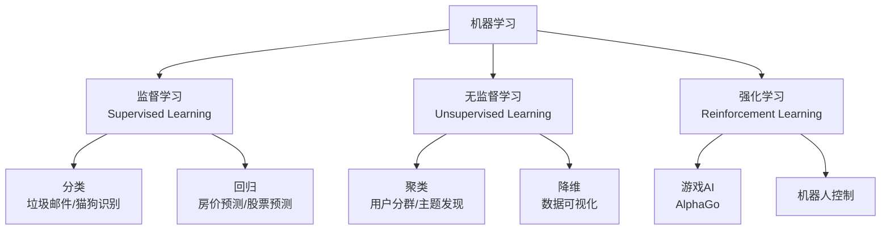
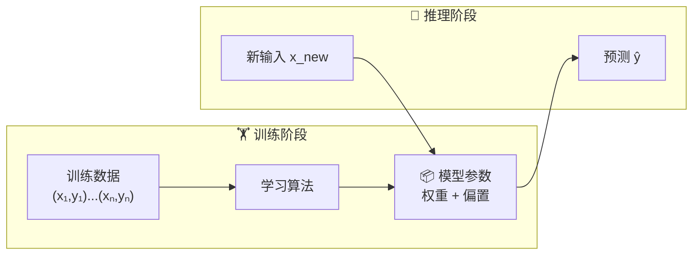
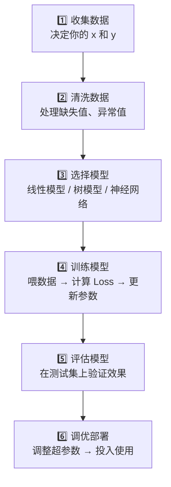

# 2.1 什么是机器学习

> 不写规则，让机器从数据中自己找规律。

---

## 一句话定义

> 📌 **机器学习（Machine Learning）**：通过数据自动改进算法的性能，而无需人类显式编程。

对比两种方式解决同一个问题「判断图片是不是猫」：

---

## 机器学习的三种类型

---

## 核心概念速览

### 训练 vs 推理

### 特征与标签

| 术语 | 含义 | 例子 |
|------|------|------|
| **特征 (Feature) $x$** | 输入给模型的信息 | 房子的面积、卧室数、地段 |
| **标签 (Label) $y$** | 我们想预测的目标 | 房子的实际售价 |
| **预测值 $\hat{y}$** | 模型输出的结果 | 模型预测的房价 |
| **损失 (Loss)** | 预测和实际的差距 | $\mathcal{L} = (\hat{y} - y)^2$ |

---

## 机器学习流程图

---

## 一个极简示例

我们要预测房价（$y$），唯一特征：面积（$x$）。

$$
\hat{y} = w \cdot x + b
$$

| 步骤 | 做了什么 |
|------|---------|
| 初始化 | 随机设 $w=0.5$, $b=0$ |
| 前向传播 | 输入 $x=100m^2$，预测 $\hat{y}=50万$ |
| 计算损失 | 真实价 $80万$，Loss = $(50-80)^2 = 900$ |
| 反向传播 | 计算 Loss 对 $w,b$ 的梯度 |
| 更新参数 | $w \leftarrow w - \alpha \cdot \nabla_w \text{Loss}$ |

> 📐 梯度下降的数学细节见 [[../03.数学补给站/最优化方法]]

---

## 最常见的误区

| 误区 😱 | 真相 ✅ |
|---------|---------|
| ML 很难，需要数学博士 | 入门只需要高中数学，进阶才需要更多数学 |
| 数据越多模型越好 | 质量 > 数量，垃圾数据 = 垃圾模型 |
| 模型越复杂越好 | 奥卡姆剃刀：简单的能解决问题的才是好模型 |
| ML 可以解决一切 | 有明确规则的问题不需要 ML（如计算工资） |

---

## → 接下来

- [[2.2 监督学习]] — 深入分类与回归
- [[2.3 无监督学习]] — 没有标签时怎么办
- 🛠️ [[项目：房价预测]] — 动手实现你的第一个 ML 模型
