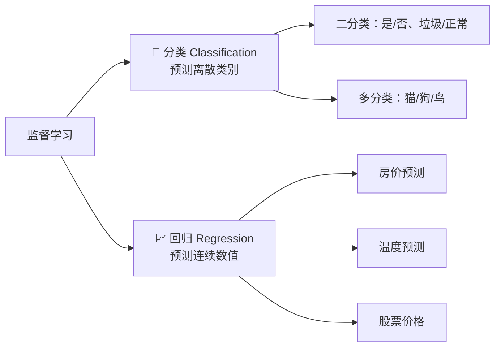
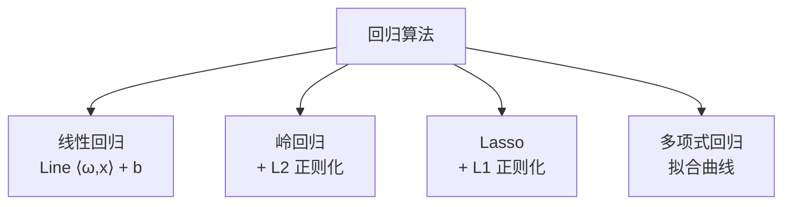
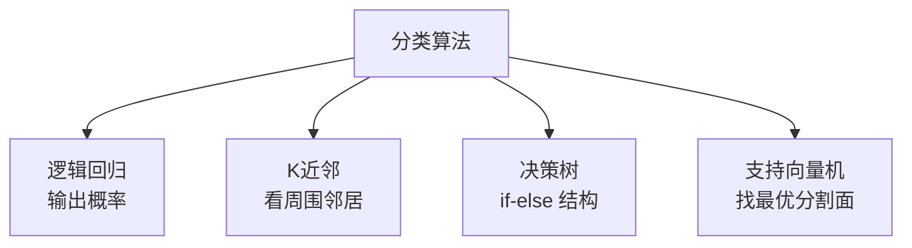
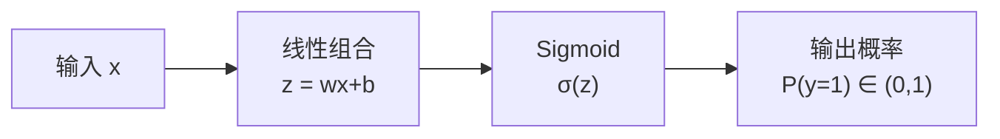
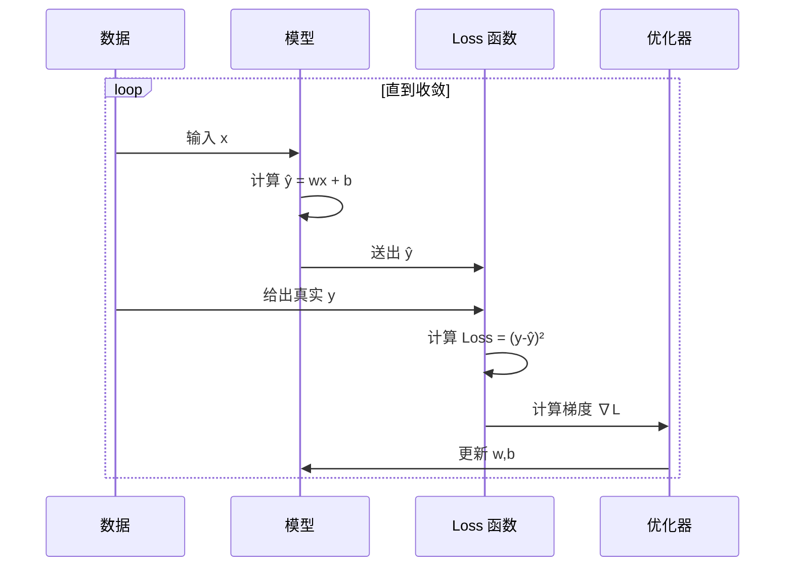

# 2.2 监督学习

> 给定输入 $x$ 和正确答案 $y$，让模型学会映射 $f: x \to y$。

---

## 什么是监督学习

你有**带标签的数据**：每个样本都有一个正确答案。

```
房价数据集:
  面积100m² → 80万  ← 这是标签（正确答案）
  面积150m² → 120万
  面积200m² → 160万
  
模型学习后，预测:
  面积175m² → ?万    ← 模型要推断出这个
```

---

## 两大任务：分类 vs 回归



| | 分类 | 回归 |
|------|------|------|
| 输出类型 | 离散类别 | 连续数值 |
| 输出范围 | {0, 1, 2, ...} | $(-\infty, +\infty)$ |
| 例子 | 判断邮件是否是垃圾 | 预测明天温度 |
| 常见 Loss | 交叉熵 Cross-Entropy | 均方误差 MSE |
| 最后层激活 | Softmax / Sigmoid | 无 / Linear |

---

## 经典算法一览

### 回归算法



#### 🔑 线性回归

最简单的监督学习模型：

$$\hat{y} = w_1x_1 + w_2x_2 + \cdots + w_nx_n + b = \mathbf{w}^\top\mathbf{x} + b$$

**Loss 函数（均方误差 MSE）**：

$$\text{MSE} = \frac{1}{n}\sum_{i=1}^{n}(y_i - \hat{y}_i)^2$$

> 直观理解：预测值离真实值越远，惩罚越大（平方放大差异）。

---

### 分类算法



#### 🔑 逻辑回归

虽然叫「回归」，但它是**分类算法**：

$$\hat{y} = \sigma(\mathbf{w}^\top\mathbf{x} + b) = \frac{1}{1 + e^{-(\mathbf{w}^\top\mathbf{x} + b)}}$$

Sigmoid 函数 $\sigma$ 把任意实数映射到 $(0,1)$ 之间，解释为概率。



**Loss 函数（交叉熵）**：

$$\mathcal{L} = -[y \log(\hat{y}) + (1-y)\log(1-\hat{y})]$$

> 📐 交叉熵的理解需要概率基础，见 [[../03.数学补给站/概率统计精华#信息熵与交叉熵|概率统计 → 信息熵]]

---

## 训练过程详解

以线性回归为例，展示完整训练循环：



**Python 伪代码**：

```python
# 1. 初始化参数
w = 0.0  # 权重
b = 0.0  # 偏置

# 2. 训练循环
for epoch in range(1000):
    # 前向传播
    y_pred = w * x + b
    
    # 计算损失
    loss = ((y - y_pred) ** 2).mean()
    
    # 反向传播（计算梯度）
    dw = -2 * (x * (y - y_pred)).mean()  # ∂L/∂w
    db = -2 * (y - y_pred).mean()        # ∂L/∂b
    
    # 更新参数
    lr = 0.01  # 学习率
    w = w - lr * dw
    b = b - lr * db
```

> 📐 梯度推导见 [[../03.数学补给站/最优化方法]] 和 [[../03.数学补给站/微积分关键概念]]

---

## 你需要记住的

| 概念 | 一句话 |
|------|--------|
| 监督学习 | 有标签数据的学习 |
| 分类 | 预测离散类别（输出概率） |
| 回归 | 预测连续数值 |
| Loss | 衡量预测多差的指标 |
| 优化 | 沿着梯度反方向更新参数 |

---

## → 接下来

- [[2.3 无监督学习]] — 没有标签怎么办
- [[2.4 模型评估与选择]] — 怎么判断模型好坏
- 🛠️ [[项目：房价预测]] — 动手实现线性回归
