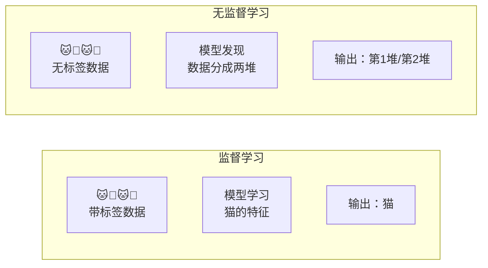
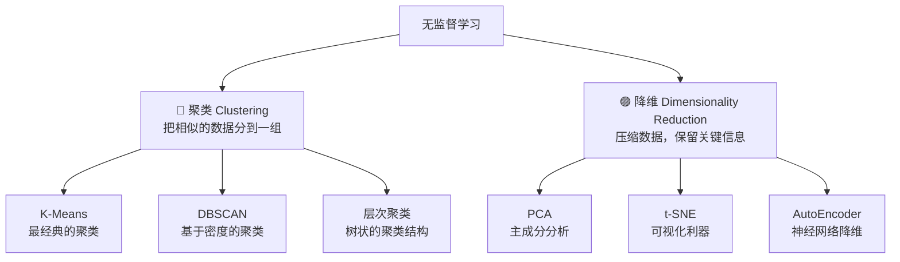
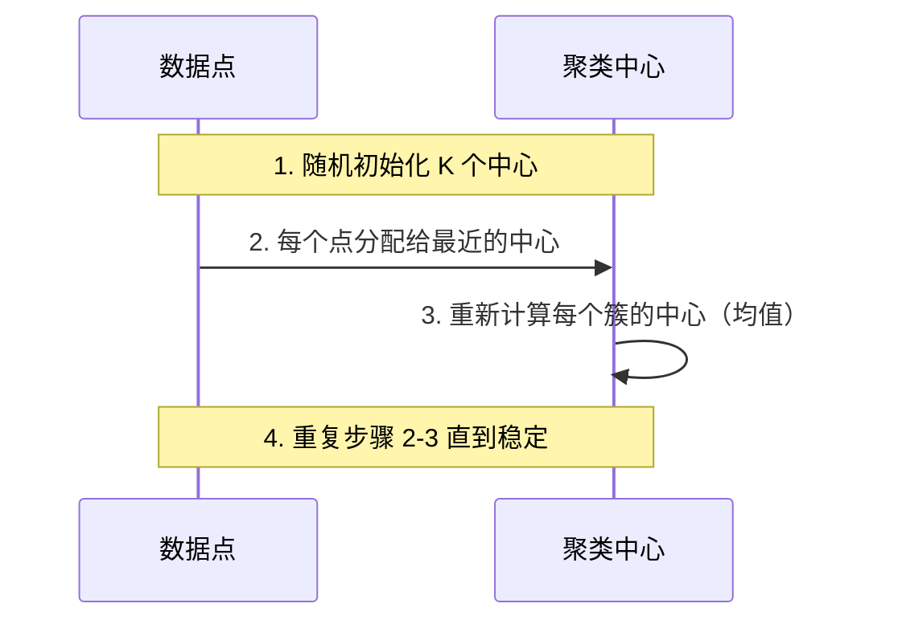
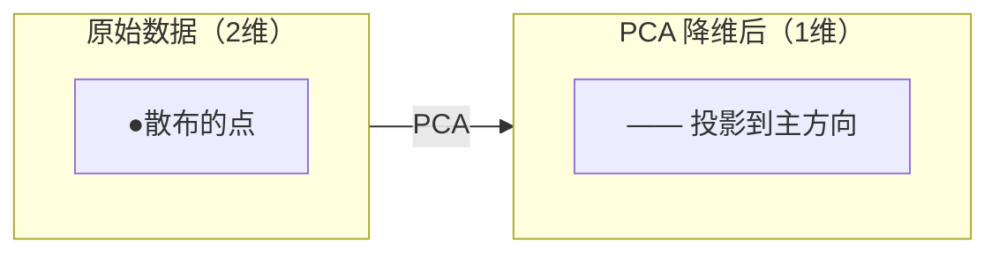

# 2.3 无监督学习

> 没有标签怎么办？让模型自己发现数据中的结构。

---

## 和监督学习的区别



> 💡 无监督学习不是猜标签，而是在**无标签数据中发现隐藏的结构和模式**。

---

## 两大核心任务



---

## K-Means 聚类

### 核心思想

> 把数据点分成 K 组，使得**组内距离最小、组间距离最大**。



### 图解

```
初始随机中心           第1次迭代后           收敛
    ●                   ●                    ●
  *   *               ↗*   *↖            ↗*  ⋆  *↖
    ⋆                    ⋆                 
  *   *               ↘*   *↙            ↘*  ⋆  *↙
    ●                   ●                    ●
```

### 关键问题：K 怎么选？

| 方法 | 原理 |
|------|------|
| **肘部法则** | 画 K vs SSE 曲线，找拐点 |
| **轮廓系数** | 衡量聚类质量（-1 到 1，越大越好） |
| **业务理解** | 有时候 K 由实际需求决定 |

---

## PCA 主成分分析

### 核心思想

> 找到数据变化最大的方向（主成分），把数据投影上去。



💡 PCA 在现代 AI 中的角色被 Embedding 取代了大半，但理解它能帮你理解「降维」和「特征提取」的直觉。

> 📐 PCA 的数学（协方差矩阵、特征值分解）见 [[../03.数学补给站/线性代数核心#特征值分解|线代 → 特征值]]

---

## t-SNE — 可视化利器

PCA 是线性降维，t-SNE 是非线性降维。**特别适合高维数据的可视化**。

> 💡 当你训练了一个神经网络，把最终的隐藏层向量用 t-SNE 画出来，就能看到模型是否「学到了有意义的表示」。

---

## 无监督学习在 LLM 时代的应用

| 应用 | 说明 |
|------|------|
| **预训练** | GPT 的 Next Token Prediction 本质上是自监督学习 |
| **聚类 embedding** | 对文本 embedding 做 K-Means，发现主题 |
| **异常检测** | 检测异常行为、欺诈交易 |
| **推荐系统** | 用户聚类 + 物品聚类 |
| **对比学习** | SimCLR、CLIP 等自监督方法 |

---

## 你需要记住的

| 概念 | 一句话 |
|------|--------|
| 聚类 | 自动把相似的东西分到一起 |
| 降维 | 压缩数据同时保留主要信息 |
| K-Means | 最常用聚类，速度快、易理解 |
| 自监督学习 | 从数据本身生成标签，是大模型预训练的基础 |

---

## → 接下来

- [[2.4 模型评估与选择]] — 训练完了，怎么知道好不好？
- 🛠️ [[项目：房价预测]] — 动手写第一行 ML 代码
