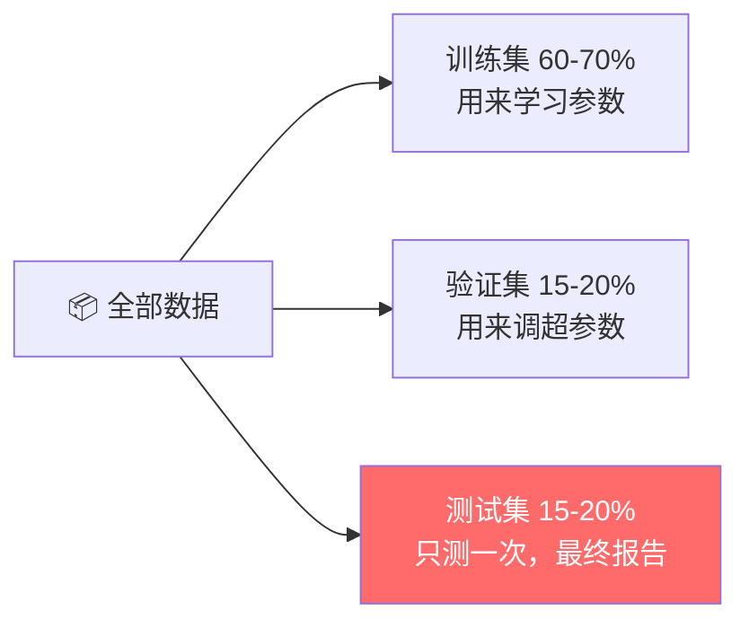
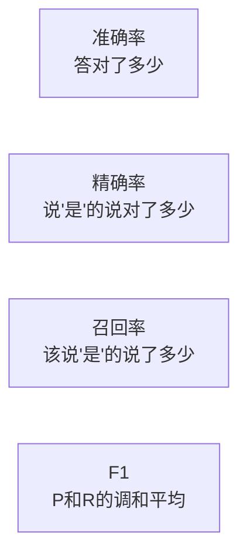
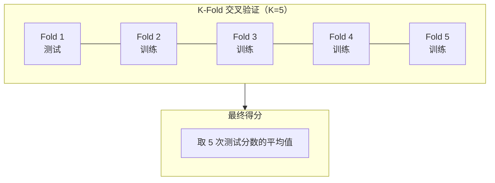
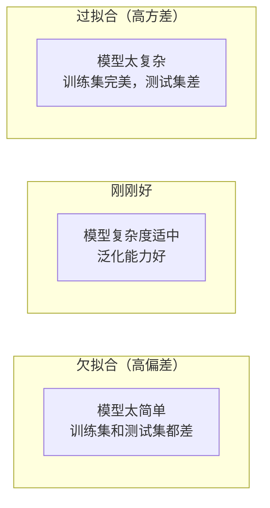
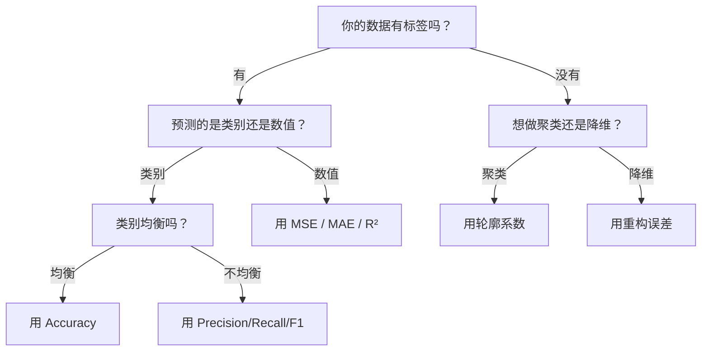

# 2.4 模型评估与选择

> 训练完了 ≠ 模型好用。怎么科学地判断模型好不好？

---

## 训练集、验证集、测试集

**最重要的概念，没有之一。**



| 数据集 | 作用 | 能看几次？ |
|--------|------|-----------|
| **训练集** | 更新模型参数 | 每个 epoch 都看 |
| **验证集** | 调超参数、选模型 | 反复看（会间接"泄漏"） |
| **测试集** | 最终评估 | **只能看一次！** |

> ⚠️ **绝对不能用测试集来调模型**，否则你的评估结果就是自欺欺人。

---

## 分类任务的评估指标

### 混淆矩阵

```
                预测猫       预测狗
    实际猫    ✅ TP 90只    ❌ FN 10只
    实际狗    ❌ FP 5只     ✅ TN 95只
```

| 缩写 | 全称 | 含义 |
|------|------|------|
| TP | True Positive | 正确预测为正例 |
| TN | True Negative | 正确预测为负例 |
| FP | False Positive | 错误预测为正例（误报） |
| FN | False Negative | 错误预测为负例（漏报） |

### 四个核心指标

| 指标 | 公式 | 什么时候关心 |
|------|------|-------------|
| **准确率 Accuracy** | $\frac{TP+TN}{Total}$ | 类别均衡时 |
| **精确率 Precision** | $\frac{TP}{TP+FP}$ | 宁缺毋滥（垃圾邮件过滤） |
| **召回率 Recall** | $\frac{TP}{TP+FN}$ | 宁杀错不放过（癌症检测） |
| **F1-Score** | $2\cdot\frac{P\times R}{P+R}$ | 精确率和召回率的平衡 |



---

## 回归任务的评估指标

| 指标 | 公式 | 特点 |
|------|------|------|
| **MSE** | $\frac{1}{n}\sum(y_i-\hat{y}_i)^2$ | 对大误差惩罚重 |
| **MAE** | $\frac{1}{n}\sum|y_i-\hat{y}_i|$ | 对大误差不敏感 |
| **RMSE** | $\sqrt{MSE}$ | 和 y 同一量纲，直观 |
| **$R^2$** | $1 - \frac{SS_{res}}{SS_{tot}}$ | 越接近 1 越好 |

---

## 交叉验证

当数据量小时，怎么可靠地评估？



> 💡 每轮换一个 Fold 做测试集，其他人做训练集。5 次结果取平均。

---

## 偏差 vs 方差

理解这两个概念是调模型的关键：



| | 欠拟合 | 过拟合 |
|------|--------|--------|
| 训练集表现 | 差 ❌ | 好 ✅ |
| 测试集表现 | 差 ❌ | 差 ❌ |
| 原因 | 模型太简单 | 模型记住了噪声 |
| 解法 | 加特征、加复杂度 | [[2.5 过拟合与正则化\|正则化]]、加数据、早停 |

---

## 实际选择建议



---

## → 接下来

- [[2.5 过拟合与正则化]] — 防止模型"背书"的秘诀
- 🛠️ [[项目：房价预测]] — 把这些指标用在实际项目中
