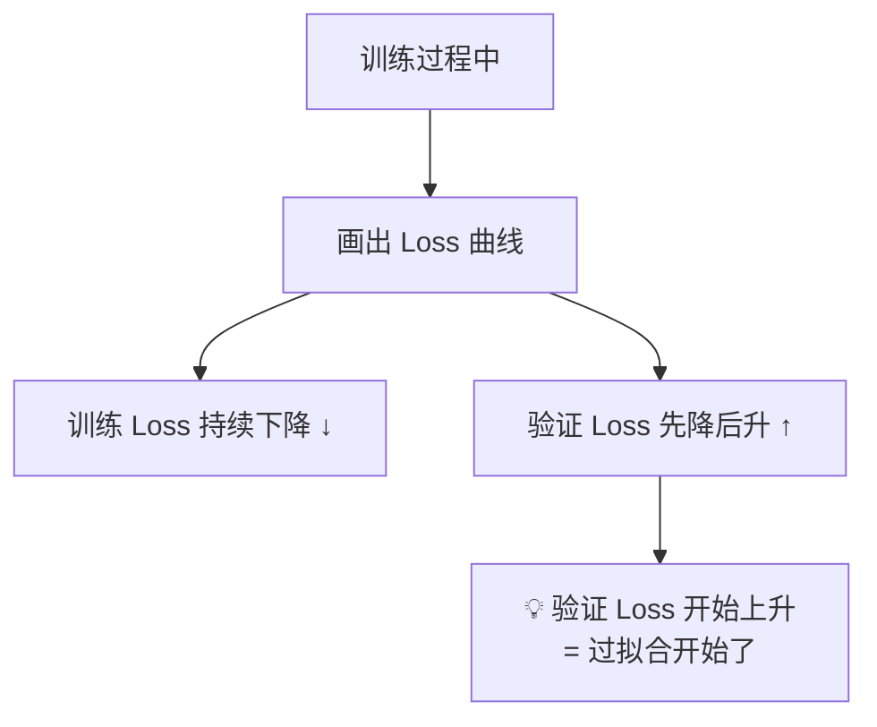
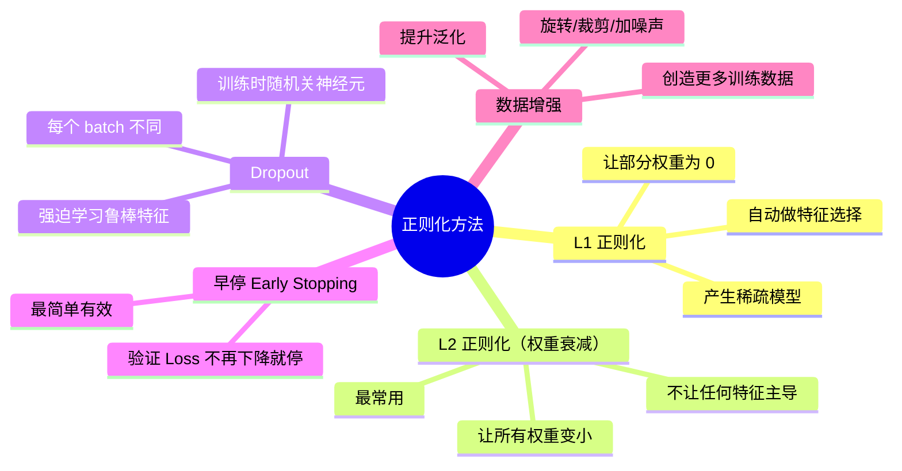
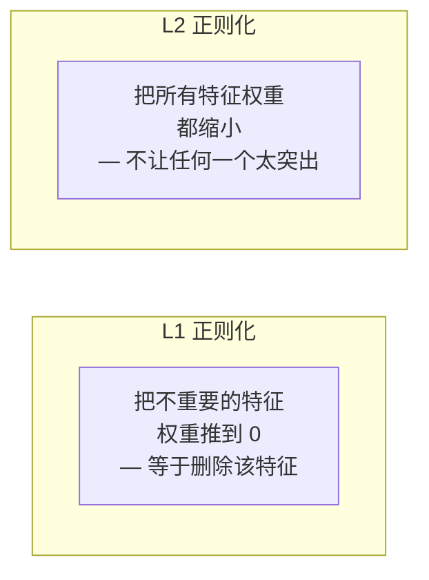
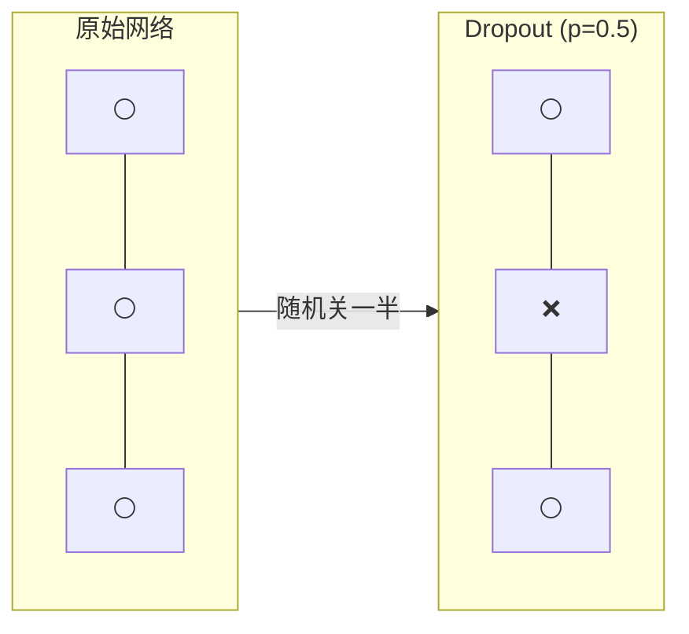
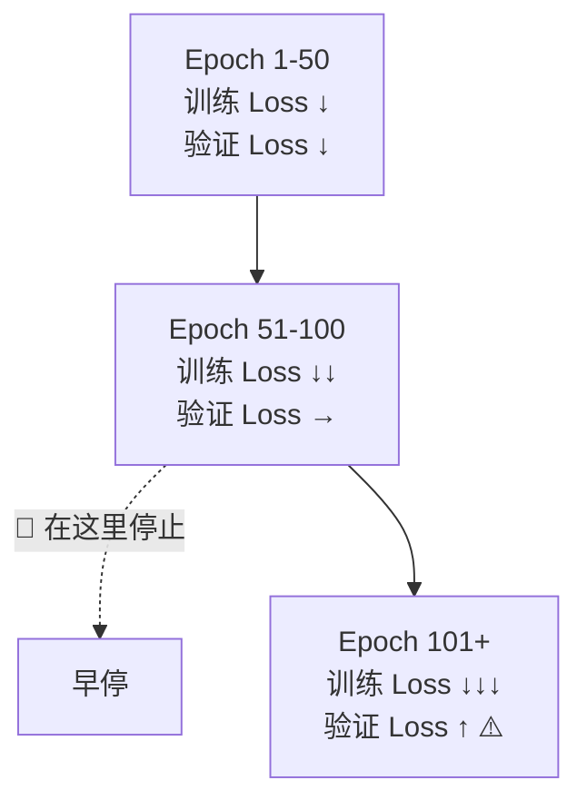

# 2.5 过拟合与正则化

> 模型不是背答案的学生——它要学会举一反三。

---

## 什么是过拟合

**过拟合 = 模型在训练集上表现极好，但在新数据上表现糟糕。**

就像学生把课后习题的答案全背下来了，但换个问法就不会了。

---

## 如何检测过拟合

**确认过拟合的信号：**

| 现象 | 说明 |
|------|------|
| 训练 Loss 远低于验证 Loss | 模型在"背诵"训练数据 |
| 验证 Loss 不降反升 | 泛化能力开始退化 |
| 参数值非常大 | 模型过于敏感 |

---

## 正则化：对抗过拟合的武器

---

## L1 vs L2 正则化

### 数学形式

带正则化的 Loss 函数：

$$\mathcal{L}_{\text{total}} = \mathcal{L}_{\text{original}} + \lambda \cdot R(w)$$

| 正则化 | $R(w)$ | 效果 |
|--------|--------|------|
| L1 (Lasso) | $\sum |w_i|$ | 稀疏解，自动选特征 |
| L2 (Ridge) | $\sum w_i^2$ | 小权重，防止过拟合 |

### 直观理解

> 📐 为什么 L1 会产生稀疏解？从几何上看，L1 的约束区域是菱形，L2 是圆形。菱形更容易在坐标轴上「碰」到最优解。数学细节见 [[../03.数学补给站/最优化方法]]

---

## Dropout — 深度学习的标配

> 💡 **直觉**：就像考试时不许你翻书，你必须真正理解才能答对。Dropout 让每个神经元不能依赖特定同伴，必须学会独立提取有用特征。

---

## 早停 Early Stopping

**做法**：每训练几个 epoch 检查一次验证集 Loss，如果连续 N 次没有下降就停止。

> 💡 几乎所有现代大模型训练都会用早停——省时间、防过拟合、效果还好。

---

## 实战原则

| 场景 | 首选方法 |
|------|---------|
| 传统 ML（树、回归）| L1/L2 正则化 |
| 深度神经网络 | Dropout + Early Stopping + L2 |
| 图像任务 | 数据增强 + Dropout |
| 大模型微调 | LoRA（自带正则化效果）见 [[../06.大语言模型/6.5 LoRA高效微调]] |
| 数据量少 | 数据增强 + 强正则化 |
| 数据量多 | 轻度正则化就够了 |

---

## → 接下来

你已经学完了机器学习基础的理论部分，现在是时候动手了：

🛠️ [[项目：房价预测]] — 第一个端到端 ML 项目，把所有理论串联起来。
