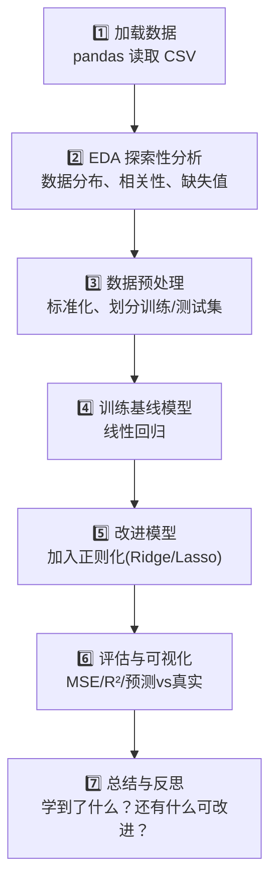

# 🛠️ 项目：房价预测

> 你的第一个端到端 ML 项目。用真实数据，完成从数据加载到模型评估的完整流程。

---

## 项目目标

使用波士顿房价数据集（或加州房价数据集），训练一个回归模型预测房价。

### 学习要点

- ✅ 完整的 ML 项目流程
- ✅ 数据探索与可视化
- ✅ 特征工程
- ✅ 模型训练与评估
- ✅ 正则化防止过拟合
- ✅ 超参数调优

---

## 项目流程



---

## 1. 环境准备

```python
# 安装依赖
# pip install numpy pandas matplotlib scikit-learn seaborn

import numpy as np
import pandas as pd
import matplotlib.pyplot as plt
import seaborn as sns
from sklearn.model_selection import train_test_split, cross_val_score
from sklearn.preprocessing import StandardScaler
from sklearn.linear_model import LinearRegression, Ridge, Lasso
from sklearn.ensemble import RandomForestRegressor
from sklearn.metrics import mean_squared_error, mean_absolute_error, r2_score

# 设置中文字体（如果显示中文）
plt.rcParams['font.sans-serif'] = ['SimHei', 'DejaVu Sans']
plt.rcParams['axes.unicode_minus'] = False
```

---

## 2. 加载与探索数据

```python
# 加载数据（这里用 fetch_california_housing 代替）
from sklearn.datasets import fetch_california_housing

data = fetch_california_housing()
df = pd.DataFrame(data.data, columns=data.feature_names)
df['Price'] = data.target  # 房价（单位：10万美元）

print(f"数据集大小: {df.shape}")
print(f"\n列名: {list(df.columns)}")
print(f"\n数据统计:\n{df.describe()}")
print(f"\n缺失值:\n{df.isnull().sum()}")
```

### 探索性问题（逐一回答）

1. 📊 数据有多少行？多少列？
2. 📊 哪些特征可能和房价相关？
3. 📊 有缺失值吗？异常值呢？
4. 📊 目标变量（房价）的分布是怎样的？

---

## 3. EDA 探索性数据分析

```python
# 房价分布
fig, axes = plt.subplots(1, 2, figsize=(14, 5))

axes[0].hist(df['Price'], bins=50, edgecolor='black', alpha=0.7)
axes[0].set_title('房价分布直方图')
axes[0].set_xlabel('房价 (10万美元)')
axes[0].set_ylabel('频数')

# 相关性矩阵
corr_matrix = df.corr()
sns.heatmap(corr_matrix, annot=True, fmt='.2f', cmap='coolwarm', 
            ax=axes[1], square=True, linewidths=1)
axes[1].set_title('特征相关性热力图')

plt.tight_layout()
plt.savefig('房价EDA.png', dpi=150, bbox_inches='tight')
plt.show()
```

### 💡 关键观察

哪个特征和房价的相关性最强？这个特征反映了什么经济规律？

---

## 4. 数据预处理

```python
# 分离特征和标签
X = df.drop('Price', axis=1)
y = df['Price']

# 划分训练集 / 测试集（80% / 20%）
X_train, X_test, y_train, y_test = train_test_split(
    X, y, test_size=0.2, random_state=42
)

# 标准化（让所有特征在同一尺度上）
scaler = StandardScaler()
X_train_scaled = scaler.fit_transform(X_train)
X_test_scaled = scaler.transform(X_test)  # ⚠️ 注意：用训练集的参数

print(f"训练集大小: {X_train.shape}")
print(f"测试集大小: {X_test.shape}")
```

> ⚠️ **为什么测试集用 `transform` 而不是 `fit_transform`？**
> 因为在实际应用中，测试集模拟的是「新来的数据」，你不能偷看它的统计信息。

---

## 5. 训练基线模型

```python
# 最简单的基线：线性回归
lr = LinearRegression()
lr.fit(X_train_scaled, y_train)

# 预测
y_pred_train = lr.predict(X_train_scaled)
y_pred_test = lr.predict(X_test_scaled)

# 评估
print("=== 线性回归（基线）===")
print(f"训练集 MSE: {mean_squared_error(y_train, y_pred_train):.4f}")
print(f"测试集 MSE: {mean_squared_error(y_test, y_pred_test):.4f}")
print(f"训练集 R²: {r2_score(y_train, y_pred_train):.4f}")
print(f"测试集 R²: {r2_score(y_test, y_pred_test):.4f}")
```

### 思考题

训练集和测试集的差距大吗？如果差距大，可能是什么原因？→ [[2.5 过拟合与正则化|回顾：过拟合]]

---

## 6. 改进：加入正则化

```python
# Ridge 回归（L2 正则化）
ridge = Ridge(alpha=1.0)  # alpha 是正则化强度
ridge.fit(X_train_scaled, y_train)

y_pred_ridge = ridge.predict(X_test_scaled)

print("=== Ridge 回归（L2 正则化）===")
print(f"测试集 MSE: {mean_squared_error(y_test, y_pred_ridge):.4f}")
print(f"测试集 R²: {r2_score(y_test, y_pred_ridge):.4f}")

# Lasso 回归（L1 正则化）
lasso = Lasso(alpha=0.01)
lasso.fit(X_train_scaled, y_train)

y_pred_lasso = lasso.predict(X_test_scaled)

print("\n=== Lasso 回归（L1 正则化）===")
print(f"测试集 MSE: {mean_squared_error(y_test, y_pred_lasso):.4f}")
print(f"测试集 R²: {r2_score(y_test, y_pred_lasso):.4f}")

# Lasso 做了特征选择：哪些特征的系数变成了 0？
print(f"\n非零特征数: {(lasso.coef_ != 0).sum()} / {len(lasso.coef_)}")
```

---

## 7. 超参数调优

```python
# 尝试不同的 alpha 值
alphas = [0.001, 0.01, 0.1, 1.0, 10.0, 100.0]
results = []

for alpha in alphas:
    ridge = Ridge(alpha=alpha)
    ridge.fit(X_train_scaled, y_train)
    
    # 交叉验证
    cv_scores = cross_val_score(ridge, X_train_scaled, y_train, 
                                 cv=5, scoring='r2')
    
    y_pred = ridge.predict(X_test_scaled)
    test_r2 = r2_score(y_test, y_pred)
    
    results.append({
        'alpha': alpha,
        'cv_r2_mean': cv_scores.mean(),
        'cv_r2_std': cv_scores.std(),
        'test_r2': test_r2
    })

# 打印结果
results_df = pd.DataFrame(results)
print(results_df)

# 画图
plt.figure(figsize=(10, 5))
plt.semilogx(results_df['alpha'], results_df['cv_r2_mean'], 
             'b-o', label='交叉验证 R²')
plt.fill_between(results_df['alpha'], 
                 results_df['cv_r2_mean'] - results_df['cv_r2_std'],
                 results_df['cv_r2_mean'] + results_df['cv_r2_std'],
                 alpha=0.2)
plt.semilogx(results_df['alpha'], results_df['test_r2'], 
             'r-s', label='测试集 R²')
plt.xlabel('Alpha (正则化强度)')
plt.ylabel('R² 分数')
plt.legend()
plt.title('超参数调优：不同 Alpha 的效果')
plt.grid(True, alpha=0.3)
plt.savefig('超参数调优.png', dpi=150, bbox_inches='tight')
plt.show()
```

---

## 8. 最终评估

```python
# 选择最佳模型
best_alpha = results_df.loc[results_df['cv_r2_mean'].idxmax(), 'alpha']
best_model = Ridge(alpha=best_alpha)
best_model.fit(X_train_scaled, y_train)

y_pred_final = best_model.predict(X_test_scaled)

print(f"最佳 alpha: {best_alpha}")
print(f"最终测试集 MSE: {mean_squared_error(y_test, y_pred_final):.4f}")
print(f"最终测试集 MAE: {mean_absolute_error(y_test, y_pred_final):.4f}")
print(f"最终测试集 R²: {r2_score(y_test, y_pred_final):.4f}")

# 预测值 vs 真实值
plt.figure(figsize=(8, 6))
plt.scatter(y_test, y_pred_final, alpha=0.5, edgecolors='k', linewidth=0.5)
plt.plot([y_test.min(), y_test.max()], [y_test.min(), y_test.max()], 
         'r--', lw=2, label='完美预测线')
plt.xlabel('真实房价')
plt.ylabel('预测房价')
plt.title(f'预测 vs 真实 (R² = {r2_score(y_test, y_pred_final):.3f})')
plt.legend()
plt.grid(True, alpha=0.3)
plt.savefig('预测vs真实.png', dpi=150, bbox_inches='tight')
plt.show()
```

---

## 9. 总结模板

完成项目后，写一份简短的总结（可以写在 Obsidian 笔记里）：

```markdown
## 项目总结：房价预测

### 做了什么
- 用加州房价数据集训练了一个房价预测模型
- 对比了线性回归、Ridge、Lasso 三种方法

### 关键发现
- [填写：哪个特征最重要？]
- [填写：正则化带来了多大提升？]

### 遇到的困难
- [填写：踩了什么坑？]

### 下一步想尝试
- [填写：还想改进什么？]
```

---

## 延伸挑战 🚀

如果想更进一步：

1. **试试非线性模型**：用 `RandomForestRegressor` 或 `GradientBoostingRegressor`
2. **特征交叉**：创造新特征（如 `房间数 × 面积`）
3. **异常值处理**：检测和处理异常值，看对模型有什么影响
4. **部署模型**：用 `pickle` 保存模型，写一个简单的预测接口

---

## → 下一步

完成这个项目后，你已经掌握了 ML 的基础全流程。接下来进入深度学习：

→ [[../04.深度学习/4.1 神经网络基础|深度学习：神经网络基础]]

或先查阅数学基础：

→ [[../03.数学补给站/线性代数核心|数学补给站：线性代数]]
→ [[../03.数学补给站/微积分关键概念|数学补给站：微积分]]
