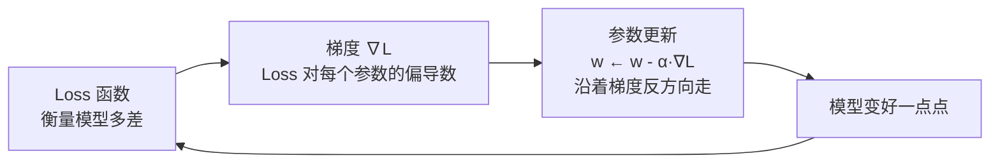
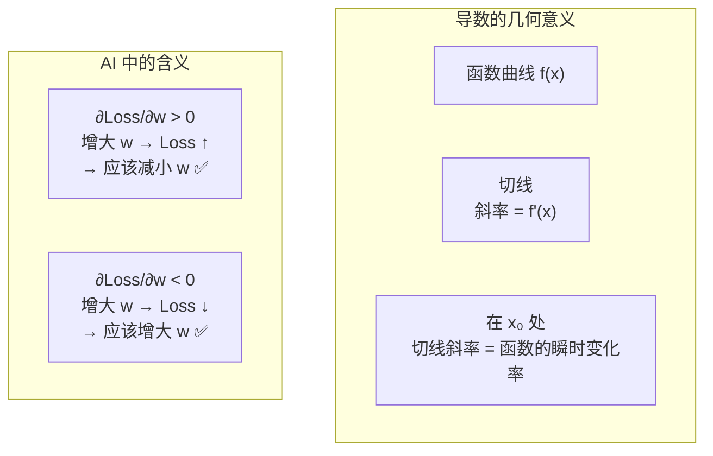
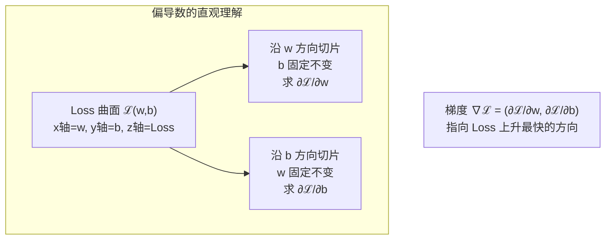
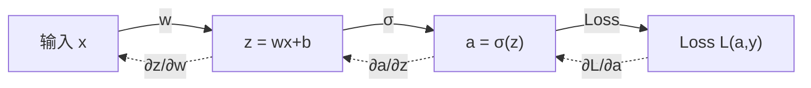
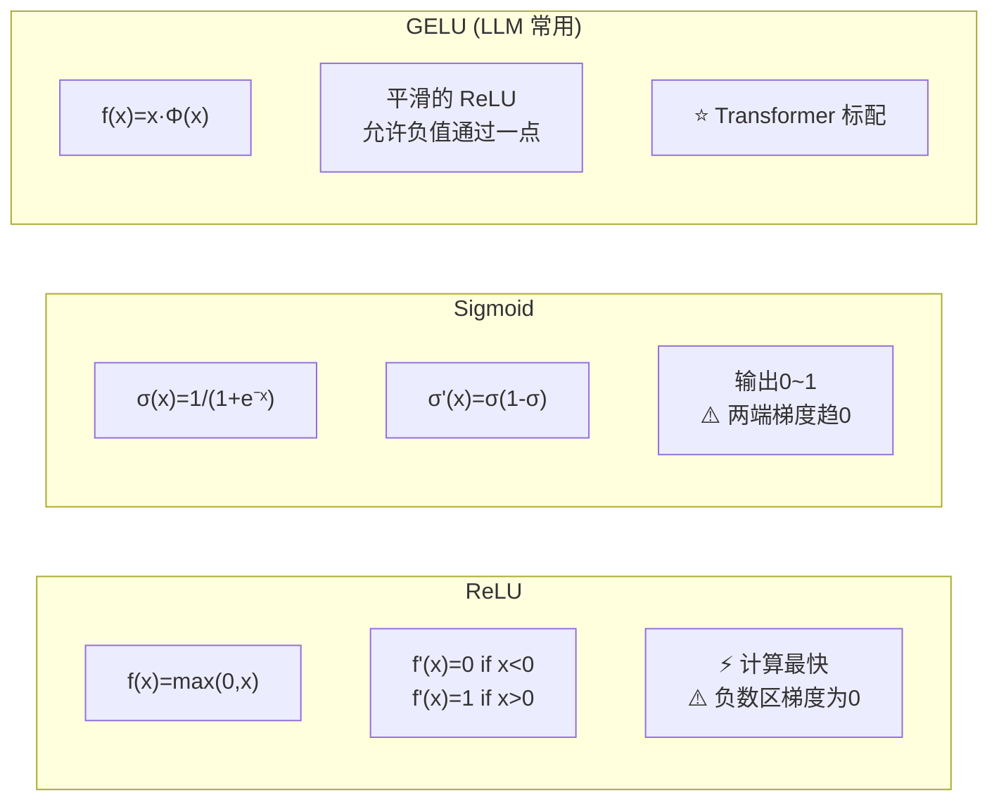
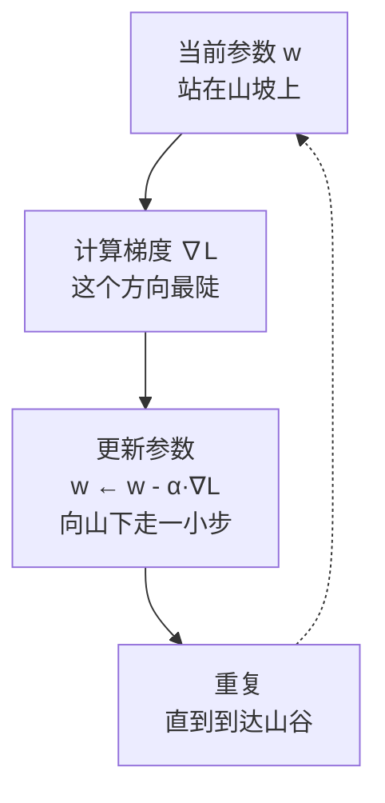

# 📐 微积分关键概念

> 深度学习的「学习」靠的就是导数。掌握导数、偏导数和链式法则就足够应对绝大多数场景。

---

## 为什么需要微积分



> 💡 **核心洞察**：训练神经网络 = 反复计算梯度并用它更新参数。梯度就是 Loss 对参数的导数。

---

## 1. 导数 — 变化率

### 直观理解

> 导数 = 函数在某一点的「斜率」= 输入变化一点点，输出变化多少

$$f'(x) = \lim_{h \to 0}\frac{f(x+h) - f(x)}{h}$$



**在 AI 中的含义**：
- 如果 $\frac{\partial \text{Loss}}{\partial w} > 0$：增大 $w$ → Loss 增大 → 应该减小 $w$
- 如果 $\frac{\partial \text{Loss}}{\partial w} < 0$：增大 $w$ → Loss 减小 → 应该增大 $w$

---

## 2. 偏导数 — 多变量函数的导数

当函数有多个变量时，逐个求导：

$$f(w,b) = w^2 + b^2$$

$$\frac{\partial f}{\partial w} = 2w, \quad \frac{\partial f}{\partial b} = 2b$$



> 💡 把其他变量当成常数，对目标变量求导。

**在 AI 中的含义**：神经网络的每个参数都有各自的偏导数，形成**梯度向量**。

---

## 3. 链式法则 — 反向传播的数学核心

### 公式

$$\frac{\partial L}{\partial x} = \frac{\partial L}{\partial y} \cdot \frac{\partial y}{\partial x}$$

### 在神经网络中



**反向传播**就是链式法则的高效实现：

```python
# 用链式法则计算 ∂L/∂w
dL_dw = dL_da * da_dz * dz_dw
#        ↑        ↑       ↑
#     Loss对激活  激活对z  z对w
```

> 📌 详细推导见 [[../04.深度学习/4.2 反向传播与训练]]

---

## 4. 常见函数的导数（速查）



| 函数 | 导数 | 在 AI 中的位置 |
|------|------|--------------|
| $f(x)=x^2$ | $f'(x)=2x$ | MSE Loss |
| $f(x)=\frac{1}{x}$ | $f'(x)=-\frac{1}{x^2}$ | — |
| $f(x)=e^x$ | $f'(x)=e^x$ | Softmax 分子 |
| $f(x)=\ln x$ | $f'(x)=\frac{1}{x}$ | 交叉熵 Loss |
| $\sigma(x)=\frac{1}{1+e^{-x}}$ | $\sigma'(x)=\sigma(x)(1-\sigma(x))$ | Sigmoid 激活 |
| $\text{ReLU}(x)=\max(0,x)$ | $\text{ReLU}'(x) = \begin{cases}1 & x>0 \\ 0 & x<0\end{cases}$ | 隐藏层激活 |
| $\text{GELU}(x)$ | 近似 Sigmoid 形状 | Transformer/LLM ⭐ |

### 可视化对比

![[attachments/activation_functions.png]]

![[attachments/activation_derivatives.png]]

---

## 5. 梯度下降的直观理解



> 🏔️ **想象**：你蒙着眼睛站在山上，想知道怎么下山。你感受脚下的坡度（梯度），向最陡的下坡方向走一小步（学习率 × 梯度），重复直到感觉不到坡度了（收敛）。

---

## 6. 何时需要查阅本篇

| 当你在学... | 需要的微积分概念 |
|------------|----------------|
| [[../02.机器学习基础/2.2 监督学习\|梯度下降]] | 导数、偏导数 |
| [[../04.深度学习/4.2 反向传播与训练\|反向传播]] | 链式法则 ← 重点 |
| [[../06.大语言模型/6.4 RLHF与偏好对齐\|PPO]] | 策略梯度 |
| 任何 Loss 函数的设计 | 导数、最优化 |

---

## → 相关数学

- [[线性代数核心]] — 梯度在向量/矩阵上的扩展
- [[最优化方法]] — 各种梯度下降变体
