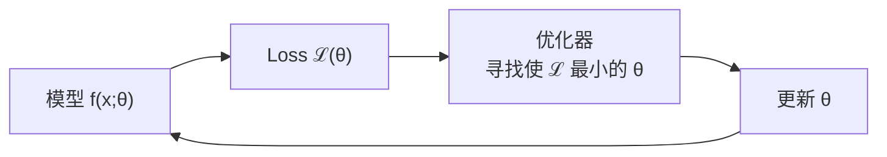
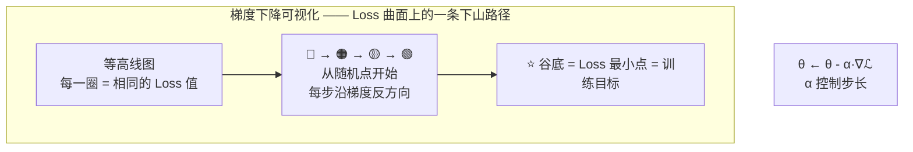
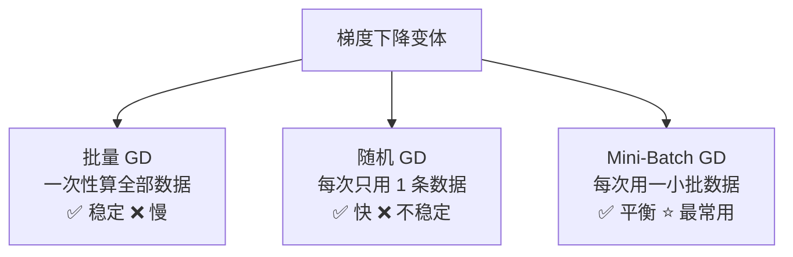
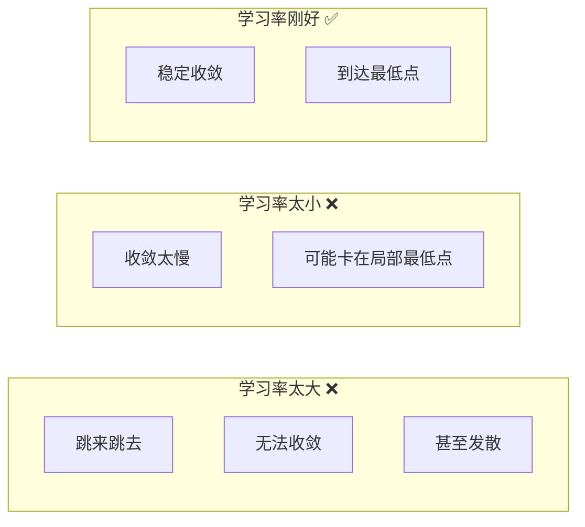
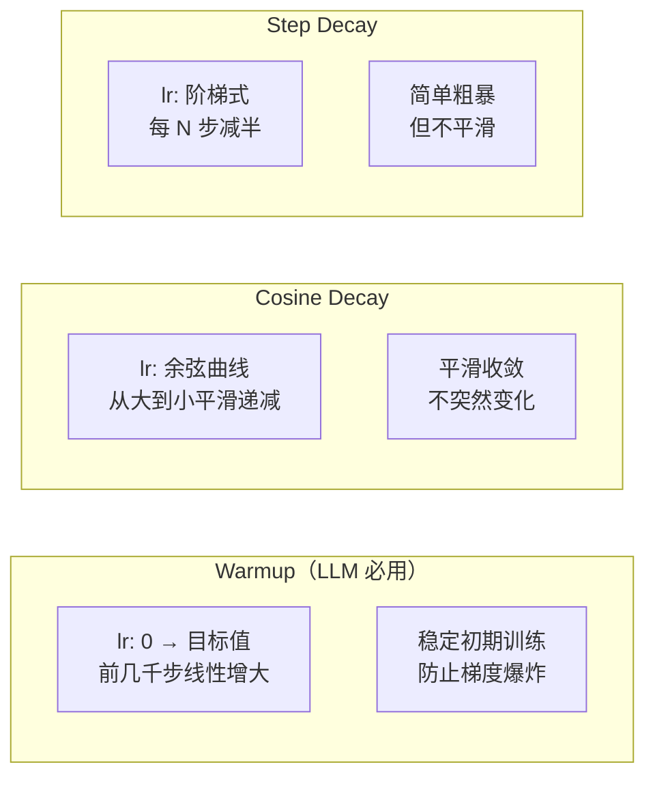
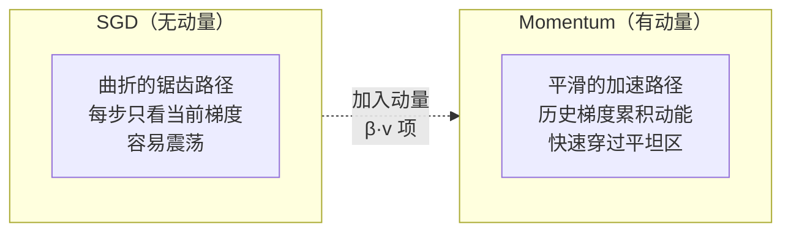
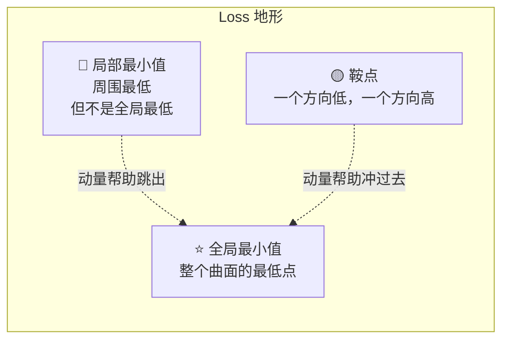
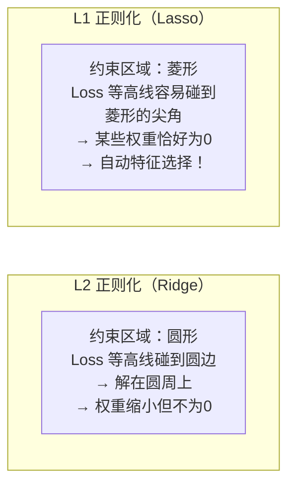

# 📐 最优化方法

> 把 Loss 降到最低。深度学习的训练就是一个巨大的优化问题。

---

## 为什么需要最优化



> 💡 **深度学习的训练 = 在几十亿维的参数空间中寻找最低点。**

---

## 1. 梯度下降（GD）

### 基本公式

$$\theta_{t+1} = \theta_t - \alpha \cdot \nabla_\theta \mathcal{L}(\theta_t)$$



| 符号 | 含义 |
|------|------|
| $\theta$ | 模型参数（权重和偏置） |
| $\alpha$ | **学习率** — 每步走多大 |
| $\nabla_\theta\mathcal{L}$ | 梯度 — 最陡的上升方向 |

> ⚠️ 为什么是**减去**梯度？梯度指向 Loss 增长最快的方向，我们要降低 Loss，所以反着走。

![[attachments/gradient_descent.png]]

---

## 2. 三种梯度下降变体



| 方法 | 每次用多少数据 | 特点 |
|------|-------------|------|
| Batch GD | 全部 | 最精确，但太慢 |
| SGD | 1 条 | 最快，但噪声大 |
| **Mini-Batch** | 32/64/128 条 | ⭐ **标准做法** |

---

## 3. 学习率 — 最重要的超参数



### 学习率调度策略



| 策略 | 描述 |
|------|------|
| **Warmup** | 从小学习率开始，逐渐增大 → 稳定初期训练（LLM 必用） ⭐ |
| **Cosine Decay** | 余弦曲线从大到小 → 平滑收敛 |
| **Step Decay** | 每隔 N 步减半 → 简单粗暴 |
| **Reduce on Plateau** | Loss 不动了就减小学习率 |

![[attachments/learning_rate_comparison.png]]

---

## 4. 动量优化器 — SGD 的进化

### Momentum

```python
v = β * v - α * ∇L     # 累积历史梯度（动量）
θ = θ + v               # 用动量更新
```



> 🏂 **比喻**：SGD = 每步重新决定方向。Momentum = 像下坡的滑雪者，积累动能，不容易被小石头卡住。

### 局部最小值 vs 全局最小值



### Adam — 深度学习标配

**Adam = Momentum + 自适应学习率**

| 特点 | 说明 |
|------|------|
| 自适应 | 每个参数有自己的学习率 |
| 动量 | 积累历史梯度方向 |
| 偏差校正 | 修正初始几步的偏差 |
| 默认首选 | 绝大多数情况的默认优化器 |

```python
# 几乎所有深度学习项目的第一行训练代码
optimizer = torch.optim.Adam(model.parameters(), lr=1e-3)
```

---

## 5. 正则化与优化的关系

| 正则化方法 | 从优化角度看 |
|-----------|------------|
| **L2 权重衰减** | 在梯度上额外减去一个 $w$ 的项 |
| **L1 正则化** | 让优化器倾向于把权重推向 0 |
| **Dropout** | 每次优化只在随机子网络上进行 |
| **Batch Normalization** | 改变优化地形，让 Loss 曲面更平滑 |

```
带 L2 正则化的权重更新：
  w ← w - α·(∇_w Loss + λ·w)
                ↑           ↑
            正常梯度    L2 项的梯度
```

### L1 vs L2 的几何直觉



> 💡 L1 产生稀疏解（部分权重=0）是因为菱形有尖角。L2 是圆形，等高线碰到时各权重一般都不为 0。

![[attachments/l1_l2_regularization.png]]

---

## 6. 训练技巧速查

| 技巧 | 做什么 | 什么时候用 |
|------|--------|-----------|
| **Gradient Clipping** | 限制梯度最大值 | 训练不稳定时 |
| **Warmup** | 学习率从小开始 | LLM 训练必备 |
| **Weight Decay** | L2 正则化的现代叫法 | 防止过拟合 |
| **Mixed Precision** | 用 FP16 加速训练 | 节省显存 |

---

## 7. 何时需要查阅本篇

| 当你在学... | 需要的优化概念 |
|------------|--------------|
| [[../02.机器学习基础/2.2 监督学习\|线性回归训练]] | 梯度下降基础 |
| [[../04.深度学习/4.2 反向传播与训练\|神经网络训练]] | 优化器选择、学习率调度 |
| [[../06.大语言模型/6.2 预训练管线\|LLM 预训练]] | Warmup、Gradient Clipping、分布式优化 |
| [[../06.大语言模型/6.5 LoRA高效微调\|LoRA 微调]] | 只优化新增参数（低秩矩阵） |

---

## → 相关数学

- [[微积分关键概念]] — 梯度就是偏导数组成的向量
- [[线性代数核心]] — 梯度是向量/矩阵，要理解高维空间
