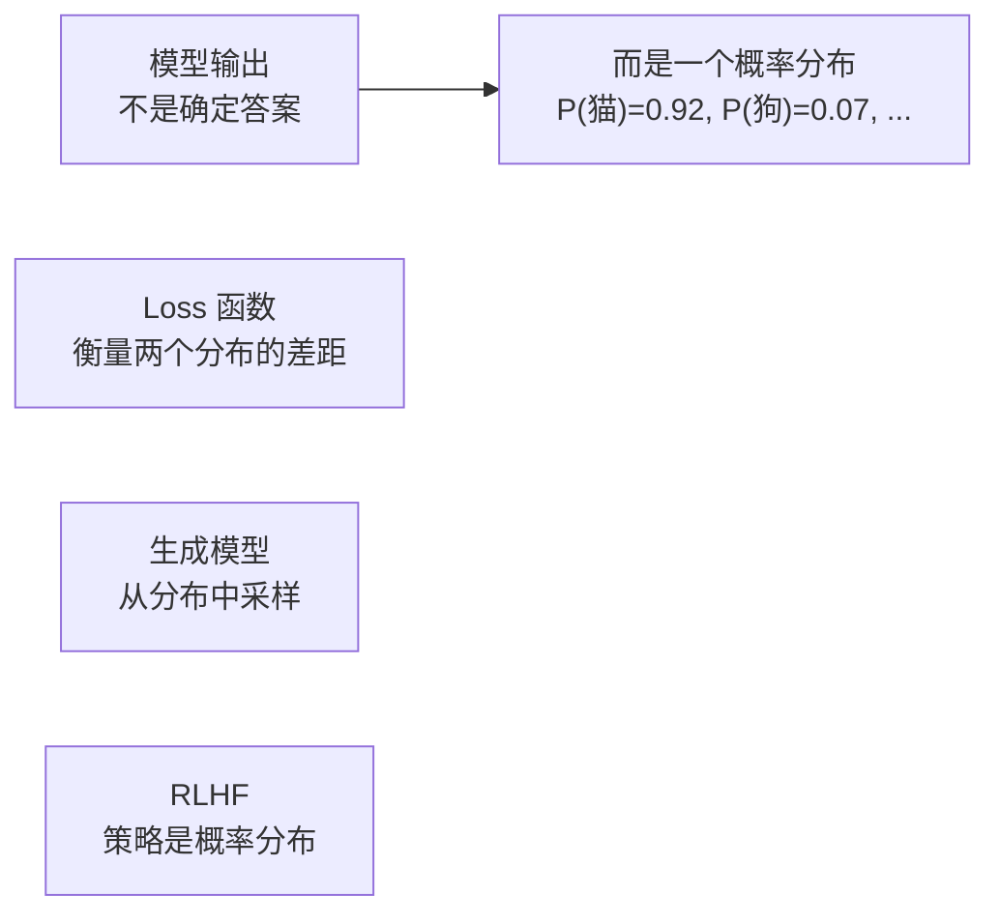
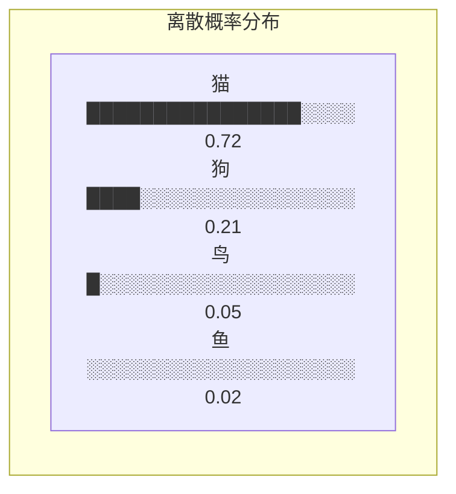
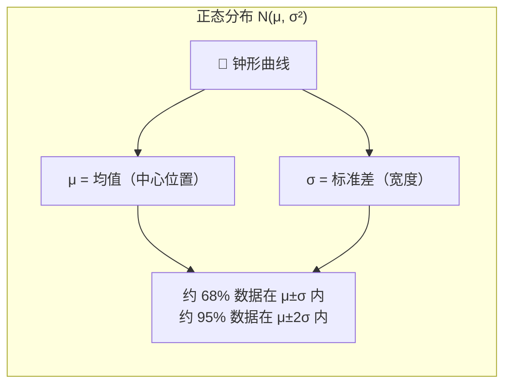
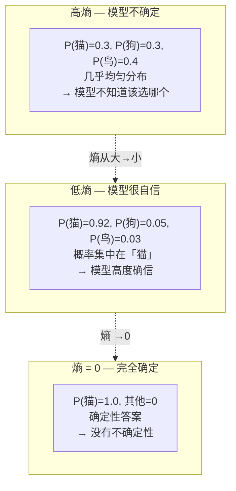
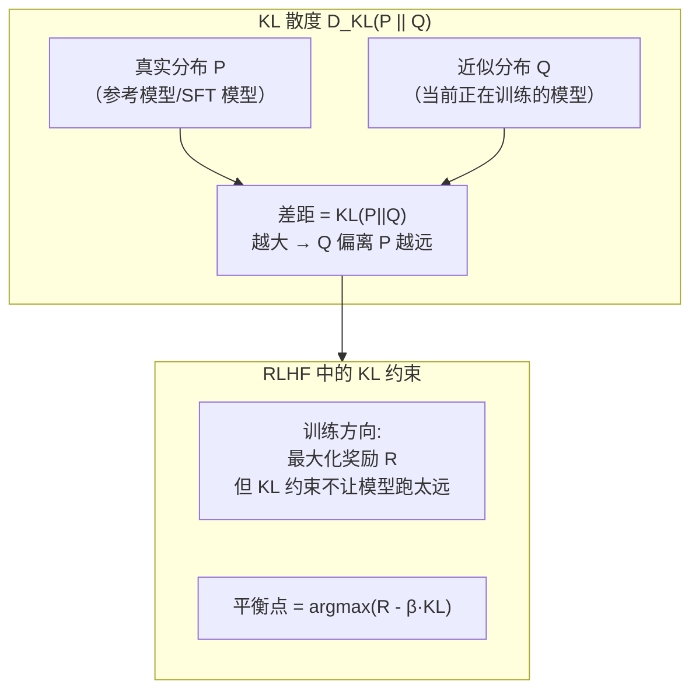

# 📐 概率统计精华

> AI 处理的是不确定的世界。概率统计给了我们描述和处理不确定性的语言。

---

## 为什么需要概率统计



---

## 1. 随机变量与概率分布

### 离散分布

分类模型的输出就是离散概率分布：

```
模型预测这张图是什么：
  P(猫) = 0.72
  P(狗) = 0.21
  P(鸟) = 0.05
  P(鱼) = 0.02
  ─────────────
  Total = 1.00
```



### 连续分布 — 正态分布

回归任务、生成模型中的噪声通常假设服从高斯分布（正态分布）：

$$f(x) = \frac{1}{\sqrt{2\pi}\sigma}e^{-\frac{(x-\mu)^2}{2\sigma^2}}$$



![[attachments/normal_distribution.png]]

---

## 2. 期望值

**期望就是「加权平均」：**

$$E[X] = \sum_i x_i \cdot P(x_i)$$

**在 AI 中**：强化学习和 RLHF 中大量用到期望。PPO 的目标函数就是对策略分布求期望。

---

## 3. 熵 — 不确定性的度量

$$H(P) = -\sum_i P(x_i) \log P(x_i)$$



| 场景 | 熵 |
|------|-----|
| 硬币正面概率 50% | 熵最大（最不确定） |
| 硬币正面概率 99% | 熵很小（几乎确定） |
| 硬币正面概率 100% | 熵 = 0（完全确定） |

**在 AI 中的位置**：
- 模型输出概率很接近 → 高熵 → 模型不确定
- 模型输出概率很极端 → 低熵 → 模型很自信

![[attachments/entropy_comparison.png]]

---

## 4. KL 散度 — 两个分布的距离

$$D_{KL}(P \parallel Q) = \sum_i P(i) \log\frac{P(i)}{Q(i)}$$



> 💡 KL 散度衡量「用分布 Q 来近似分布 P 会损失多少信息」。

**在 AI 中的位置**：
- **RLHF 的核心约束**：不让更新后的模型偏离原始模型太远
- 训练 VAE 时的 Loss 项
- 知识蒸馏

---

## 5. 交叉熵 — 分类 Loss 的本质

$$\mathcal{L}_{CE} = -\sum_i y_i \log(\hat{y}_i)$$

| 真实标签 $y$ | 预测 $\hat{y}$ | 交叉熵 |
|-------------|---------------|--------|
| $[1,0,0]$ 猫 | $[0.9, 0.05, 0.05]$ | $-\ln(0.9) = 0.105$ ✅ 小 |
| $[1,0,0]$ 猫 | $[0.3, 0.35, 0.35]$ | $-\ln(0.3) = 1.204$ ❌ 大 |

> 💡 预测越接近真实标签，交叉熵越小。这就是分类任务用交叉熵的原因。

---

## 6. 最大似然估计（MLE）

> 选择让观察到的数据「最可能发生」的参数。

在 AI 中，训练过程本质就是在做最大似然估计 —— 寻找让训练数据出现概率最大的模型参数。

---

## 7. 何时需要查阅本篇

| 当你在学... | 需要的概率统计概念 |
|------------|------------------|
| [[../02.机器学习基础/2.2 监督学习\|逻辑回归]] | 概率输出、交叉熵 |
| [[../04.深度学习/4.5 Transformer详解\|Softmax]] | 概率分布归一化 |
| [[../06.大语言模型/6.1 GPT架构深度解析\|语言模型]] | 条件概率 $P(\text{token}_{t} | \text{token}_{<t})$ |
| [[../06.大语言模型/6.4 RLHF与偏好对齐\|RLHF]] | KL 散度、期望、策略分布 |
| [[../06.大语言模型/6.6 推理优化与量化\|温度采样]] | 从分布中采样 |

---

## → 相关数学

- [[线性代数核心]] — Softmax 是矩阵运算
- [[最优化方法]] — 最大化似然 = 最小化负对数似然
