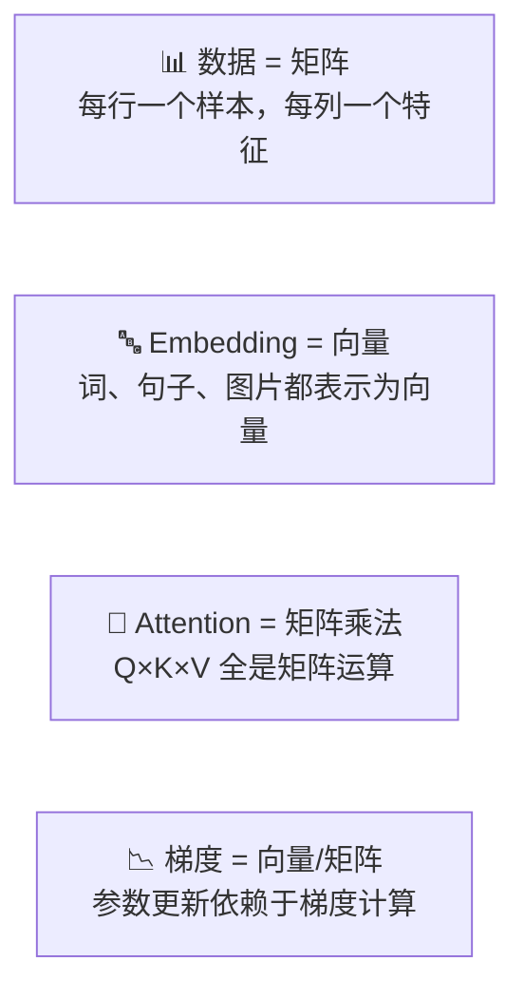
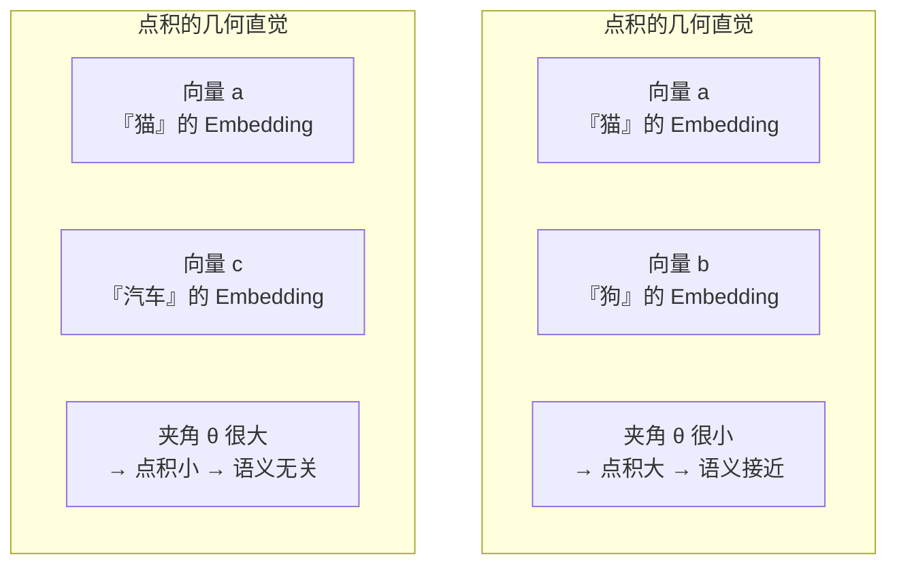
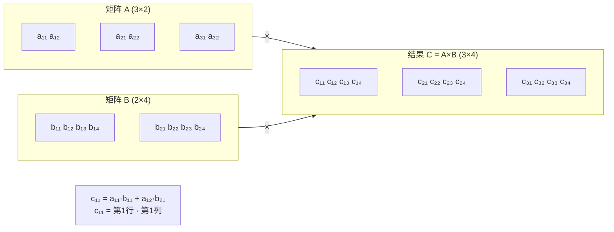
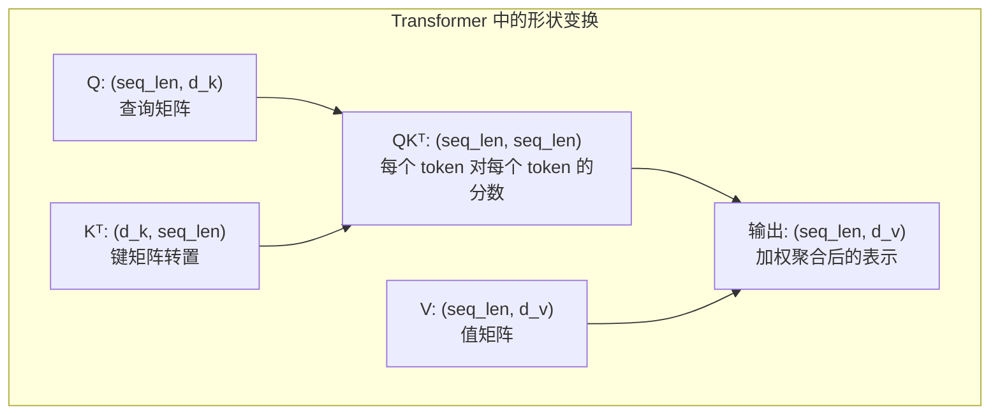
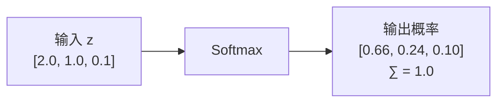
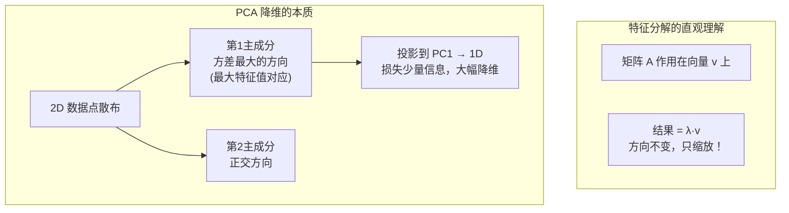
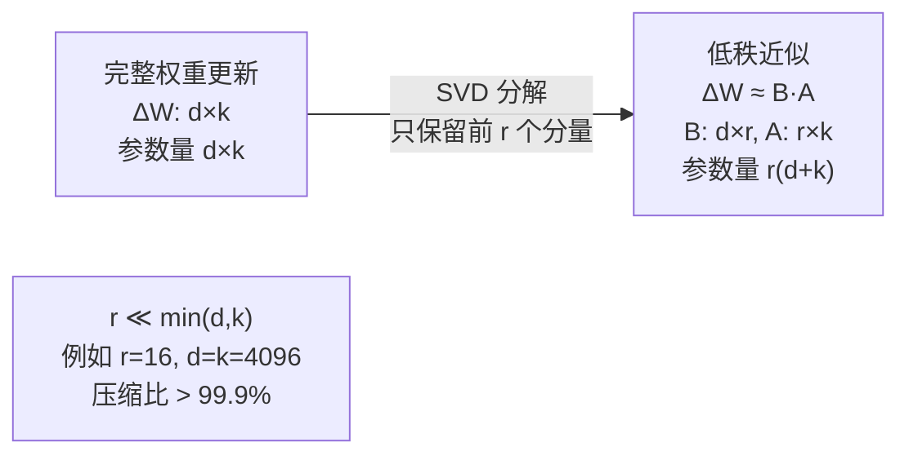

# 📐 线性代数核心

> AI 中最常用的线性代数概念，按需查阅，不必精通证明。

---

## 为什么需要线性代数



> 💡 **核心洞察**：在深度学习中，一切都是张量（多维数组）。线性代数就是操作这些张量的语言。

---

## 1. 向量

### 几何理解

> 向量 = 空间中的一个箭头（有方向和长度）

### AI 中的向量

> 向量 = 一个样本的特征列表

```
房价特征向量: x = [面积, 卧室数, 房龄, 地段评分]
                = [120,    3,     10,    8     ]
```

### 关键运算

#### 点积 — Self-Attention 的灵魂

$$\mathbf{a}\cdot\mathbf{b} = \sum_i a_i b_i = \|\mathbf{a}\|\|\mathbf{b}\|\cos\theta$$



> 💡 在 Transformer 的 Self-Attention 中，$QK^\top$ 本质就是对序列中每一对 token 做**点积**，衡量它们的「相关性」。

| 运算 | 公式 | AI 中的含义 |
|------|------|------------|
| **点积** | $\mathbf{a}\cdot\mathbf{b} = \sum a_i b_i$ | 两个向量的相似度！**Self-Attention 的核心** |
| **范数** | $\|\mathbf{x}\|_2 = \sqrt{\sum x_i^2}$ | 向量的「大小」，用于正则化 |
| **余弦相似度** | $\cos\theta = \frac{\mathbf{a}\cdot\mathbf{b}}{\|\mathbf{a}\|\|\mathbf{b}\|}$ | Embedding 相似度计算 |

---

## 2. 矩阵

### AI 中的矩阵

```
      特征1  特征2  特征3
样本1 [ 3.2   1.5   0.8 ]
样本2 [ 2.1   4.0   1.2 ]
样本3 [ 5.0   2.3   0.9 ]
...
样本m [ ...   ...   ... ]
```

**形状 = (样本数, 特征数) = (m, n)**

### 矩阵乘法

$$C = A \times B \quad \text{where} \quad C_{ij} = \sum_k A_{ik} B_{kj}$$





> 🔥 **这是深度学习中执行次数最多的运算。** 全都是矩阵乘法！

### 广播（Broadcasting）

```python
# 形状 (4, 3) 的矩阵 + 形状 (3,) 的向量
# → 自动扩展到 (4, 3)，每行加上同一个偏置向量
```

---

## 3. Softmax 函数

把任意实数向量变成概率分布：

$$\text{softmax}(z_i) = \frac{e^{z_i}}{\sum_j e^{z_j}}$$



**在 AI 中的位置**：
- 分类任务的最后一层
- **Attention 权重归一化** ← 超重要
- 语言模型的 token 概率输出

---

## 4. 特征值与特征分解

$$A\mathbf{v} = \lambda \mathbf{v}$$



| 概念 | AI 应用 |
|------|---------|
| 特征值 $\lambda$ | 方差解释量（PCA） |
| 特征向量 $\mathbf{v}$ | 数据变化的主方向（PCA） |
| SVD | 矩阵压缩、LoRA 的数学基础 |

### LoRA 为什么有效（SVD 直觉）



> 📌 LoRA 的数学本质就是 SVD 的低秩近似。权重更新 ΔW 中最重要的信息集中在前 r 个奇异值方向上。详见 [[../06.大语言模型/6.5 LoRA高效微调]]

---

## 5. 何时需要查阅本篇

| 当你在学... | 需要的线性代数概念 |
|------------|------------------|
| [[../02.机器学习基础/2.2 监督学习\|线性回归]] | 向量内积、矩阵乘法 |
| [[../04.深度学习/4.2 反向传播与训练\|反向传播]] | 矩阵求导、雅可比矩阵 |
| [[../04.深度学习/4.5 Transformer详解\|Transformer]] | 矩阵乘法、Softmax、缩放 |
| [[../06.大语言模型/6.5 LoRA高效微调\|LoRA]] | 低秩分解、SVD |
| [[../07.RAG检索增强生成/7.2 Embedding与向量库\|Embedding]] | 向量空间、余弦相似度 |

---

## 速查表

```
运算           NumPy/PyTorch      含义
─────────────────────────────────────────
矩阵乘法        A @ B              神经网络的核心运算
逐元素乘        A * B              门控、mask
转置           A.T                维度对齐
求和            A.sum(axis=0)      对 batch / 特征聚合
Softmax        F.softmax(x, dim)  概率归一化
范数           torch.norm(x)      正则化
```

---

## → 相关数学

- [[微积分关键概念]] — 梯度、链式法则
- [[最优化方法]] — 梯度下降如何用到向量/矩阵上
