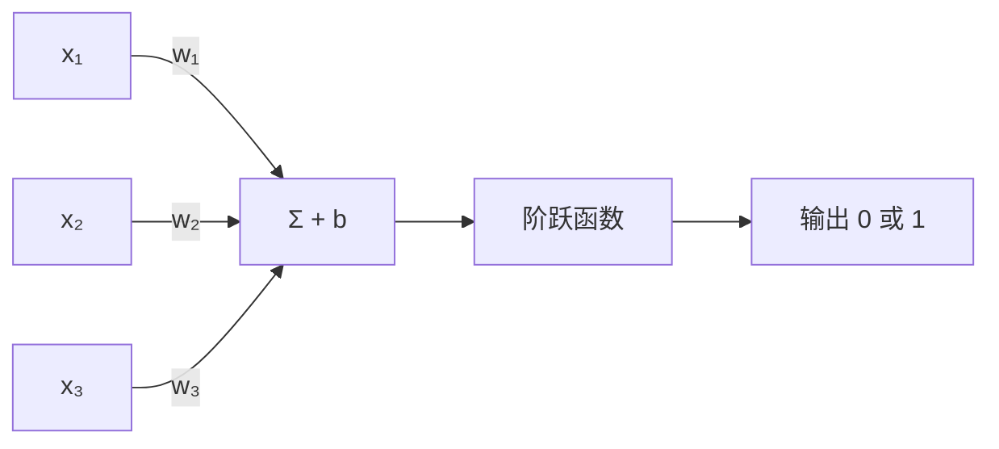
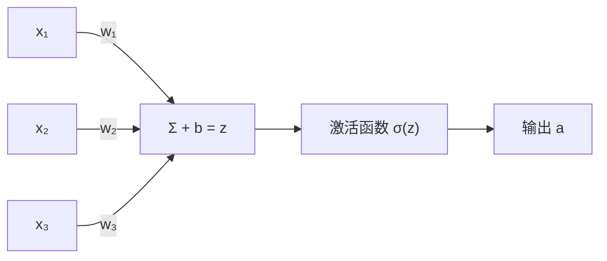
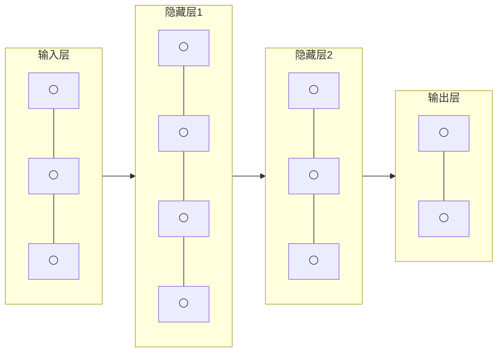
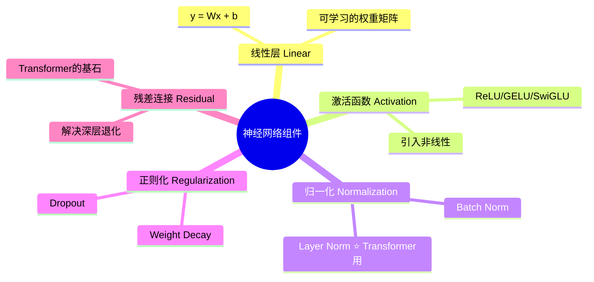
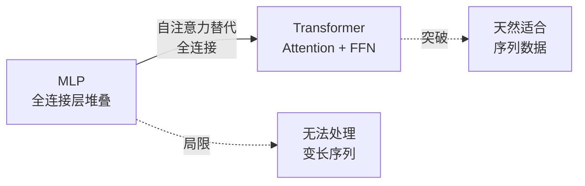

# 4.1 神经网络基础

> 从单个神经元到深层网络，理解神经网络如何「学习」任意函数。

---

## 从感知机到神经元

### 感知机（1957）



$$f(x) = \begin{cases} 1 & \text{if } \mathbf{w}^\top\mathbf{x} + b > 0 \\ 0 & \text{otherwise} \end{cases}$$

**局限**：只能解决线性可分问题（连 XOR 都搞不定）。

---

### 现代神经元



$$a = \sigma(\mathbf{w}^\top\mathbf{x} + b)$$

**关键改进：激活函数。** 非线性激活让网络能拟合任意函数。

---

## 激活函数

| 函数 | 公式 | 优点 | 缺点 | 用在哪 |
|------|------|------|------|--------|
| **ReLU** | $\max(0, x)$ | 计算快、不饱和 | 负数部分为 0（Dead ReLU） | 隐藏层标配 |
| **GELU** | $x \cdot \Phi(x)$ | 平滑、效果好 | 计算稍慢 | Transformer/LLM ⭐ |
| **Sigmoid** | $\frac{1}{1+e^{-x}}$ | 输出 (0,1) | 梯度消失 | 二分类输出层 |
| **Tanh** | $\frac{e^x-e^{-x}}{e^x+e^{-x}}$ | 零中心 | 梯度消失 | RNN |
| **Softmax** | $\frac{e^{z_i}}{\sum e^{z_j}}$ | 和为 1 | — | 多分类输出层 ⭐ |
| **SwiGLU** | $x \cdot \sigma(Wx) \cdot \text{SiLU}(x)$ | LLM 新宠 | 参数量稍多 | Llama 等现代 LLM |

> 💡 GELU 是现代 Transformer 的默认激活，SwiGLU 是最新趋势（Llama 系列使用）。

---

## 多层感知机（MLP）

把神经元叠起来：



**通用近似定理**：一个足够宽的隐藏层可以拟合任何连续函数。

> 💡 「足够宽」在实践中不现实，所以用「深度」代替「宽度」——这就是**深度学习**名字的由来。

---

## 神经网络的核心组件



---

## Layer Normalization — Transformer 的灵魂

Layer Norm 对**每个样本的特征维度**做归一化：

$$\text{LayerNorm}(x) = \gamma \cdot \frac{x - \mu}{\sigma} + \beta$$

> 💡 和 Batch Norm 的区别：BN 对 Batch 维度归一化（CV 用），LN 对特征维度归一化（NLP/Transformer 用）。

---

## 一个最简单的神经网络（PyTorch）

```python
import torch
import torch.nn as nn

class SimpleNN(nn.Module):
    def __init__(self, input_dim, hidden_dim, output_dim):
        super().__init__()
        self.fc1 = nn.Linear(input_dim, hidden_dim)   # 输入 → 隐藏
        self.relu = nn.ReLU()                          # 非线性
        self.fc2 = nn.Linear(hidden_dim, output_dim)   # 隐藏 → 输出
    
    def forward(self, x):
        x = self.fc1(x)    # 线性变换
        x = self.relu(x)   # 激活
        x = self.fc2(x)    # 线性变换
        return x
```

---

## 从 MLP 到 Transformer 的进化（预告）



> 📌 详细拆解：[[4.5 Transformer详解]] — 这是你整个学习路径中最重要的章节之一。

---

## → 接下来

- [[4.2 反向传播与训练]] — 网络怎么「学」的？
- [[4.5 Transformer详解]] — Skip 到最重要的架构
- 🛠️ [[项目：手写数字识别]] — 动手训练你的第一个神经网络
