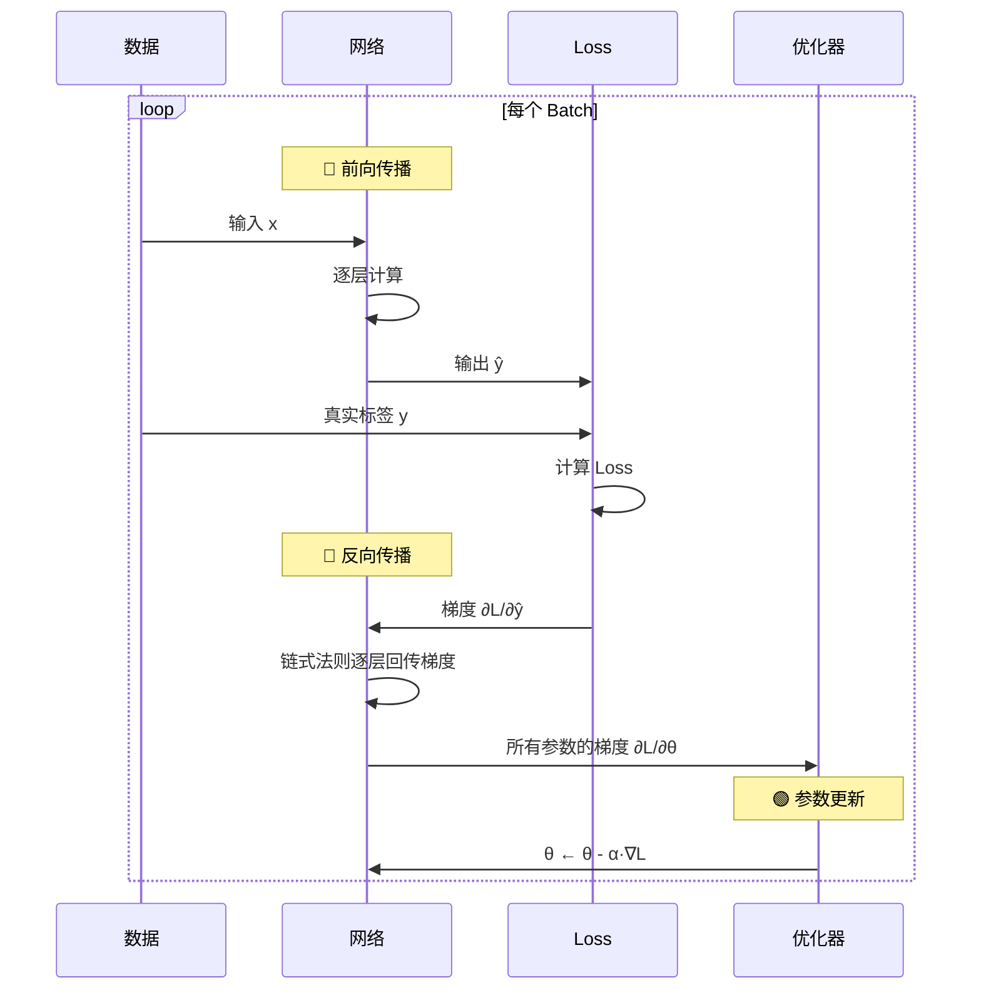
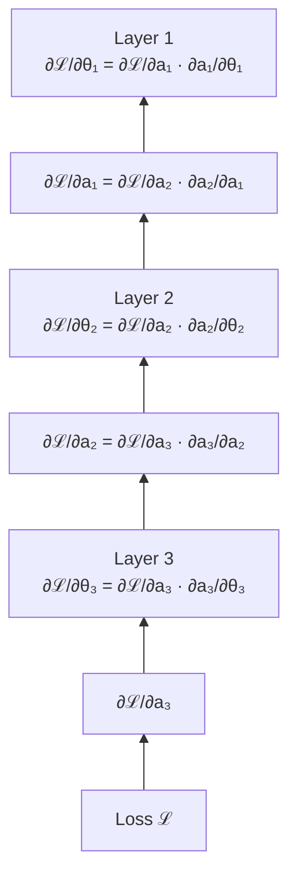
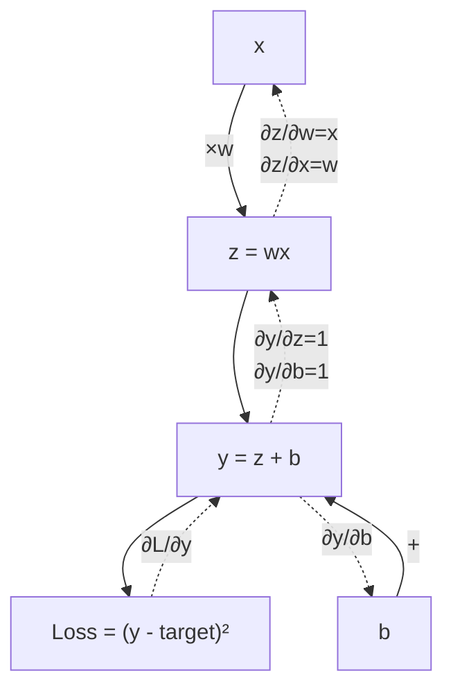

# 4.2 反向传播与训练

> 神经网络的「学习」= 前向传播算 Loss + 反向传播算梯度。

---

## 两阶段训练循环



---

## 为什么需要反向传播

假设一个 3 层网络：

$$
\mathcal{L}(x) = \text{Loss}(f_3(f_2(f_1(x, \theta_1), \theta_2), \theta_3), y)
$$

我们需要 $\frac{\partial \mathcal{L}}{\partial \theta_1}, \frac{\partial \mathcal{L}}{\partial \theta_2}, \frac{\partial \mathcal{L}}{\partial \theta_3}$。

直接算要分别展开三个式子，暴力计算量巨大。

**反向传播的洞见：梯度可以从后往前复用！**

---

## 链式法则在反向传播中的应用



> 💡 每一步只需要**本地梯度**（当前层的导数）× **上游梯度**（从后面传来的）。不需要重新计算整个网络。

---

## 计算图



---

## 自动微分 — 你不需要手算

```python
import torch

# 前向传播：PyTorch 自动构建计算图
x = torch.tensor([2.0], requires_grad=True)
w = torch.tensor([3.0], requires_grad=True)
b = torch.tensor([1.0], requires_grad=True)

y = w * x + b       # y = 3×2 + 1 = 7
loss = (y - 10) ** 2  # loss = (7-10)² = 9

# 反向传播：一行代码自动算所有梯度
loss.backward()

print(f"∂L/∂w = {w.grad}")  # ∂L/∂w = 2×(y-10)×x = -12
print(f"∂L/∂b = {b.grad}")  # ∂L/∂b = 2×(y-10) = -6
print(f"∂L/∂x = {x.grad}")  # ∂L/∂x = 2×(y-10)×w = -18
```

> 🎉 **你永远不需要手动推导梯度。** PyTorch/JAX/TensorFlow 都内置了自动微分。

---

## 训练循环的 PyTorch 标准写法

```python
# 定义
model = MyNeuralNet()
criterion = nn.CrossEntropyLoss()   # Loss 函数
optimizer = torch.optim.Adam(model.parameters(), lr=0.001)

# 训练循环
for epoch in range(num_epochs):
    for x_batch, y_batch in dataloader:
        # 1. 前向传播
        y_pred = model(x_batch)
        loss = criterion(y_pred, y_batch)
        
        # 2. 反向传播
        optimizer.zero_grad()   # ⚠️ 清空上一轮的梯度
        loss.backward()          # 计算梯度
        
        # 3. 参数更新
        optimizer.step()         # θ ← θ - α·∇L
    
    print(f"Epoch {epoch}: Loss = {loss.item():.4f}")
```

### ⚠️ 三个常见错误

| 错误 | 后果 | 正确做法 |
|------|------|---------|
| 忘记 `zero_grad()` | 梯度累积，相当于用了超大的 batch | 每次都清零 |
| 忘记 `.backward()` | 没算梯度，参数不更新 | Loss 后调用 |
| 忘记 `.step()` | 算了梯度但没更新参数 | backward 后调用 |

---

## 训练技巧

| 技巧 | 说明 |
|------|------|
| **Learning Rate Warmup** | 前几百步从 0 线型增大 lr，防止早期不稳定 |
| **Gradient Clipping** | 限制梯度最大值，防止梯度爆炸 |
| **Mixed Precision (FP16)** | 用半精度加速训练，节省显存 |
| **Gradient Accumulation** | 多个小 batch 累积后再更新，模拟大 batch |

> 📐 数学细节见 [[../03.数学补给站/最优化方法]] 和 [[../03.数学补给站/微积分关键概念]]

---

## → 接下来

- [[4.3 CNN卷积网络]] — 图像领域的基础架构
- [[4.5 Transformer详解]] — Skip 到核心中的核心
