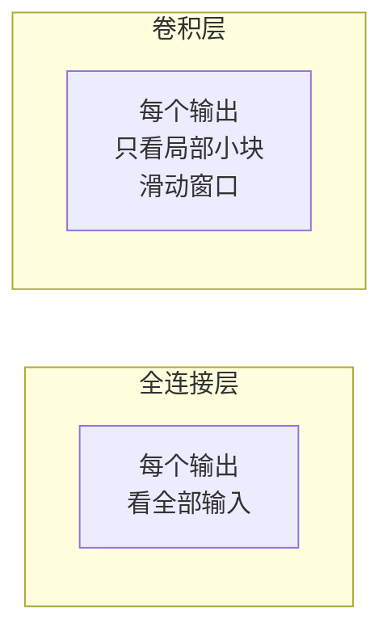
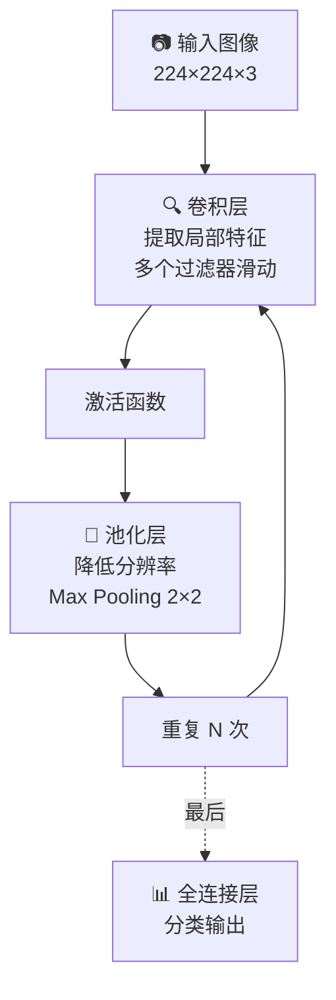
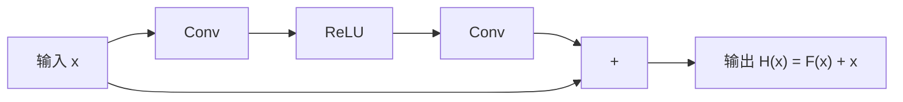

# 4.3 CNN 卷积网络

> 为图像而生的架构。虽然 LLM 时代 CV 的地位变了，但理解 CNN 能帮你建立「归纳偏置」的概念。

---

## MLP 处理图像的问题

```
一张 224×224×3 的图像：
→ 展开为 150,528 维向量
→ 第一层 1000 个神经元
→ 参数量 = 150,528 × 1000 = 1.5 亿

问题：
❌ 参数太多
❌ 丢失空间结构
❌ 狗在图片左边 vs 右边 → MLP 认为是不同输入
```

---

## CNN 的核心思想



### 两个关键假设

| 假设 | 含义 |
|------|------|
| **局部性** | 像素之间的关系主要是局部的（相邻像素关联大） |
| **平移不变性** | 猫在图片左上角还是右下角，都是猫 |

---

## CNN 三大组件



---

## 卷积操作

一个小窗口（kernel / filter）在图像上滑动，每个位置计算一次加权和：

```
图像:               Kernel (3×3):
1  2  3  4         -1  0  1
5  6  7  8    ×    -1  0  1  → 特征图
9  10 11 12        -1  0  1
13 14 15 16

卷积结果 = (-1×1 + 0×2 + 1×3) + (-1×5 + 0×6 + 1×7) + ...
         = 边缘检测器的输出
```

> 💡 不同的 Kernel 检测不同的特征：边缘、纹理、颜色模式……深度学习让网络**自动学习**这些 Kernel。

---

## 池化（Pooling）

```
特征图:             Max Pooling (2×2):
3  8  1  2          8  5
1  5  3  4    →     7  6
2  7  1  6
4  3  5  2
```

- 降低空间分辨率 → 减少计算量
- 提供小幅平移不变性
- 扩大感受野

---

## 经典架构演进

| 架构 | 年份 | 创新 | 影响 |
|------|------|------|------|
| LeNet | 1998 | 卷积+池化+全连接 | CNN 鼻祖 |
| **AlexNet** | 2012 | ReLU + Dropout + GPU | 🔥 深度学习革命 |
| VGG | 2014 | 小 Kernel（3×3）堆叠 | 简洁规则化 |
| **ResNet** | 2015 | 残差连接 | ⭐ 影响 Transformer |
| DenseNet | 2017 | 密集连接 | — |

---

## ResNet 残差连接 — 通向 Transformer 的桥梁



> 💡 **残差连接让网络学习「残差」F(x) = H(x) - x 而不是直接学习 H(x)。** 这解决了深层网络退化问题。

这不正是 Transformer 中 Self-Attention 后面那个「+」操作的来源吗！

---

## CNN 在现代的位置

| 领域 | 状况 |
|------|------|
| 图像分类/检测 | ✅ 仍然主流（配合 Transformer，如 ViT） |
| 医学影像 | ✅ CNN 依然强势 |
| 视频理解 | 🔄 向 Video Transformer 迁移 |
| 作为 LLM 的视觉编码器 | ✅ CLIP、LLaVA 等用 ViT（Transformer 版 CNN 思想） |

> 💡 理解 CNN 的局部性假设和归纳偏置，对理解 ViT 和现代多模态模型有直接帮助。

---

## → 接下来

- [[4.4 RNN与序列模型]] — 文本处理的前身
- [[4.5 Transformer详解]] — 🔥 重点中的重点
