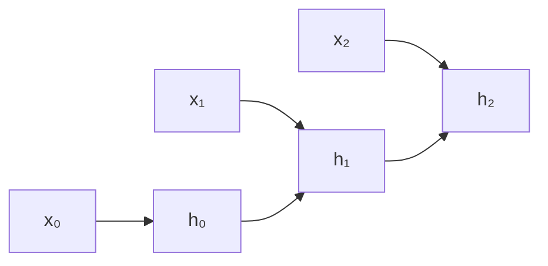
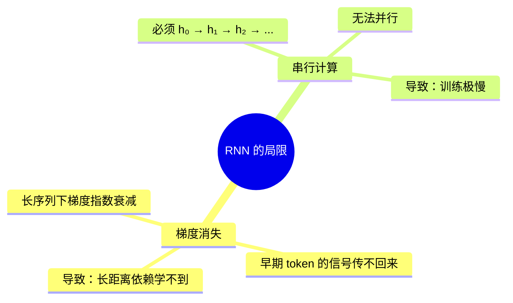
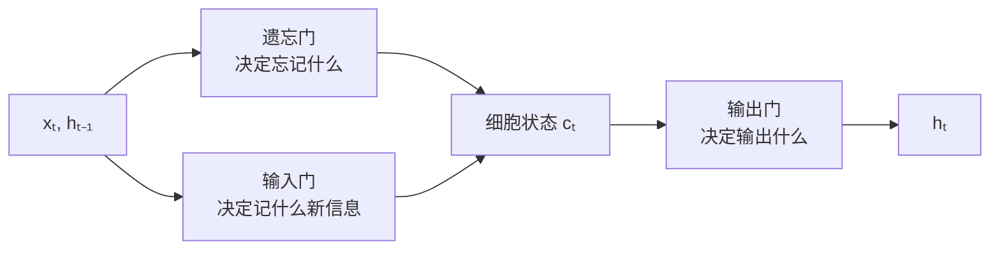
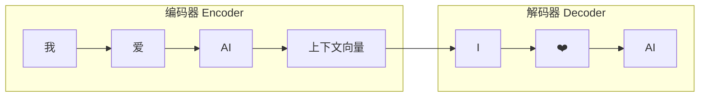

# 4.4 RNN 与序列模型

> Transformer 出现之前，处理文本的王者是 RNN。理解 RNN 的局限，才能真正理解 Transformer 为什么革命性。

---

## 为什么需要序列模型

文本是序列数据——顺序很重要：

```
"狗 咬 人" ≠ "人 咬 狗"
```

传统 MLP 把输入当成无序的特征集合，无法捕获顺序信息。

---

## RNN 核心思想

> 处理序列中的每个元素时，同时「记住」之前处理过的内容。



**数学形式**：

$$h_t = \tanh(W_h h_{t-1} + W_x x_t)$$

当前状态 $h_t$ = 当前输入 $x_t$ + 上一状态 $h_{t-1}$

---

## RNN 的两大致命问题



> 💡 Transformer 通过 **Self-Attention 机制 + 并行计算** 一举解决了这两个问题。

---

## LSTM — 加「门」缓解遗忘

LSTM（1997）通过三个「门」来控制信息流：



| 门 | 作用 |
|-----|------|
| 遗忘门 | 决定扔掉旧记忆的哪些部分 |
| 输入门 | 决定写入哪些新信息 |
| 输出门 | 决定基于当前记忆输出什么 |

> 💡 LSTM 确实缓解了梯度消失，但**串行计算的问题依然没有解决**。

---

## Seq2Seq — 编码-解码架构



**问题**：所有输入信息都被压缩到一个固定长度的「上下文向量」中。句子越长，丢失越严重。

> 📌 解决方案就是 Attention 机制 → [[5.2 从Seq2Seq到Attention|NLP：从 Seq2Seq 到 Attention]]

---

## RNN 在现代的位置

| 任务 | 状态 |
|------|------|
| 文本处理 | 🔄 基本被 Transformer 取代 |
| 时间序列预测 | 🟡 RNN/LSTM 仍有用武之地 |
| 语音识别 | 🔄 向 Conformer 迁移 |
| LLM | ❌ 不会用 RNN（太慢） |

---

## 从 RNN 到 Transformer 的思维跳跃

| RNN 的视角 | Transformer 的视角 |
|-----------|------------------|
| 序列 = 时间步，必须按顺序处理 | 序列 = 集合，允许任意位置直接交互 |
| 依赖 = 隐藏状态传递 | 依赖 = Self-Attention 权重直接建模 |
| 长距离 = 间接（通过多个时间步） | 长距离 = 直接（$O(1)$ 步到达） |

> 🚀 这个思维跳跃是理解 Transformer 的关键。接下来：[[4.5 Transformer详解]]
