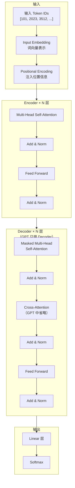
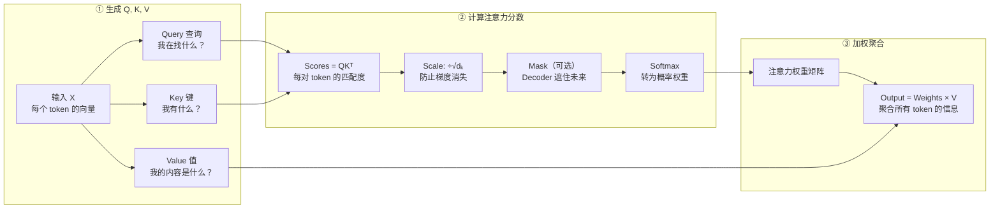
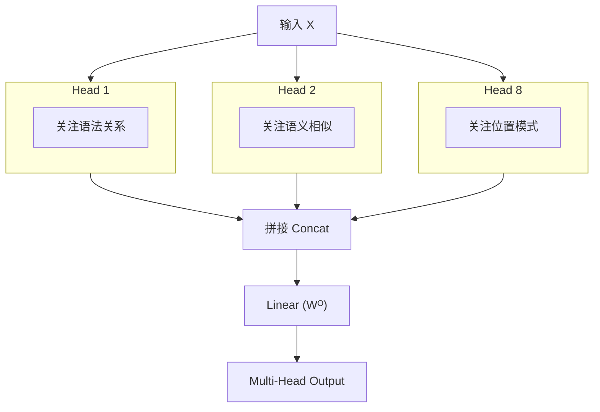
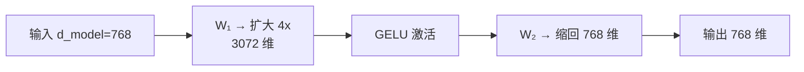
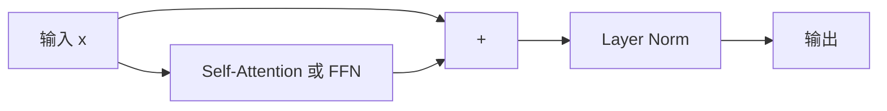
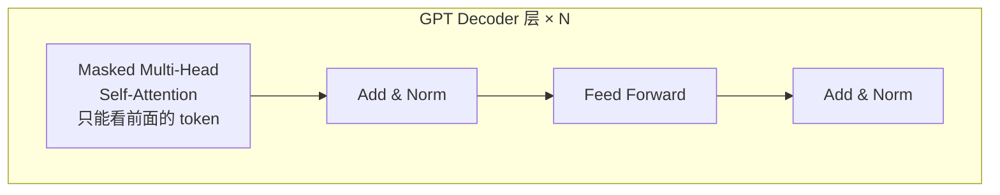
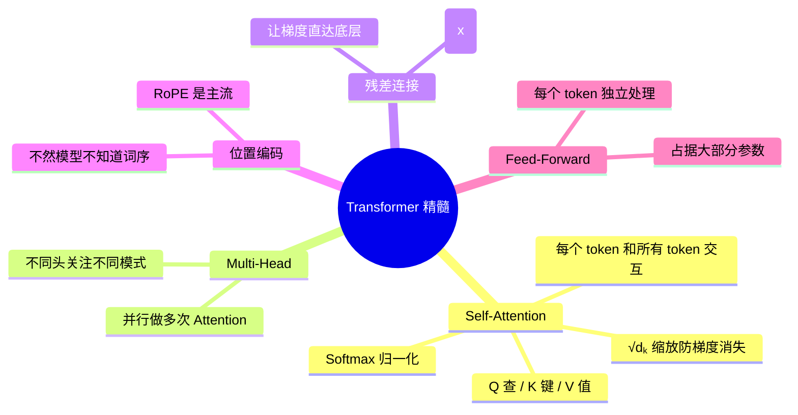

# 4.5 🔥 Transformer 详解

> "Attention Is All You Need" — 这八个字改变了 AI 的一切。

---

## 为什么 Transformer 是革命性的

| 问题 | RNN/LSTM | Transformer |
|------|----------|-------------|
| 长距离依赖 | ❌ 梯度消失，间接传递 | ✅ Self-Attention 直接建模任意距离 |
| 并行计算 | ❌ 必须串行 $h_0 \to h_1 \to \cdots$ | ✅ 所有位置同时计算 |
| 训练速度 | 🐢 慢 | 🚀 极快（GPU 友好） |
| 可扩展性 | 📏 有限 | 📐 **Scaling Law 成立** |

---

## 整体架构



> 💡 **GPT 系列只用 Decoder 部分**（去掉 Cross-Attention）。这是你必须记住的关键事实。

---

## 自注意力 Self-Attention — 核心中的核心

### 直观理解

> 阅读一句话时，你的大脑会自动关注句中其他相关的词。Self-Attention 让模型做同样的事。

```
"The cat sat on the mat because it was tired."
                                   ↑
                           "it" 应该关注 "cat" 还是 "mat"？
```

Self-Attention 通过计算权重，自动发现 "it" 和 "cat" 的关联。

---

### 三步运算



### 数学公式

$$\text{Attention}(Q, K, V) = \text{softmax}\!\left(\frac{QK^\top}{\sqrt{d_k}}\right)V$$

```python
import torch
import torch.nn.functional as F

def self_attention(Q, K, V, mask=None):
    """
    Q, K, V: shape (batch, seq_len, d_k)
    """
    d_k = Q.size(-1)
    
    # 1. 计算注意力分数
    scores = torch.matmul(Q, K.transpose(-2, -1))  # (batch, seq, seq)
    
    # 2. 缩放（防止 softmax 梯度消失）
    scores = scores / math.sqrt(d_k)
    
    # 3. 遮罩（Decoder 中防止看到未来 token）
    if mask is not None:
        scores = scores.masked_fill(mask == 0, -1e9)
    
    # 4. Softmax 转为概率
    attn_weights = F.softmax(scores, dim=-1)
    
    # 5. 加权求和
    output = torch.matmul(attn_weights, V)
    
    return output, attn_weights
```

> 📐 数学背景：QKᵀ 是矩阵乘法（内积），Softmax 归一化，见 [[../../03.数学补给站/线性代数核心|线代补给]] 和 [[../../03.数学补给站/概率统计精华|概率补给]]

---

## 为什么除 $\sqrt{d_k}$？

假设 $d_k = 64$，Q 和 K 的元素是 $\mathcal{N}(0,1)$ 标准正态分布。

$QK^\top$ 的方差会变成 $d_k = 64$。

**方差越大 → Softmax 输出越极端 → 梯度接近 0 → 学不动。**

除以 $\sqrt{d_k}$ 把方差拉回 1，解决梯度消失。

---

## Multi-Head Attention

> 不是做一次 Attention，而是做 H 次，每次关注不同的方面。



$$\text{MultiHead}(Q,K,V) = \text{Concat}(\text{head}_1, \ldots, \text{head}_h)W^O$$

每个 head 相当于一个独立的「焦点」，合起来看不同的语言特征。

---

## Feed-Forward Network (FFN)

Attention 让 token 之间交流，FFN 让每个 token 自己思考：

$$\text{FFN}(x) = \text{GELU}(xW_1 + b_1)W_2 + b_2$$



> 💡 FFN 占了 Transformer 参数量的约 2/3。它可以看作一个微型的「知识存储」单元。

---

## 残差连接 + Layer Norm



每一次子层（Attention 或 FFN）都包裹在 **Add & Norm** 中：

$$\text{Output} = \text{LayerNorm}(x + \text{Sublayer}(x))$$

> 📌 **残差连接** 是 ResNet 的遗产（[[4.3 CNN卷积网络|见 CNN 章节]]），**Layer Norm** 是让训练稳定的关键（[[4.1 神经网络基础|见 NN 基础]]）。

---

## 位置编码 Positional Encoding

Attention 本身不关心顺序——"狗咬人"和"人咬狗"的 Attention 权重可能一样。

必须注入位置信息：

**原始 Transformer（正弦编码）**：

$$PE_{(pos, 2i)} = \sin\!\left(\frac{pos}{10000^{2i/d_{model}}}\right)$$

$$PE_{(pos, 2i+1)} = \cos\!\left(\frac{pos}{10000^{2i/d_{model}}}\right)$$

**现代 LLM（RoPE 旋转位置编码）**：

> 💡 RoPE 是现在的主流（Llama、Qwen 等都用它）。核心思想：通过旋转矩阵编码相对位置，而不是绝对位置。这让模型对相对位置关系更敏感。

---

## GPT-Only Decoder 架构

GPT 去掉了 Cross-Attention，只保留 Masked Self-Attention：



**Causal Mask（因果遮罩）**：确保预测第 $t$ 个 token 时只能看到 $1 \sim t-1$ 的 token。

```
       t₁   t₂   t₃   t₄
  t₁ [ 1    0    0    0 ]   ← t₁ 只能看自己
  t₂ [ 1    1    0    0 ]   ← t₂ 能看 t₁ 和 t₂
  t₃ [ 1    1    1    0 ]   ← t₃ 能看前三个
  t₄ [ 1    1    1    1 ]   ← t₄ 能看到全部
```

---

## 现代 Transformer 的改进

| 原始论文 (2017) | 现代 LLM | 改进原因 |
|----------------|---------|---------|
| 正弦位置编码 | **RoPE** | 更好的相对位置建模 |
| ReLU 激活 | **GELU / SwiGLU** | 更平滑，效果更好 |
| Multi-Head Attention | **GQA / MQA** | 减少 KV-Cache，加速推理 |
| Post-LN | **Pre-LN** | 训练更稳定 |
| — | **Flash Attention** | 用 IO 感知算法加速，节省显存 |
| — | **MoE（混合专家）** | 用更少计算量实现更大模型容量 |

> 📌 这些改进的细节会在 [[../06.大语言模型/6.1 GPT架构深度解析|LLM：GPT 架构深度解析]] 中展开。

---

## 你必须记住的 Transformer 精髓



---

## 动手验证理解

读完之后，试着回答：

1. ❓ Self-Attention 的计算复杂度是多少？为什么？
2. ❓ 「Multi-Head」中的 Head 之间有什么不同？
3. ❓ 为什么 GPT 只用 Decoder 而不用 Encoder？
4. ❓ 如果没有残差连接，深层 Transformer 会发生什么？
5. ❓ 为什么除以 $\sqrt{d_k}$ 而不是除以 $d_k$？

---

## → 接下来

理解 Transformer 后，你已具备了理解 LLM 的最关键基础：

→ [[../06.大语言模型/6.1 GPT架构深度解析|LLM：GPT 架构深度解析]]

或者先完成手写数字识别项目，实践神经网络训练：

→ 🛠️ [[项目：手写数字识别]]
