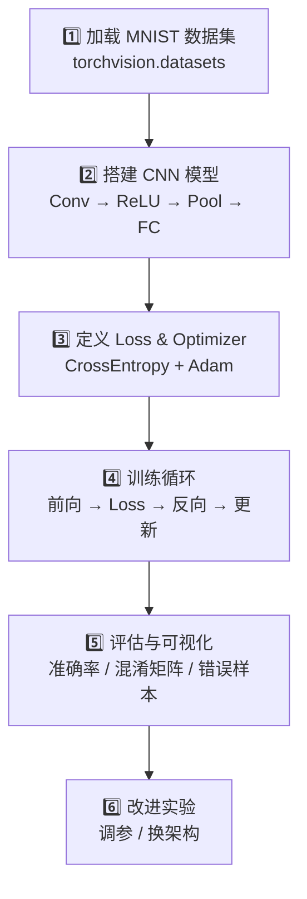

# 🛠️ 项目：手写数字识别

> 用 PyTorch 训练一个卷积神经网络，识别 MNIST 手写数字。这是深度学习入门的「Hello World」。

---

## 项目目标

训练一个 CNN 模型，输入手写数字图片（28×28 灰度图），输出 0-9 的分类。

### 学习要点

- ✅ PyTorch 项目开发流程
- ✅ CNN 的搭建与训练
- ✅ DataLoader 的使用
- ✅ GPU 训练
- ✅ 模型评估与可视化

---

## 项目流程



---

## 1. 环境准备

```python
import torch
import torch.nn as nn
import torch.nn.functional as F
import torch.optim as optim
from torch.utils.data import DataLoader
from torchvision import datasets, transforms
import matplotlib.pyplot as plt
import numpy as np
from sklearn.metrics import confusion_matrix
import seaborn as sns

# 检查 GPU
device = torch.device('cuda' if torch.cuda.is_available() else 'cpu')
print(f'使用设备: {device}')
```

---

## 2. 加载数据

```python
# 数据预处理
transform = transforms.Compose([
    transforms.ToTensor(),                    # PIL → Tensor (0-1)
    transforms.Normalize((0.1307,), (0.3081,)) # 标准化
])

# 训练集
train_dataset = datasets.MNIST(
    root='./data', train=True, 
    download=True, transform=transform
)

# 测试集
test_dataset = datasets.MNIST(
    root='./data', train=False, 
    download=True, transform=transform
)

# DataLoader
train_loader = DataLoader(train_dataset, batch_size=64, shuffle=True)
test_loader = DataLoader(test_dataset, batch_size=1000, shuffle=False)

print(f'训练集大小: {len(train_dataset)}')
print(f'测试集大小: {len(test_dataset)}')
```

### 可视化几张样本

```python
fig, axes = plt.subplots(2, 5, figsize=(10, 4))
for i, ax in enumerate(axes.flat):
    img, label = train_dataset[i]
    ax.imshow(img.squeeze(), cmap='gray')
    ax.set_title(f'Label: {label}')
    ax.axis('off')
plt.savefig('mnist_samples.png', dpi=150, bbox_inches='tight')
plt.show()
```

---

## 3. 搭建 CNN

```python
class MNIST_CNN(nn.Module):
    def __init__(self):
        super().__init__()
        # 卷积部分：提取特征
        self.conv1 = nn.Conv2d(1, 32, kernel_size=3, padding=1)
        self.conv2 = nn.Conv2d(32, 64, kernel_size=3, padding=1)
        
        # 池化
        self.pool = nn.MaxPool2d(2, 2)
        
        # Dropout 防止过拟合
        self.dropout1 = nn.Dropout2d(0.25)
        self.dropout2 = nn.Dropout(0.5)
        
        # 全连接部分：分类
        # 28×28 → pool → 14×14 → pool → 7×7
        self.fc1 = nn.Linear(64 * 7 * 7, 128)
        self.fc2 = nn.Linear(128, 10)
    
    def forward(self, x):
        # 输入: (batch, 1, 28, 28)
        x = self.pool(F.relu(self.conv1(x)))  # → (batch, 32, 14, 14)
        x = self.pool(F.relu(self.conv2(x)))  # → (batch, 64, 7, 7)
        x = self.dropout1(x)
        
        x = x.view(x.size(0), -1)             # 展平
        x = F.relu(self.fc1(x))
        x = self.dropout2(x)
        x = self.fc2(x)                       # 输出 10 类
        return x

model = MNIST_CNN().to(device)
print(model)

# 参数统计
total_params = sum(p.numel() for p in model.parameters())
trainable_params = sum(p.numel() for p in model.parameters() if p.requires_grad)
print(f'总参数量: {total_params:,}')
```

---

## 4. 定义 Loss & Optimizer

```python
criterion = nn.CrossEntropyLoss()
optimizer = optim.Adam(model.parameters(), lr=0.001)

# 学习率调度器
scheduler = optim.lr_scheduler.StepLR(optimizer, step_size=5, gamma=0.1)
```

---

## 5. 训练循环

```python
def train(model, device, train_loader, optimizer, criterion, epoch):
    model.train()
    running_loss = 0.0
    correct = 0
    total = 0
    
    for batch_idx, (data, target) in enumerate(train_loader):
        data, target = data.to(device), target.to(device)
        
        # 1. 清零梯度
        optimizer.zero_grad()
        
        # 2. 前向传播
        output = model(data)
        
        # 3. 计算 Loss
        loss = criterion(output, target)
        
        # 4. 反向传播
        loss.backward()
        
        # 5. 更新参数
        optimizer.step()
        
        # 统计
        running_loss += loss.item()
        pred = output.argmax(dim=1)
        correct += pred.eq(target).sum().item()
        total += target.size(0)
        
        if batch_idx % 100 == 0:
            print(f'Epoch {epoch} [{batch_idx*len(data)}/{len(train_loader.dataset)}] '
                  f'Loss: {loss.item():.4f}')
    
    avg_loss = running_loss / len(train_loader)
    accuracy = 100. * correct / total
    print(f'\n训练集: Loss={avg_loss:.4f}, Accuracy={accuracy:.2f}%\n')
    return avg_loss, accuracy

def test(model, device, test_loader, criterion):
    model.eval()
    test_loss = 0
    correct = 0
    all_preds = []
    all_targets = []
    
    with torch.no_grad():  # 不计算梯度
        for data, target in test_loader:
            data, target = data.to(device), target.to(device)
            output = model(data)
            test_loss += criterion(output, target).item()
            pred = output.argmax(dim=1)
            correct += pred.eq(target).sum().item()
            
            all_preds.extend(pred.cpu().numpy())
            all_targets.extend(target.cpu().numpy())
    
    test_loss /= len(test_loader)
    accuracy = 100. * correct / len(test_loader.dataset)
    print(f'测试集: Loss={test_loss:.4f}, Accuracy={accuracy:.2f}%\n')
    return test_loss, accuracy, all_preds, all_targets

# 开始训练
num_epochs = 10
for epoch in range(1, num_epochs + 1):
    train_loss, train_acc = train(model, device, train_loader, optimizer, criterion, epoch)
    test_loss, test_acc, _, _ = test(model, device, test_loader, criterion)
    scheduler.step()
```

---

## 6. 结果可视化

### 混淆矩阵

```python
_, _, all_preds, all_targets = test(model, device, test_loader, criterion)

cm = confusion_matrix(all_targets, all_preds)
plt.figure(figsize=(10, 8))
sns.heatmap(cm, annot=True, fmt='d', cmap='Blues')
plt.xlabel('预测')
plt.ylabel('真实')
plt.title('混淆矩阵')
plt.savefig('confusion_matrix.png', dpi=150, bbox_inches='tight')
plt.show()
```

### 错误样本分析

```python
# 找出预测错误的样本
model.eval()
wrong_samples = []

with torch.no_grad():
    for data, target in test_loader:
        data, target = data.to(device), target.to(device)
        output = model(data)
        pred = output.argmax(dim=1)
        
        mask = ~pred.eq(target)
        for i in range(len(mask)):
            if mask[i]:
                wrong_samples.append({
                    'image': data[i].cpu(),
                    'true': target[i].item(),
                    'pred': pred[i].item()
                })
        if len(wrong_samples) >= 10:
            break

# 显示
fig, axes = plt.subplots(2, 5, figsize=(12, 5))
for i, ax in enumerate(axes.flat):
    if i < len(wrong_samples):
        sample = wrong_samples[i]
        ax.imshow(sample['image'].squeeze(), cmap='gray')
        ax.set_title(f'真:{sample["true"]} 预测:{sample["pred"]}', color='red')
    ax.axis('off')
plt.suptitle('预测错误的样本')
plt.savefig('wrong_samples.png', dpi=150, bbox_inches='tight')
plt.show()
```

---

## 7. 改进实验

试试这些改进，观察效果：

| 改进 | 代码改动 | 预期效果 |
|------|---------|---------|
| 增加卷积层 | 多加一层 `nn.Conv2d` | 可能提高精度 |
| Batch Normalization | 卷积后加 `nn.BatchNorm2d` | 加速收敛 |
| 调整 Dropout 比例 | 改变 `p` 值 | 影响过拟合 |
| 换优化器 | Adam → SGD + Momentum | 对比不同优化器 |
| 学习率调整 | 改 lr 或 Warmup | 影响收敛速度 |
| 数据增强 | 加旋转/平移变换 | 提升泛化 |

```python
# 实验：加 BatchNorm 的改进版
class Improved_CNN(nn.Module):
    def __init__(self):
        super().__init__()
        self.conv1 = nn.Conv2d(1, 32, 3, padding=1)
        self.bn1 = nn.BatchNorm2d(32)  # 新增
        self.conv2 = nn.Conv2d(32, 64, 3, padding=1)
        self.bn2 = nn.BatchNorm2d(64)  # 新增
        self.conv3 = nn.Conv2d(64, 128, 3, padding=1)  # 新增层
        self.bn3 = nn.BatchNorm2d(128)  # 新增
        
        self.pool = nn.MaxPool2d(2, 2)
        self.dropout = nn.Dropout(0.3)
        
        # 28 → 14 → 7 → 3（注意尺寸变化）
        self.fc1 = nn.Linear(128 * 3 * 3, 256)
        self.fc2 = nn.Linear(256, 10)
    
    def forward(self, x):
        x = self.pool(F.relu(self.bn1(self.conv1(x))))
        x = self.pool(F.relu(self.bn2(self.conv2(x))))
        x = self.pool(F.relu(self.bn3(self.conv3(x))))
        x = x.view(x.size(0), -1)
        x = self.dropout(F.relu(self.fc1(x)))
        x = self.fc2(x)
        return x

# 记录实验结果
# 基线模型测试集准确率: ___%
# 改进后测试集准确率: ___%
# 提升: ___%
```

---

## 8. 总结模板

```markdown
## 项目总结：手写数字识别

### 做了什么
- 用 CNN 在 MNIST 上训练了一个手写数字分类器
- 尝试了 [改进了什么]

### 关键结果
- 测试集准确率: ___%
- 共 ___ 个参数
- 训练时间: ___ 分钟

### 遇到的困难
- [填写]

### 学到了什么
1. CNN 的卷积-池化-全连接结构
2. PyTorch 的训练循环写法
3. [你的感悟]
```

---

## 延伸挑战 🚀

1. **用 Fashion-MNIST**：换个更有挑战性的数据集（衣服分类）
2. **迁移到 ResNet**：用 `torchvision.models.resnet18` 替换自定义 CNN
3. **模型部署**：用 `torch.jit` 导出模型，写一个简单的 Flask API

---

## → 下一步

完成后，进入 NLP 的世界：

→ [[../05.NLP自然语言处理/5.1 文本表示与词向量|NLP：文本表示与词向量]]
