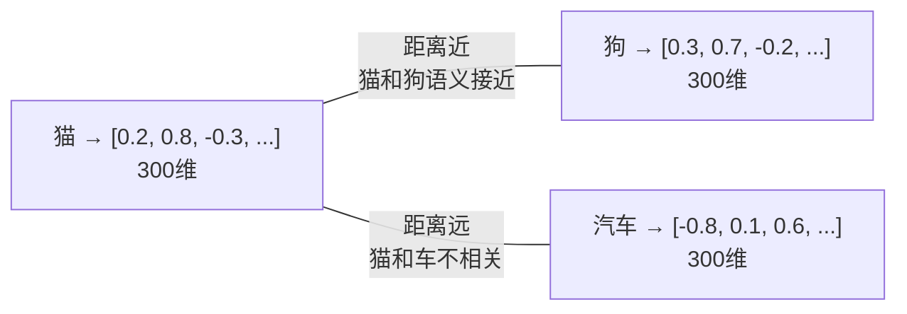
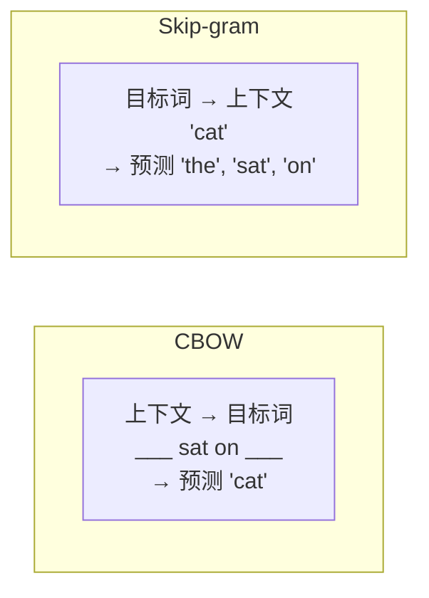
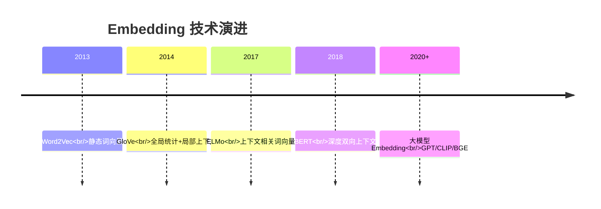

# 5.1 文本表示与词向量

> 计算机不懂文字，只懂数字。怎么把「猫」变成一个向量？

---

## 从独热编码到词向量

### One-Hot 编码（最朴素的办法）

```
词汇表: [猫, 狗, 鸟, 鱼, ...]（假设 10,000 个词）

"猫" → [1, 0, 0, 0, ..., 0]  10,000 维向量
"狗" → [0, 1, 0, 0, ..., 0]
```

**问题**：
- ❌ 向量维度 = 词汇表大小（几万~几十万维）
- ❌ 任意两个词的相似度 = 0（"猫"和"狗"被认为毫无关系）
- ❌ 极其稀疏，浪费存储和计算

---

### 分布式表示（词向量）

> 💡 用一个低维密集向量表示词，让**语义相似的词在向量空间中距离也近**。



---

## Word2Vec — 词向量的里程碑（2013）

### 两个经典模型



### 著名的类比性质

```
king - man + woman ≈ queen
巴黎 - 法国 + 意大利 ≈ 罗马
```

```python
# 这个性质至今仍是 Embedding 质量的重要检验
vec("king") - vec("man") + vec("woman") ≈ vec("queen")
```

> 💡 词向量中竟然编码了语义关系！这启发了后来所有的 Embedding 方法。

---

## Embedding 层的演进



| 类型 | 代表 | 特点 | 局限 |
|------|------|------|------|
| **静态** | Word2Vec, GloVe | 每个词一个固定向量 | "苹果"（手机 vs 水果）同一个向量 |
| **上下文相关** | ELMo, BERT | 同一个词在不同句子中有不同向量 | 需要前向传播计算 |
| **LLM Embedding** | GPT, BGE, m3e | 最强语义表示 | 计算成本高 |

---

## Embedding 在 LLM 时代的位置


> 💡 LLM 的第一层就是一个 Embedding 层。它是一个巨大的查找表：`词汇表大小 × d_model`。

---

## 现代 Embedding 模型

| 模型 | 维度 | 适用场景 |
|------|------|---------|
| OpenAI text-embedding-3-small | 1536 | 通用（付费） |
| BGE (BAAI) | 768/1024 | 中文友好 ⭐ |
| m3e (Moka) | 768 | 中文专用 |
| Jina Embeddings | 768/1024 | 长文本 |

> 📌 这些 Embedding 模型是 RAG 系统的核心组件 → [[../07.RAG检索增强生成/7.2 Embedding与向量库]]

---

## → 接下来

- [[5.2 从Seq2Seq到Attention]] — 从翻译模型理解 Attention 的由来
- 🛠️ [[项目：文本分类]] — 用预训练 Embedding 做文本分类
