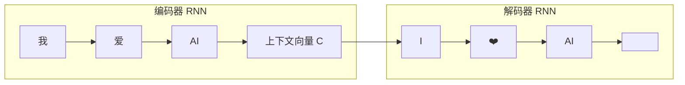
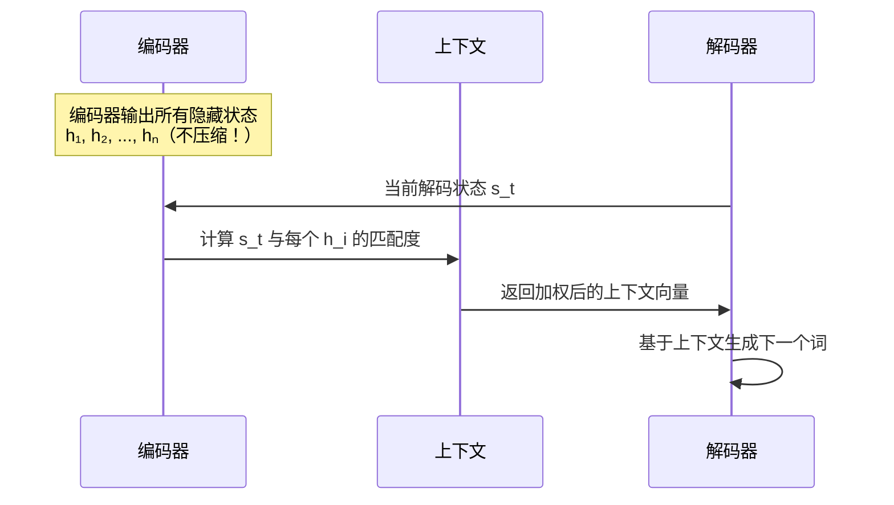
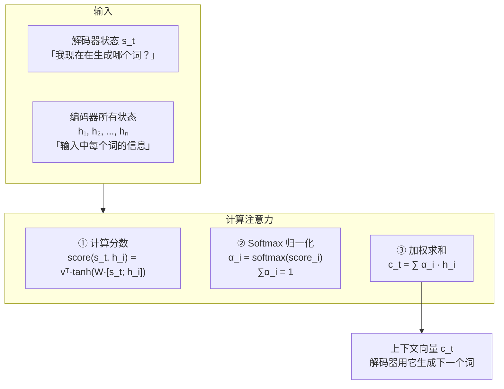
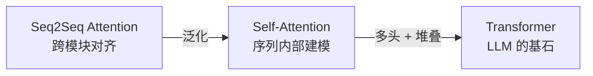

# 5.2 从 Seq2Seq 到 Attention

> Attention 不是凭空出现的——它是为了解决机器翻译中的「信息瓶颈」而发明的。

---

## Seq2Seq 架构

最早的神经网络机器翻译架构（Sutskever et al., 2014）：



### 核心问题：信息瓶颈

```
输入："今天天气很好我们一起去公园散步然后吃午饭吧"
                                 ↓
                     上下文向量 C (固定长度 512 维)
                                 ↓
                           必须捕获所有信息！
```

> 🚨 长句子的开头信息会被「遗忘」——因为必须经过多个 RNN 时间步才能到达结尾。

---

## Attention 的诞生

Bahdanau et al. (2015) 提出了解决方案：

> 💡 **不要让编码器把所有信息压缩到一个向量。让解码器在每一步都能「看」输入的所有位置，自己决定关注哪里。**



---

## Attention 计算流程



### 可视化 Attention

```
输入:  The   cat   sat   on   the   mat
       ↓     ↓     ↓     ↓     ↓     ↓
       α₁    α₂    α₃    α₄    α₅    α₆
       
生成 "坐" 时的注意力权重:
      0.02  0.35  0.48  0.08  0.02  0.05
                    ↑
              最关注 "sat"
```

---

## 从 Seq2Seq Attention 到 Self-Attention

| | Seq2Seq Attention | Self-Attention (Transformer) |
|------|-------------------|---------------------------|
| 谁和谁 | 解码器 ↔ 编码器 | 序列内部：token ↔ token |
| 方向 | 单向（解码→编码） | 双向（任意两个 token） |
| 目的 | 对齐翻译 | 构建序列内部表示 |

> 🚀 **Transformer 的核心创新**：把「解码器看编码器」的 Attention 推向了「每个 token 看所有 token」的 Self-Attention。



---

## 为什么理解这个脉络很重要

> 从 Seq2Seq → Attention → Self-Attention → Transformer 的演进，展示了 AI 研究中的一个经典模式：**发现瓶颈 → 提出机制 → 泛化推广 → 发现新的 Scaling 可能。**

- Seq2Seq 的瓶颈：信息压缩
- Attention 的解决：动态加权
- Transformer 的泛化：把 Attention 用于序列建模本身
- Scaling Law 的发现：Transformer + 大规模 = 涌现能力

---

## → 接下来

- [[5.3 预训练语言模型]] — BERT 和 GPT 如何改变了 NLP
- [[../04.深度学习/4.5 Transformer详解|回顾：Transformer 详解]] — Self-Attention 的完整数学推导
