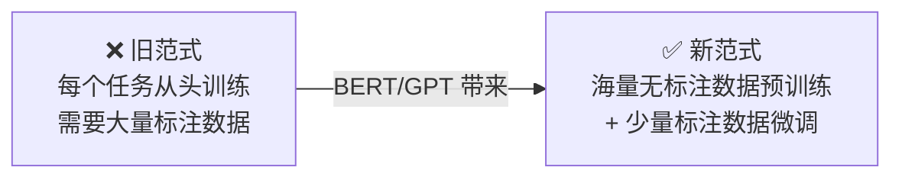
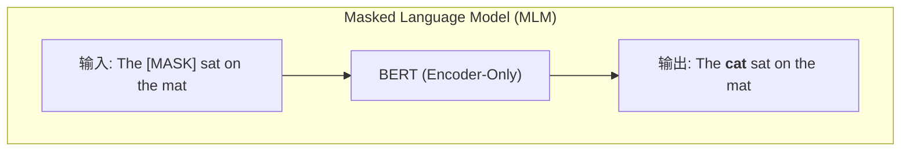
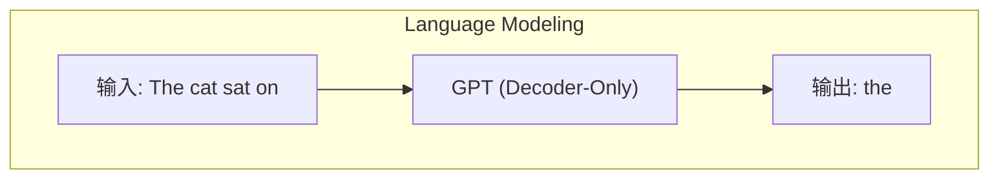
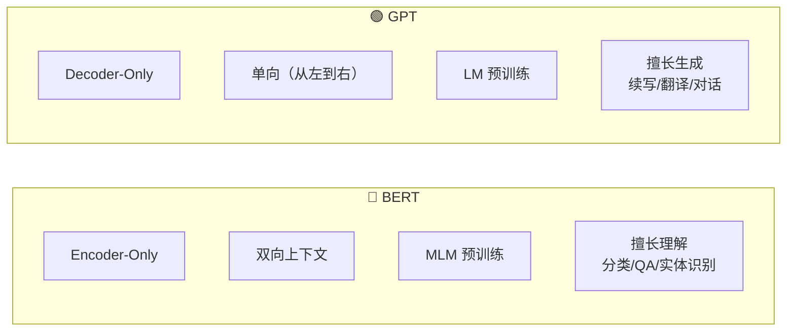

# 5.3 预训练语言模型

> 「预训练 + 微调」范式统一了 NLP，为大模型时代铺平了道路。

---

## 范式转变



| | 传统 NLP | 预训练时代 |
|------|---------|-----------|
| 数据需求 | 大量标注 | 少量标注（百~万级） |
| 通用性 | 每个任务一个模型 | 一个模型适配多任务 |
| 性能 | 任务依赖 | 全面提升 |
| 代表 | 手工特征 + 浅层模型 | BERT / GPT |

---

## BERT — 双向理解（2018）

### 核心创新



> 💡 随机遮住一些词，让模型根据上下文（包括前后！）预测被遮住的词。这让 BERT 获得了**双向**理解能力。

### BERT 预训练的两个任务

| 任务 | 怎么做 | 学会了什么 |
|------|--------|-----------|
| **MLM** | 随机遮住 15% 的词，预测它们 | 词级别的语义理解 |
| **NSP** | 判断两句话是否连续 | 句子级别的关系理解 |

### 微调方式

```python
# 在 BERT 上接一个简单的分类头
class BertForClassification(nn.Module):
    def __init__(self, num_classes):
        self.bert = BertModel.from_pretrained('bert-base')
        self.classifier = nn.Linear(768, num_classes)
    
    def forward(self, input_ids, attention_mask):
        outputs = self.bert(input_ids, attention_mask)
        cls_embedding = outputs.last_hidden_state[:, 0, :]  # [CLS] token
        return self.classifier(cls_embedding)
```

---

## GPT — 单向生成（2018）

### 核心创新



> 💡 给定前面的文本，预测下一个词。这让 GPT 获得了**生成**能力。

### BERT vs GPT



| | BERT | GPT |
|------|------|-----|
| 架构 | Encoder-Only | Decoder-Only |
| 预训练任务 | MLM (完形填空) | LM (下一个词) |
| 上下文 | 双向 | 单向 |
| 强项 | 理解 | 生成 |
| 参数量 | 1.1亿 / 3.4亿 | 1.17亿 → 1750亿+ |
| 后续发展 | RoBERTa 等改进 | 🔥 **Scaling 到 LLM** |

---

## 为什么 GPT 赢了？

> 历史选择了 Decoder-Only 架构作为 LLM 的基础，原因是 Scaling Law。

1. **LM 目标更自然**：预测下一个词是语言最本质的任务，扩展性好
2. **Decoder 更容易做大**：去掉 Encoder 简化架构，堆更多层
3. **In-Context Learning 出现**：GPT-3 证明足够大的 Decoder-Only 模型出现了「涌现能力」
4. **生成是终极目标**：人类最终需要 AI 生成，而不只是理解

---

## 从预训练模型到大模型的飞跃

| 预训练模型时代 (~2018-2020) | 大模型时代 (2020+) |
|--------------------------|-------------------|
| 几亿参数 | 几百亿~上万亿参数 |
| 需要微调才能用 | 零样本/少样本就能用 |
| 任务特定头 | 统一文本接口 |
| BERT / RoBERTa | GPT-3 / GPT-4 / Llama |
| 学术实验室 | 工业界主导 |

---

## → 接下来

理解预训练范式后，正式进入大语言模型的核心：

→ [[../06.大语言模型/6.1 GPT架构深度解析|LLM：GPT 架构深度解析]]

→ [[5.4 分词与数据处理|NLP：分词与数据处理]]
