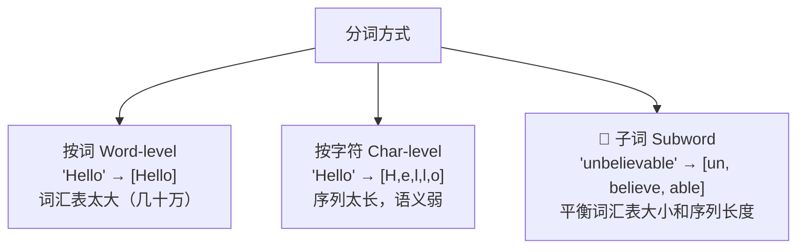
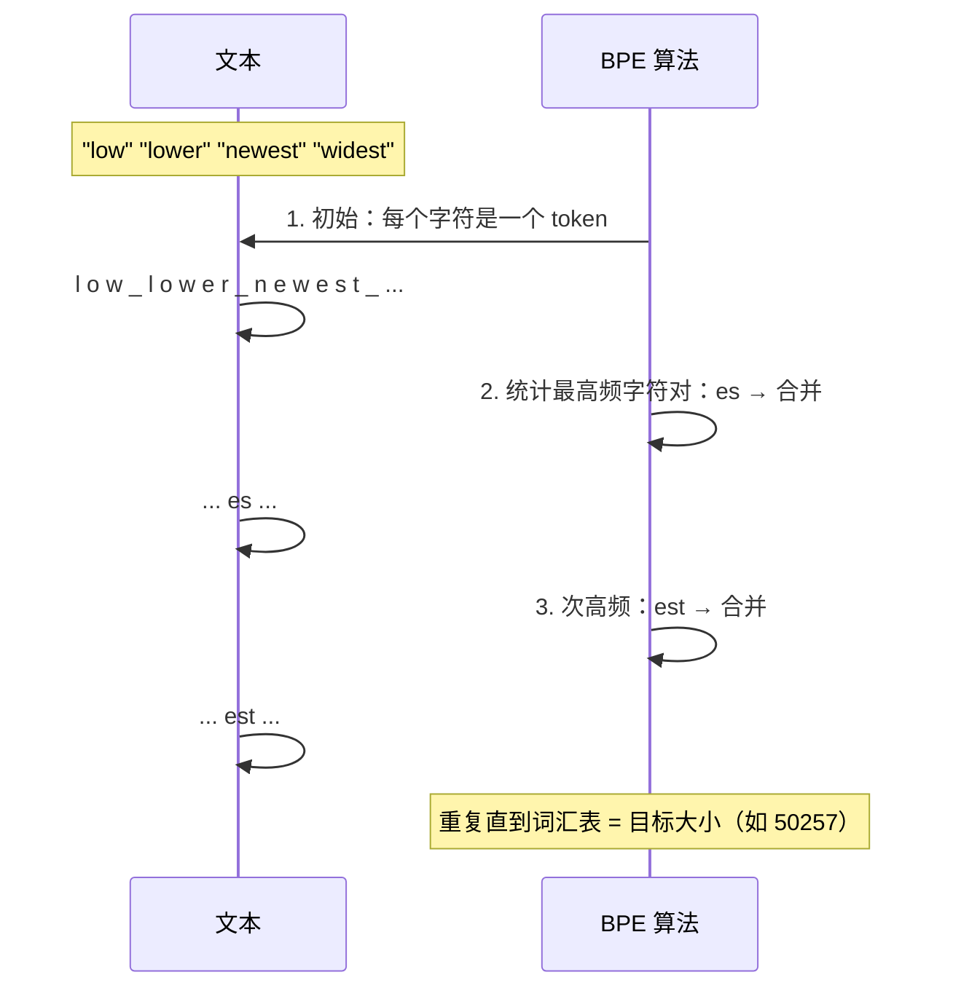

# 5.4 分词与数据处理

> 模型不识字——它只认识 Token。分词决定了模型看到的「语言」长什么样。

---

## 为什么需要分词

```
原始文本: "Hello, 世界！I love AI."
                ↓ Tokenizer
Token IDs:  [9906, 11, 1906, 100, 0, 40, 1107, 9552, 13]
```

> 💡 分词（Tokenization）= 把文本切分成模型可以理解的最小单元（Token），然后映射为数字 ID。

---

## 分词粒度对比



| 方式 | 词汇表大小 | 序列长度 | OOV 问题 |
|------|-----------|---------|---------|
| Word-level | 几十万 | 短 | 严重（新词无解） |
| Char-level | 几十 | 长 | 不存在 |
| **Subword** ⭐ | 3万~10万 | 适中 | 基本解决 |

---

## BPE 算法 — LLM 的事实标准

GPT 系列使用的分词算法是 BPE（Byte Pair Encoding）。

### 核心思想

> 统计文本中出现频率最高的「字符对」，合并为新 Token。重复直到词汇表达目标大小。



### 实际例子

```
输入: "unbelievably"
BPE:  un · believe · ably
     ↑    ↑         ↑
   前缀  词根      后缀

输入: "ChatGPT is amazing!"
GPT-2 Tokenizer → [20233, 8582, 374, 318, 16342, 0]
```

---

## 主流 Tokenizer

| Tokenizer | 使用方 | 词汇表大小 | 特点 |
|-----------|--------|-----------|------|
| BPE | GPT-2/3/4, Llama | 50k-100k | 最主流 |
| WordPiece | BERT | 30k | ## 标记子词开头 |
| SentencePiece | T5, Llama | 32k-128k | 语言无关，支持中文 |
| Unigram | XLNet | 概率选择 | — |

---

## 分词对 LLM 的影响

### 1. 语言公平性

```
"Hello world" → 2 tokens
"你好世界"    → 4 tokens  ← 中文需要更多 token！
```

> ⚠️ 大多数 Tokenizer 对中文效率低。中文字符每个可能是 1-3 个 token，英文单词可能 1 个 token。这在 API 计费和上下文窗口中影响很大。

### 2. 特殊 Token

| Token | ID | 含义 |
|-------|-----|------|
| `<|endoftext|>` | 50256 (GPT-2) | 文档结束标记 |
| `[CLS]` | 101 (BERT) | 分类头输入 |
| `[SEP]` | 102 (BERT) | 句子分隔 |
| `<|im_start|>` | — | Chat Template 的角色标记 |

---

## Chat Template — LLM 的格式化

现代对话模型需要对输入进行格式化：

```python
# 原始对话
messages = [
    {"role": "system", "content": "You are helpful."},
    {"role": "user", "content": "What is AI?"}
]

# Chat Template 格式化后
"""
<|im_start|>system
You are helpful.<|im_end|>
<|im_start|>user
What is AI?<|im_end|>
<|im_start|>assistant
"""
```

> 💡 Chat Template 是 SFT 和推理时都必须正确处理的关键环节。

---

## 实践：用 Hugging Face 分词

```python
from transformers import AutoTokenizer

# 加载 GPT-2 Tokenizer
tokenizer = AutoTokenizer.from_pretrained('gpt2')

# 编码
text = "Hello, world! AI is amazing."
tokens = tokenizer.encode(text)
print(f"Token IDs: {tokens}")
print(f"Token 文本: {[tokenizer.decode([t]) for t in tokens]}")
print(f"Token 数量: {len(tokens)}")

# 解码
decoded = tokenizer.decode(tokens)
print(f"解码: {decoded}")
```

---

## → 接下来

→ 🛠️ [[项目：文本分类]] — 用 BERT 做文本分类实战

或直接进入 LLM 的核心：

→ [[../06.大语言模型/6.1 GPT架构深度解析|LLM：GPT 架构深度解析]]
