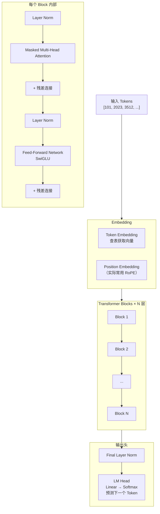
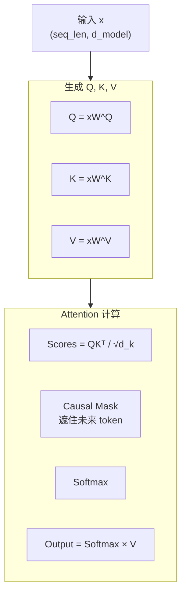
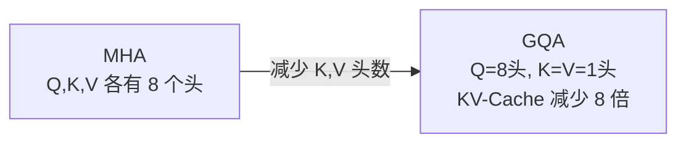
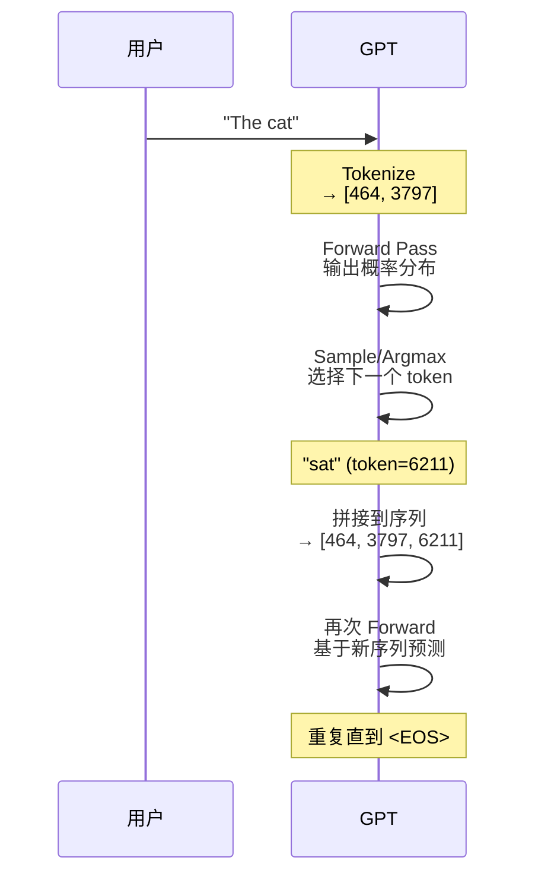

# 6.1 GPT 架构深度解析

> 彻底理解 GPT 的每一层在做什么，是整个学习路径中最关键的一块拼图。

---

## GPT 的宏观结构



---

## 逐层拆解

### 1. Token Embedding

```python
# 词汇表大小 V, 隐藏维度 d_model
token_embedding = nn.Embedding(vocab_size, d_model)
# 例如：GPT-3: vocab_size=50257, d_model=12288
```

### 2. 位置编码（RoPE — 现代标准）

> 传统位置编码（learned/sinusoidal）→ RoPE 通过旋转矩阵编码相对位置。

**核心思想**：不把位置信息加到向量里，而是在计算 Attention 时**旋转** Q 和 K 向量。

$$\tilde{q}_m = q_m \cdot R_m, \quad \tilde{k}_n = k_n \cdot R_n$$

旋转后的内积只依赖于相对位置 $m-n$：

$$\langle \tilde{q}_m, \tilde{k}_n \rangle = f(q_m, k_n, m-n)$$

---

### 3. Masked Multi-Head Self-Attention



**Causal Mask 矩阵**：

```
  t0  t1  t2  t3
t0 ✓   ✗   ✗   ✗    每个 token 只能看到
t1 ✓   ✓   ✗   ✗    自己和前面的 token
t2 ✓   ✓   ✓   ✗
t3 ✓   ✓   ✓   ✓
```

---

### 4. Feed-Forward Network (SwiGLU)

现代 GPT（如 Llama）使用 SwiGLU 变体：

$$\text{FFN}(x) = (xW_1 \odot \text{SiLU}(xW_g))W_2$$

| 组件 | 说明 |
|------|------|
| $W_1, W_g$ | 两个独立的升维矩阵（$d_{model} \to d_{ff}$） |
| $\text{SiLU}$ | SiLU/Swish 激活 |
| $\odot$ | 逐元素乘（门控） |
| $W_2$ | 降维矩阵（$d_{ff} \to d_{model}$） |

> 💡 SwiGLU 有两个升维矩阵而非一个，参数量略大，但效果明显更好。

---

## 关键改进：从原始 Transformer 到现代 GPT

| 组件 | 原始 (2017) | 现代 GPT |
|------|------------|---------|
| 激活函数 | ReLU | **GELU** / **SwiGLU** |
| 位置编码 | Sinusoidal | **RoPE** |
| Norm 位置 | Post-LN | **Pre-LN** |
| Attention | Multi-Head | **GQA** (Grouped Query) |
| FFN | 简单两层 | **SwiGLU** |

### Pre-Norm vs Post-Norm

```python
# Post-LN（原始）：注意力后做 Norm
x = LayerNorm(x + Attention(x))

# Pre-LN（现代）：注意力前做 Norm
x = x + Attention(LayerNorm(x))
```

> 💡 Pre-LN 训练更稳定，梯度流动更顺畅，是现代 LLM 的默认选择。

### GQA — 减少推理显存



> 📌 GQA 是现代推理优化的关键，详见 [[6.6 推理优化与量化]]

---

## GPT 语言建模的数学

GPT 的任务：**自回归语言建模**。

$$P(w_1, w_2, ..., w_n) = \prod_{t=1}^{n} P(w_t \mid w_1, ..., w_{t-1})$$

每一步预测下一个 token 的概率分布：

$$P(w_t \mid w_{<t}) = \text{softmax}(h_t W_{lm})$$

其中 $h_t$ 是经过 N 层 Transformer 后的隐藏表示。

**训练目标（最小化负对数似然）**：

$$\mathcal{L} = -\frac{1}{T}\sum_{t=1}^{T} \log P(w_t \mid w_{<t})$$

---

## 推理过程（自回归生成）



---

## 参数规模与配置

| 模型 | 层数 | d_model | Heads | 总参数 |
|------|------|--------|-------|--------|
| GPT-2 Small | 12 | 768 | 12 | 1.24亿 |
| GPT-2 XL | 48 | 1600 | 25 | 15亿 |
| GPT-3 | 96 | 12288 | 96 | 1750亿 |
| Llama-7B | 32 | 4096 | 32 | 70亿 |
| Llama-70B | 80 | 8192 | 64 | 700亿 |

> 📐 参数计算见 [[../09.工程实践/GPU与CUDA基础|工程：GPU 与 CUDA]]

---

## → 接下来

架构理解了，下一步是理解整个训练流程：

- [[6.2 预训练管线]] — 数据→训练→检查点
- [[6.3 指令微调SFT]] — 从语言模型到对话助手
- [[6.4 RLHF与偏好对齐]] — 让模型说人喜欢听的话
