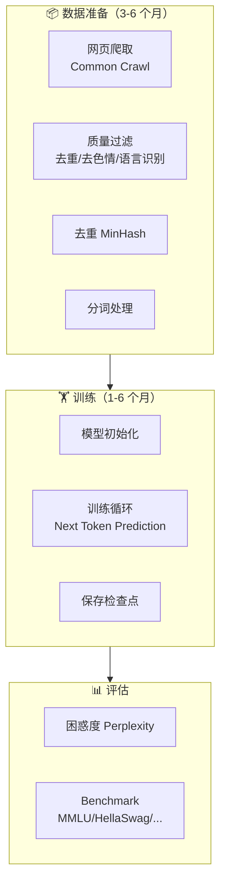
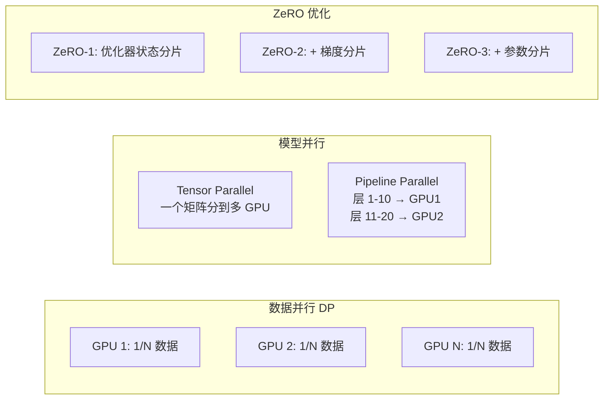

# 6.2 预训练管线

> LLM 预训练 = 用互联网级别的数据 + 数千张 GPU + 几个月时间，让模型学会语言的统计规律。

---

## 预训练全景

---

## 数据工程 — 预训练最耗时的一环

### 数据处理流水线

### 数据质量远重于数量

> 📌 **Chinchilla 定律**（DeepMind, 2022）：对于给定的计算预算，模型大小和数据量应该等比增长。

| 数据问题 | 影响 |
|---------|------|
| 低质量文本 | 模型学会生成废话 |
| 重复内容 | 模型开始背诵（而非理解） |
| 有毒内容 | 模型输出不安全言论 |
| 测试集泄露 | 评估分数虚高，欺骗自己 |

---

## 训练配置

### 关键超参数

| 参数 | 典型值 | 含义 |
|------|--------|------|
| Learning Rate | 1e-4 ~ 3e-4 | 太大不稳定，太小太慢 |
| Batch Size | 4M ~ 16M tokens | 全局 token 数（需梯度累积） |
| Warmup Steps | 2000 ~ 4000 | LR 从小开始线性增大 |
| Sequence Length | 2048 / 4096 / 8192 | 上下文窗口大小 |
| Optimizer | AdamW | Adam + 解耦权重衰减 |
| Weight Decay | 0.1 | L2 正则化强度 |
| Gradient Clip | 1.0 | 防止梯度爆炸 |

### 训练不稳定信号

| 信号 | 含义 | 处理 |
|------|------|------|
| Loss Spike（突然飙升） | 遇到了坏数据或训练不稳定 | 回滚到前一个检查点 |
| Loss 不下降 | 学习率不合适或数据有问题 | 调整 lr 或检查数据 |
| 梯度范数突增 | 即将出现 Spike | 减小 lr 或增大 clip |

---

## 分布式训练

单张 GPU 放不下 LLM，必须分布式：

> 💡 **DeepSpeed ZeRO-3** 是目前训练大模型最常用的策略，将模型参数、梯度、优化器状态分片到多张 GPU 上。

---

## 预训练成本估算

| 模型 | GPU | 训练时间 | 估算成本 |
|------|-----|---------|---------|
| GPT-3 (175B) | ~10K V100 | ~3 个月 | ~$460 万 |
| Llama-7B | 256 A100 | ~3 周 | ~$10 万 |
| Llama-70B | 1024 A100 | ~2 个月 | ~$200 万 |
| Llama 3 405B | 16K H100 | ~2 个月 | ~$5000 万+ |

> 💡 预训练对于个人开发者不是必要步骤——我们的重点是**微调和推理**。

---

## Chinchilla 最优配置

> 给定计算预算 $C$，存在使 Loss 最小的最优模型大小和数据量。

$$\text{最优 } N \approx \text{最优 } D \propto C^{0.5}$$

简单说：**别盲目堆参数，数据量要跟上。**

---

## → 接下来

预训练完成后，模型还不会对话。下一步：

→ [[6.3 指令微调SFT]] — 教会模型遵循指令
→ [[6.5 LoRA高效微调]] — 低成本微调实践
