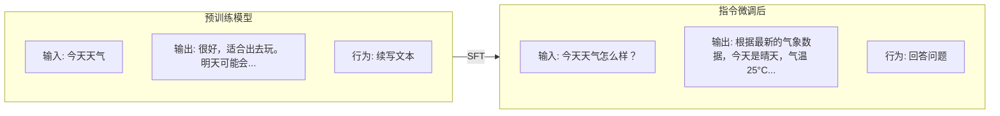
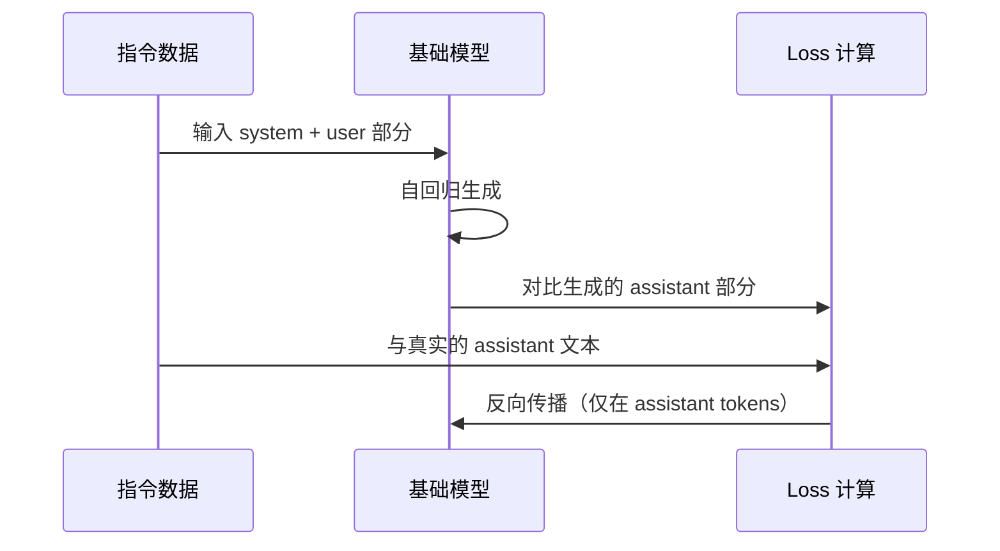
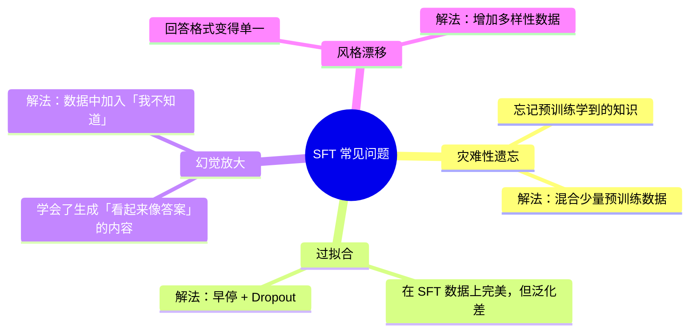

# 6.3 指令微调 SFT

> 预训练让模型「会说话」，SFT 让模型「会听话」。

---

## 预训练模型 vs 指令微调模型



> 💡 预训练模型只是学会了「给定上文续写下文」，它不理解「问答」和「指令」的概念。SFT 教会它这些。

---

## SFT 的核心：指令数据集

### 数据格式

```jsonl
{"messages": [
  {"role": "system", "content": "你是一个有帮助的助手。"},
  {"role": "user", "content": "什么是机器学习？"},
  {"role": "assistant", "content": "机器学习是人工智能的一个分支..."}
]}

{"messages": [
  {"role": "user", "content": "写一首关于春天的诗"},
  {"role": "assistant", "content": "春风拂面暖，花开满园香..."}
]}
```

### SFT 的 Chat Template

```
<|im_start|>system
你是一个有帮助的助手。<|im_end|>
<|im_start|>user
什么是机器学习？<|im_end|>
<|im_start|>assistant
机器学习是人工智能的一个分支...<|im_end|>
```

> ⚠️ **只在 `assistant` 部分计算 Loss！** 这是 SFT 训练的关键细节。

---

## SFT 的训练过程



### 实现要点

```python
# SFT 的关键：只在 assistant tokens 上计算 loss
def sft_loss(logits, labels, mask):
    """
    logits: (batch, seq_len, vocab_size)
    labels: (batch, seq_len)
    mask:   (batch, seq_len) - 1 for assistant tokens, 0 otherwise
    """
    shift_logits = logits[..., :-1, :].contiguous()
    shift_labels = labels[..., 1:].contiguous()
    shift_mask = mask[..., 1:].contiguous()
    
    loss = F.cross_entropy(
        shift_logits.view(-1, shift_logits.size(-1)),
        shift_labels.view(-1),
        reduction='none'
    )
    
    loss = loss.view(shift_mask.shape)
    loss = (loss * shift_mask).sum() / shift_mask.sum()  # 只在 assistant 上
    
    return loss
```

---

## SFT 数据的质量原则

| 原则 | 说明 |
|------|------|
| **多样性** | 覆盖不同任务类型（QA/摘要/代码/翻译/创作） |
| **高质量** | 回答准确、格式规范、没有矛盾 |
| **一致性** | 相似的问题应该有相似的风格 |
| **真实性** | 不要捏造事实（幻觉会通过 SFT 被放大） |
| **适度规模** | 几千到几万条就够了，不用海量 |

> 💡 SFT 数据的关键是**质量而非数量**。1000 条精心标注的数据胜过 10 万条噪声数据。

---

## SFT 的常见问题



---

## 实践工具：Hugging Face TRL

```python
from transformers import AutoModelForCausalLM, AutoTokenizer
from trl import SFTTrainer, DataCollatorForCompletionOnlyLM
from datasets import load_dataset
from peft import LoraConfig

# 加载基座模型
model = AutoModelForCausalLM.from_pretrained("meta-llama/Llama-2-7b-hf")
tokenizer = AutoTokenizer.from_pretrained("meta-llama/Llama-2-7b-hf")

# SFT Trainer
trainer = SFTTrainer(
    model=model,
    tokenizer=tokenizer,
    train_dataset=dataset,
    max_seq_length=2048,
    # LoRA 配置（省显存）
    peft_config=LoraConfig(
        r=16,
        lora_alpha=32,
        target_modules=["q_proj", "v_proj", "k_proj", "o_proj"],
        lora_dropout=0.05,
    ),
)

trainer.train()
```

> 📌 上面用了 LoRA，详细见 [[6.5 LoRA高效微调]]

---

## → 接下来

SFT 让模型会对话，但回答可能不符合人类偏好。下一步：

→ [[6.4 RLHF与偏好对齐]] — 让模型说「人喜欢听」的话
→ 🛠️ [[项目：微调一个中文LLM]] — 动手微调
