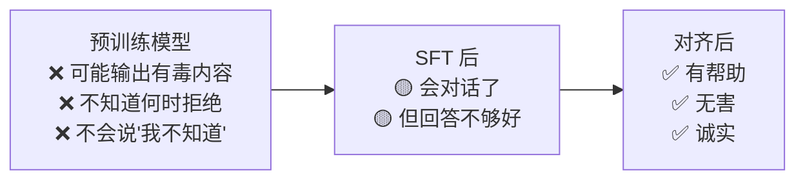
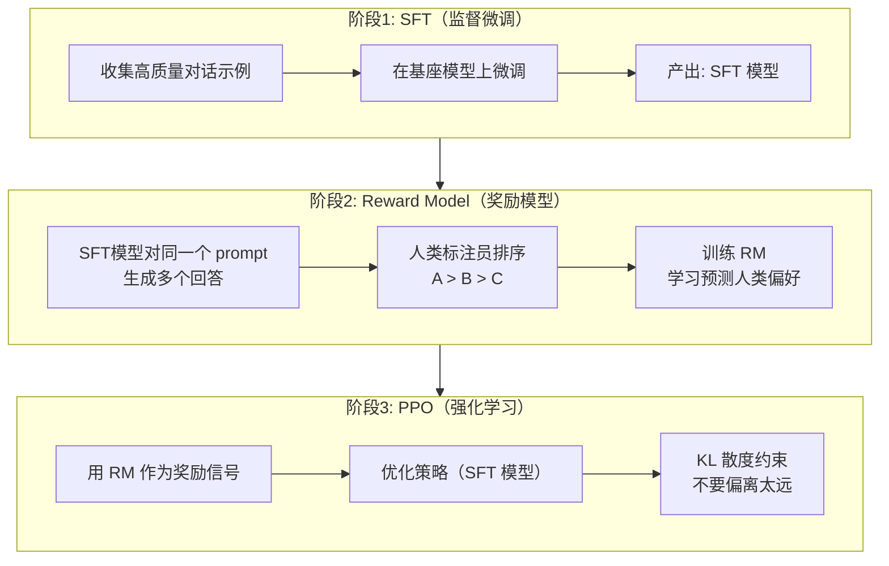
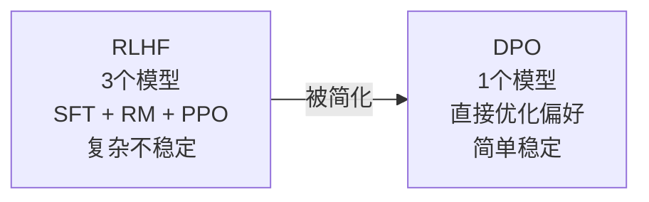
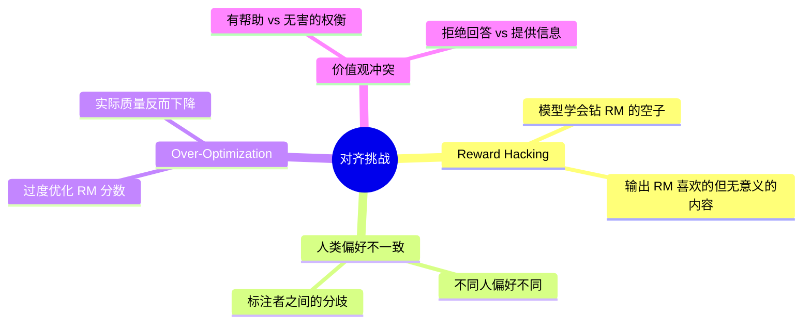

# 6.4 RLHF 与偏好对齐

> ChatGPT 的成功，RLHF 功不可没。它让模型从「能回答」变成「回答得好」。

---

## 为什么需要对齐



> 💡 对齐（Alignment）= 让模型的行为符合人类的价值观和偏好。

---

## RLHF 完整流程



---

## 阶段 2：Reward Model

### 如何训练

```
Prompt: 解释什么是黑洞

Response A: 黑洞是时空中的一个区域，引力极强... ✅ (排名 1)
Response B: 黑洞就是黑的洞...                          (排名 3)
Response C: 黑洞是一种天体，质量极大... ✅              (排名 2)
```

Reward Model 学习给 A 的打分 > C > B。

### Loss 函数（Bradley-Terry 模型）

$$\mathcal{L}_{RM} = -\mathbb{E}_{(x, y_w, y_l)}[\log \sigma(r_\theta(x, y_w) - r_\theta(x, y_l))]$$

> 💡 就是让好回答和差回答之间的得分差距尽可能大。

---

## 阶段 3：PPO 训练

### 目标函数

$$\max_\theta \mathbb{E}_{x\sim\mathcal{D}, y\sim\pi_\theta(y|x)}[r_\phi(x,y) - \beta \cdot D_{KL}(\pi_\theta(y|x) \parallel \pi_{\text{SFT}}(y|x))]$$

| 项 | 含义 |
|-----|------|
| $r_\phi(x,y)$ | RM 给的奖励（越大越好） |
| $-\beta\cdot D_{KL}$ | KL 惩罚（不要偏离 SFT 太远） |
| $\beta$ | 平衡系数 |

> 💡 **KL 惩罚是关键**：没有它的话，模型会为了最大化奖励而胡言乱语（reward hacking）。

---

## DPO — 更简单的替代方案

2023 年，Stanford 提出 DPO（Direct Preference Optimization），**不需要训练独立的 RM**：



### DPO 的核心思想

直接从偏好数据中优化策略：

$$\mathcal{L}_{DPO} = -\mathbb{E}_{(x, y_w, y_l)}\left[\log\sigma\left(\beta\log\frac{\pi_\theta(y_w|x)}{\pi_{\text{ref}}(y_w|x)} - \beta\log\frac{\pi_\theta(y_l|x)}{\pi_{\text{ref}}(y_l|x)}\right)\right]$$

> 💡 DPO 让好的回答在模型眼中的概率上升，差的下降，同时以 SFT 模型为参考（不跑偏）。

---

## RLHF vs DPO 对比

| | RLHF (PPO) | DPO |
|------|-----------|-----|
| 需要训练 RM | ✅ 需要 | ❌ 不需要 |
| 训练复杂度 | 高（3-4 个模型） | 低（1 个模型） |
| 训练稳定性 | 不稳定（需要调参） | 稳定 |
| 理论上限 | 可能更高 | 受偏好数据质量限制 |
| 适用场景 | 大规模工业 | 中小规模、实验 |

---

## 对齐的挑战



---

## → 接下来

- [[6.5 LoRA高效微调]] — 如何用一张消费级显卡微调 LLM
- 🛠️ [[项目：微调一个中文LLM]] — 实践 SFT + DPO
