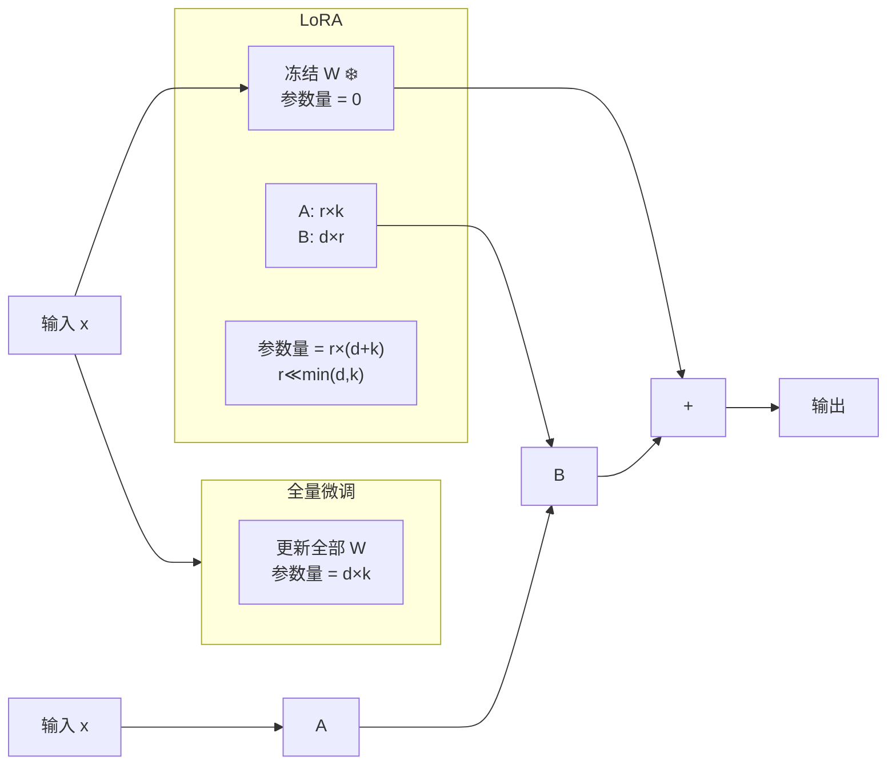

# 6.5 LoRA 高效微调

> 全量微调 70B 模型需要 140GB 显存。LoRA 让你在 24GB 消费级显卡上微调。

---

## 核心思想

原始模型权重 $W \in \mathbb{R}^{d \times k}$ 保持不变。添加可训练的「低秩适配器」：

$$W' = W + \Delta W = W + B A$$

其中 $B \in \mathbb{R}^{d \times r}$, $A \in \mathbb{R}^{r \times k}$, $r \ll \min(d, k)$



---

## 参数量对比

| 模型 | 原始参数 | LoRA 参数 (r=16) | 减少比例 |
|------|---------|------------------|---------|
| Llama-7B | 70亿 | ~840万 | **~99.88%** |
| Llama-70B | 700亿 | ~840万 | **~99.99%** |

> 💡 LoRA 增加的参数量只占原始模型的不到 0.1%，但效果接近全量微调。

---

## 哪些层加 LoRA？

通常加在 Attention 的 Q、K、V、O 投影矩阵上：

```python
target_modules = ["q_proj", "k_proj", "v_proj", "o_proj"]
```

也可以扩展到 FFN：

```python
target_modules = ["q_proj", "k_proj", "v_proj", "o_proj", 
                  "gate_proj", "up_proj", "down_proj"]
```

---

## 关键超参数

| 参数 | 含义 | 建议 |
|------|------|------|
| **r** | 低秩维度 | 8-64，一般 16 就够 |
| **lora_alpha** | 缩放系数 | 通常设为 r 的 2 倍 |
| **lora_dropout** | Dropout 比例 | 0.05-0.1 |
| **target_modules** | 哪些层加 LoRA | QKV 至少，全加更好 |

### 有效学习率

$$\text{effective\_lr} = \text{base\_lr} \times \frac{\text{lora\_alpha}}{r}$$

---

## QLoRA — 更进一步

> 在 4-bit 量化模型上做 LoRA，**让 65B 模型在一张 48GB 显卡上微调**。

```python
from transformers import BitsAndBytesConfig

# 4-bit 量化配置
bnb_config = BitsAndBytesConfig(
    load_in_4bit=True,
    bnb_4bit_quant_type="nf4",           # NormalFloat4 量化
    bnb_4bit_compute_dtype=torch.bfloat16, # 计算用 BF16
    bnb_4bit_use_double_quant=True,      # 双重量化
)

model = AutoModelForCausalLM.from_pretrained(
    "meta-llama/Llama-2-70b-hf",
    quantization_config=bnb_config,
    device_map="auto",
)
```

| 技术 | 显存需求 | 70B 模型微调 |
|------|---------|------------|
| 全量微调 | 140 GB+ | 8× A100 |
| LoRA | ~48 GB | 2× A100 |
| **QLoRA** | ~24 GB | 1× RTX 4090 ✅ |

---

## 实践示例

详见 🛠️ [[项目：微调一个中文LLM]]

---

## LoRA 的数学本质

LoRA 利用了 **SVD**（奇异值分解）的思想：

> 模型微调时的权重更新 $\Delta W$ 通常是**低秩**的——即不需要更新所有权重方向，只需要更新少数最重要的方向。

$$W' = W + BA \approx W + U_r \Sigma_r V_r^\top$$

---

## 训练后合并

LoRA 适配器可以合并回原模型权重，推理时无额外开销：

```python
model = model.merge_and_unload()
# 现在 model 就是普通的模型了，权重已包含 LoRA
```

---

## → 接下来

- 🛠️ [[项目：微调一个中文LLM]] — 用 LoRA/QLoRA 微调一个中文模型
- [[6.6 推理优化与量化]] — 微调完了怎么高效部署
