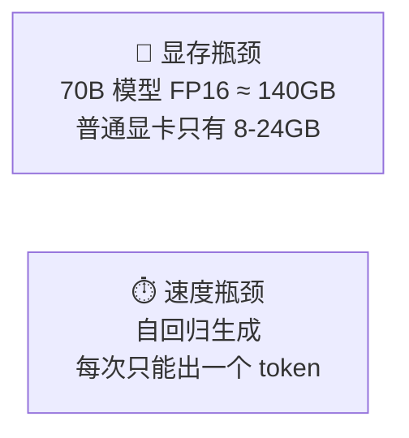
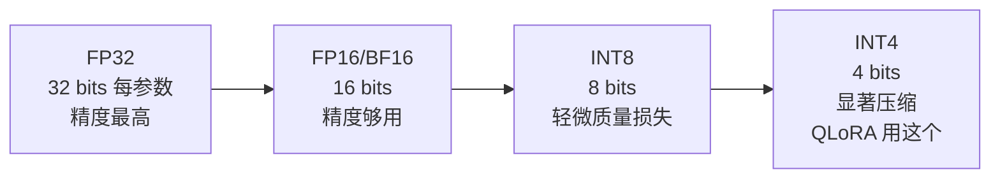
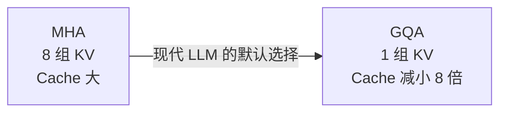
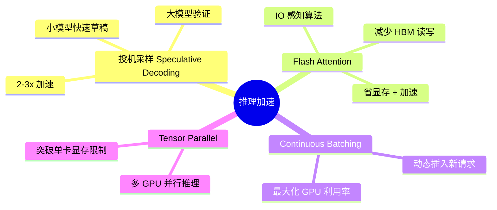

# 6.6 推理优化与量化

> 训练好的模型，怎么跑得快、显存少、响应及时？

---

## 推理的两大瓶颈



---

## 量化：让模型变小

### 核心思想

> 把模型参数从高精度（FP16/FP32）压缩到低精度（INT8/INT4），减少显存和计算量。



---

## 量化方法对比

| 方法 | 精度 | 70B 显存 | 实现 |
|------|------|---------|------|
| FP16 | 无损失 | ~140 GB | 原生 |
| **GPTQ** | INT4/INT8 | ~35 GB | 一次性量化 |
| **GGUF** | INT4/INT8 | ~35 GB | llama.cpp ⭐ |
| **AWQ** | INT4 | ~35 GB | 激活感知量化 |
| **BitsAndBytes** | NF4 | ~35 GB | HuggingFace 集成 |

### GPTQ vs GGUF

| | GPTQ | GGUF (llama.cpp) |
|------|------|-------------------|
| 运行位置 | GPU | CPU / GPU 混合 |
| 速度 | GPU 上更快 | CPU 友好 |
| 生态 | vLLM, TGI | Ollama, LM Studio |
| 场景 | 服务端 | 本地/消费级硬件 |

---

## KV-Cache — 推理加速的关键

自回归生成时，如果不优化，每一步都要重新计算所有之前 token 的 K 和 V：

```
Step 1: 计算 K₁V₁                    → 输出 "sat"
Step 2: 计算 K₁V₁, K₂V₂              → 输出 "on"
Step 3: 计算 K₁V₁, K₂V₂, K₃V₃        → 输出 "the"
...
```

> 💡 **KV-Cache** 把已经算好的 K,V 存起来，每步只算新 token 的 K,V，节省大量计算。

### GQA 减少 KV-Cache



---

## 主流推理框架

| 框架 | 特点 | 适用场景 |
|------|------|---------|
| **vLLM** | PagedAttention, 吞吐量极高 | 服务端高并发 ⭐ |
| **llama.cpp** | CPU/GPU 混合，GGUF | 本地运行 |
| **Ollama** | 基于 llama.cpp，一键部署 | 个人使用 ⭐ |
| **TGI** (HuggingFace) | 功能全，与 HF 生态集成 | 生产环境 |
| **SGLang** | 结构化生成，RadixAttention | 结构化输出 |
| **LM Studio** | GUI 界面，零代码 | 非技术用户 |

---

## 推理加速技术



---

## Ollama 快速部署

```bash
# 拉取模型（自动下载量化版）
ollama pull qwen2:7b

# 运行
ollama run qwen2:7b

# API 模式
ollama serve
# 然后访问 http://localhost:11434/api/generate
```

```python
# Python 调用
import requests

response = requests.post('http://localhost:11434/api/generate', json={
    'model': 'qwen2:7b',
    'prompt': '什么是机器学习？',
    'stream': False
})
print(response.json()['response'])
```

> 📌 完整部署见 🛠️ [[项目：部署个人LLM服务]]

---

## → 接下来

- 🛠️ [[项目：部署个人LLM服务]] — 把模型部署成 API 服务
- [[6.7 提示工程]] — 如何更好地和 LLM 对话
