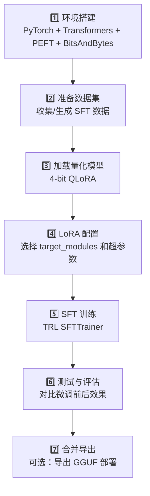

# 🛠️ 项目：微调一个中文 LLM

> 用 QLoRA 在一张消费级显卡上微调开源中文大模型。

---

## 项目目标

选择一个小型中文 LLM（如 Qwen2-7B 或 MiniCPM），用自己的数据微调。推荐场景：
- 让模型学会特定领域的知识
- 让模型模仿自己的写作风格
- 训练模型执行特定任务

---

## 项目流程



---

## 1. 环境搭建

```bash
pip install torch transformers datasets accelerate peft trl bitsandbytes
pip install xformers --index-url https://download.pytorch.org/whl/cu121  # 可选加速
```

```python
import torch
from transformers import (
    AutoModelForCausalLM, 
    AutoTokenizer, 
    BitsAndBytesConfig,
    TrainingArguments
)
from peft import LoraConfig, get_peft_model, prepare_model_for_kbit_training
from trl import SFTTrainer
from datasets import Dataset
import json
```

---

## 2. 准备数据集

### 格式要求

```jsonl
{"messages": [{"role": "user", "content": "什么是机器学习？"}, {"role": "assistant", "content": "机器学习是..."}]}
{"messages": [{"role": "user", "content": "写一首诗"}, {"role": "assistant", "content": "春风..."}]}
```

### 生成训练数据

```python
def create_conversation(user_msg, assistant_msg):
    return {
        "messages": [
            {"role": "user", "content": user_msg},
            {"role": "assistant", "content": assistant_msg}
        ]
    }

# 你的训练数据
train_data = [
    create_conversation("你好", "你好！有什么我可以帮助你的吗？"),
    create_conversation("什么是Python？", "Python 是一种高级编程语言..."),
    # ... 至少准备 500-1000 条
]

dataset = Dataset.from_list(train_data)
```

---

## 3. 加载量化模型

```python
model_name = "Qwen/Qwen2-7B-Instruct"  # 或其他中文模型

# 4-bit 量化配置
bnb_config = BitsAndBytesConfig(
    load_in_4bit=True,
    bnb_4bit_quant_type="nf4",
    bnb_4bit_compute_dtype=torch.bfloat16,
    bnb_4bit_use_double_quant=True,
)

model = AutoModelForCausalLM.from_pretrained(
    model_name,
    quantization_config=bnb_config,
    device_map="auto",
    trust_remote_code=True,  # Qwen 需要
    torch_dtype=torch.bfloat16,
)

# 为 QLoRA 准备模型
model = prepare_model_for_kbit_training(model)
model.config.use_cache = False  # 训练时关闭 KV-Cache

tokenizer = AutoTokenizer.from_pretrained(
    model_name, 
    trust_remote_code=True,
    padding_side="right",
)
tokenizer.pad_token = tokenizer.eos_token
```

---

## 4. LoRA 配置

```python
lora_config = LoraConfig(
    r=16,                     # 低秩维度
    lora_alpha=32,            # 缩放系数
    target_modules=[
        "q_proj", "k_proj", "v_proj", "o_proj",
        "gate_proj", "up_proj", "down_proj",
    ],
    lora_dropout=0.05,
    bias="none",
    task_type="CAUSAL_LM",
)

model = get_peft_model(model, lora_config)
model.print_trainable_parameters()
# 输出: trainable params: ~8.4M || all params: ~7.6B || trainable%: 0.11%
```

---

## 5. 训练

```python
training_args = TrainingArguments(
    output_dir="./qwen2-lora-finetuned",
    num_train_epochs=3,
    per_device_train_batch_size=4,  # 根据显存调整
    gradient_accumulation_steps=4,  # 模拟更大 batch
    learning_rate=2e-4,
    warmup_steps=100,
    logging_steps=10,
    save_steps=200,
    save_total_limit=2,
    fp16=False,
    bf16=True,                     # 有 BF16 就用
    optim="paged_adamw_8bit",      # 省显存
    report_to="none",
    remove_unused_columns=False,
)

trainer = SFTTrainer(
    model=model,
    tokenizer=tokenizer,
    args=training_args,
    train_dataset=dataset,
    max_seq_length=1024,  # 根据你的数据长度调整
    dataset_text_field="messages",  # 或用 formatting_func
)

# 🚀 开始训练！
trainer.train()
```

---

## 6. 测试对比

```python
def generate_response(model, tokenizer, prompt, max_length=512):
    messages = [{"role": "user", "content": prompt}]
    text = tokenizer.apply_chat_template(
        messages, tokenize=False, add_generation_prompt=True
    )
    inputs = tokenizer(text, return_tensors="pt").to(model.device)
    
    outputs = model.generate(
        **inputs,
        max_new_tokens=max_length,
        temperature=0.7,
        do_sample=True,
        top_p=0.9,
    )
    response = tokenizer.decode(outputs[0], skip_special_tokens=True)
    return response.split("assistant")[-1].strip()

# 测试
test_prompts = [
    "解释一下什么是深度学习",
    "用 Python 写一个快速排序",
    "你的训练数据覆盖的主题...",
]

for prompt in test_prompts:
    print(f"Q: {prompt}")
    print(f"A: {generate_response(model, tokenizer, prompt)}")
    print("-" * 50)
```

---

## 7. 保存与导出

```python
# 保存 LoRA 适配器
model.save_pretrained("./my_lora_adapter")
tokenizer.save_pretrained("./my_lora_adapter")

# 合并并保存完整模型（可选）
merged_model = model.merge_and_unload()
merged_model.save_pretrained("./my_merged_model")
tokenizer.save_pretrained("./my_merged_model")

# 如需导出 GGUF（用于 Ollama）
# 用 llama.cpp 的 convert.py 工具转换
```

---

## 常见问题

| 问题 | 原因 | 解决 |
|------|------|------|
| 显存不足 OOM | batch_size 太大 | 减小 batch_size，增大 gradient_accumulation |
| Loss 不下降 | 学习率不合适 | 尝试 1e-4 到 5e-4 |
| 输出重复 | 训练过拟合 | 减少 epoch，增大 lora_dropout |
| 模型忘了预训练知识 | 灾难性遗忘 | 混合少量通用数据 |
| 中文乱码 | Tokenizer 配置 | 确保 trust_remote_code=True |

---

## 总结模板

```markdown
## 项目总结：微调中文 LLM

### 基座模型: ___
### 训练数据量: ___ 条
### 训练时间: ___ 分钟
### 微调后效果: 【对比描述】
```

---

## → 下一步

→ [[项目：部署个人LLM服务]] — 把模型部署起来
→ [[../07.RAG检索增强生成/7.1 RAG原理与架构|RAG：知识增强]]
