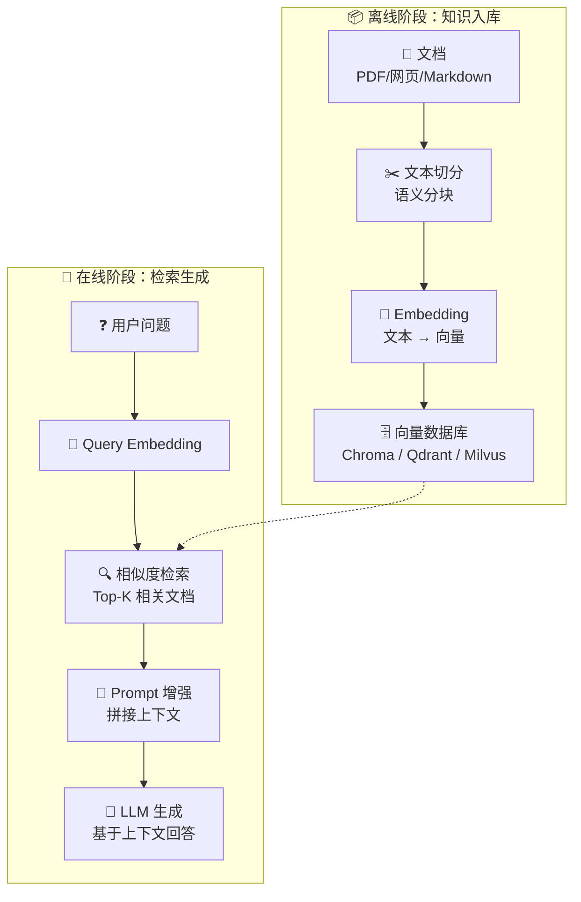
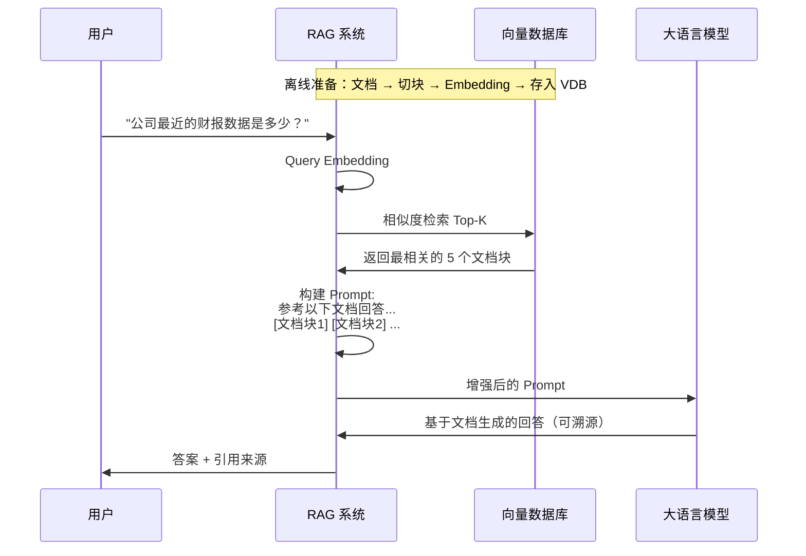
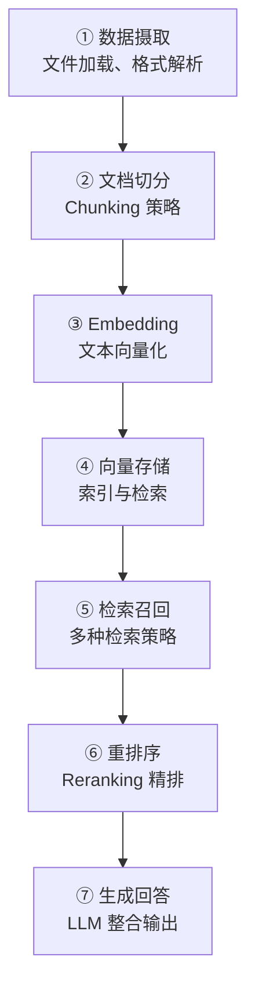

# 7.1 RAG 原理与架构

> LLM 的知识有时间限制，会「幻觉」。RAG 通过外部知识库让模型的回答更准确、更新、可溯源。

---

## 为什么需要 RAG

| 问题 | 不用 RAG | 用 RAG |
|------|---------|--------|
| 最新信息 | "我的知识截止于..." | 实时检索最新文档 |
| 私有数据 | 无法访问企业内部知识 | 检索内部文档 |
| 事实准确性 | 容易「幻觉」编造 | 基于检索到的原文 |
| 可溯源性 | 不知道来源 | 可以标注引用来源 |

---

## RAG 完整架构

---

## 核心流程详解

---

## RAG 的七层架构

---

## Naive RAG vs Advanced RAG

| | Naive RAG | Advanced RAG |
|------|-----------|-------------|
| 检索次数 | 一次 | 多轮迭代 |
| 查询方式 | 原始问题 | Query 改写/扩展 |
| 检索策略 | 单一向量检索 | 混合检索（密集+稀疏+关键词） |
| 排序 | 仅相似度 | 重排序 Reranker |
| 上下文处理 | 直接拼接 | 上下文压缩/摘要 |

---

## 关键设计决策

| 决策点 | 选项 | 考量 |
|--------|------|------|
| Chunk 大小 | 256/512/1024 tokens | 太小缺上下文，太大不精准 |
| 重叠窗口 | 10%-20% | 防止信息被切断 |
| 检索数量 Top-K | 3-10 | 太少漏信息，太多 noise |
| 相似度阈值 | 0.7-0.85 | 太低返回不相关内容 |
| Embedding 维度 | 768/1024/1536 | 越高越精准，越慢越贵 |

---

## RAG 评估指标

| 指标 | 衡量什么 |
|------|---------|
| **Hit Rate** | 正确答案是否在 Top-K 中 |
| **MRR** (平均倒数排名) | 正确答案排在多前面 |
| **Faithfulness** | 生成内容是否忠实于检索到的文档 |
| **Answer Relevance** | 回答是否切题 |

---

## → 接下来

- [[7.2 Embedding与向量库]] — 选型与实操
- [[7.3 文档处理与切分]] — Chunking 策略详解
- 🛠️ [[项目：构建知识库问答系统]] — 完整 RAG 实现
