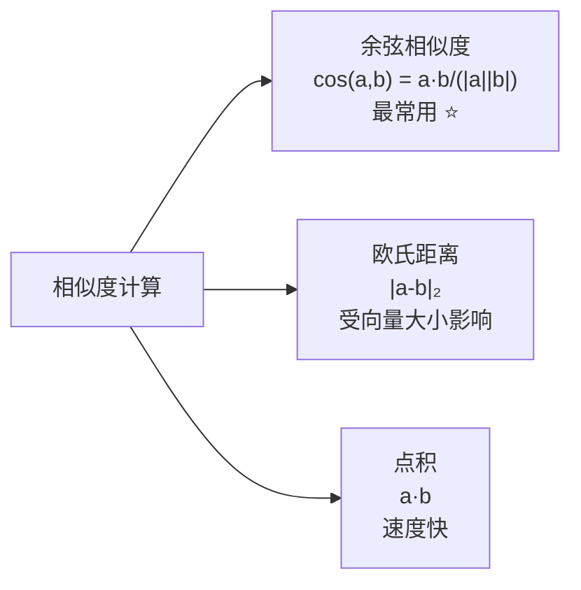
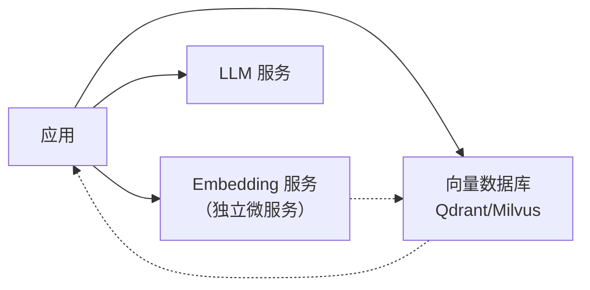

# 7.2 Embedding 与向量库

> RAG 的基础设施：把文本变成向量，找到最相关的。

---

## Embedding 模型选型

| 模型 | 维度 | 最大长度 | 语言 | 成本 |
|------|------|---------|------|------|
| OpenAI text-embedding-3-small | 1536 | 8191 | 多语言 | 付费 |
| **BGE-M3** (BAAI) | 1024 | 8192 | 中英 ⭐ | 免费 |
| **m3e-base** (Moka) | 768 | 512 | 中文 | 免费 |
| Jina Embeddings v2 | 768 | 8192 | 中英 | 免费额度 |
| **GTE-Qwen2-7B** | 3584 | 32K | 中英 | 免费(需GPU) |

---

## 向量相似度计算方法



| 方法 | 何时用 |
|------|--------|
| **余弦相似度** | 默认选择，不受向量长度影响 |
| 欧氏距离 | 向量已被归一化时 |
| 点积 | 速度优先，已归一化 |

---

## 向量数据库对比

| 数据库 | 类型 | 适用规模 | 特点 |
|--------|------|---------|------|
| **Chroma** | 嵌入式 | 小-中 | 最简单，Python 原生 ⭐ |
| **Qdrant** | 独立服务 | 中-大 | Rust 编写，性能好 |
| **Milvus** | 分布式 | 大-超大 | 企业级，支持十亿级向量 |
| FAISS | 库 | 小-中 | Meta 出品，纯本地 |
| Pinecone | 云服务 | 中-大 | 全托管，零运维 |
| LanceDB | 嵌入式 | 小-中 | 基于 Lance 格式 |

---

## Chroma 快速上手

```python
import chromadb

# 创建客户端
client = chromadb.PersistentClient(path="./my_vectordb")

# 创建集合
collection = client.create_collection(
    name="my_docs",
    metadata={"hnsw:space": "cosine"}  # 余弦相似度
)

# 添加文档
collection.add(
    documents=[
        "机器学习是人工智能的一个分支...",
        "深度学习使用多层神经网络...",
        "Transformer 架构于 2017 年提出...",
    ],
    metadatas=[
        {"source": "ml_intro.pdf", "page": 1},
        {"source": "dl_intro.pdf", "page": 3},
        {"source": "transformer_paper.pdf", "page": 1},
    ],
    ids=["doc1", "doc2", "doc3"],
)

# 查询
results = collection.query(
    query_texts=["什么是 Transformer？"],
    n_results=2,
)

for i, doc in enumerate(results['documents'][0]):
    print(f"排名 {i+1} - 距离: {results['distances'][0][i]:.4f}")
    print(f"内容: {doc[:200]}...")
    print(f"来源: {results['metadatas'][0][i]}")
    print()
```

---

## 使用 Hugging Face Embedding

```python
from sentence_transformers import SentenceTransformer

# 加载 BGE 中文模型
model = SentenceTransformer("BAAI/bge-small-zh-v1.5")

# 文档 Embedding
documents = [
    "机器学习是人工智能的一个分支",
    "深度学习使用多层神经网络",
]

# 为文档添加前缀（BGE 要求）
docs_with_prefix = [f"为这个句子生成表示以用于检索相关文章：{d}" for d in documents]
doc_embeddings = model.encode(docs_with_prefix, normalize_embeddings=True)

# 查询 Embedding
query = "什么是神经网络？"
query_with_prefix = f"为这个句子生成表示以用于检索相关文章：{query}"
query_embedding = model.encode(query_with_prefix, normalize_embeddings=True)

# 计算相似度
similarities = model.similarity(query_embedding, doc_embeddings)
print(f"相似度: {similarities}")
```

---

## 生产环境架构



---

## → 接下来

- [[7.3 文档处理与切分]] — Chunking 是 RAG 最难的部分
- 🛠️ [[项目：构建知识库问答系统]] — 实战搭建
