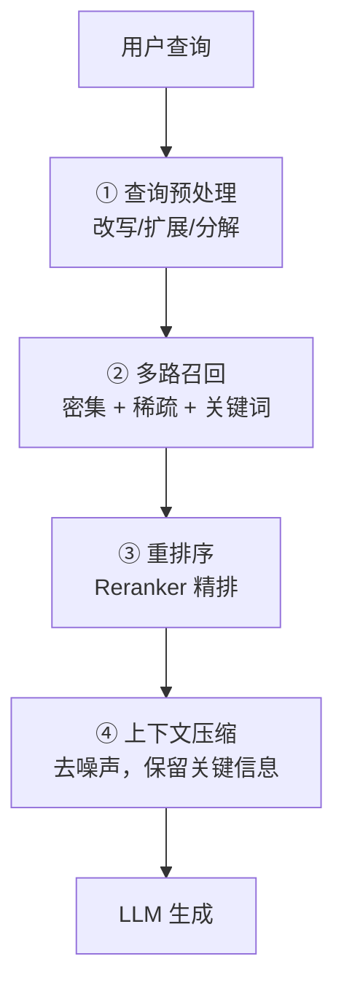
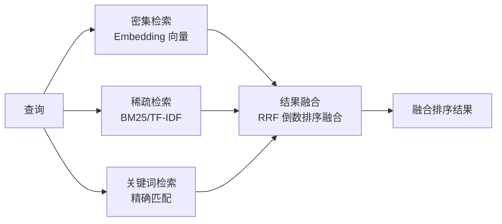

# 7.4 检索优化策略

> 向量检索只是起点。真正的 RAG 需要多层检索优化。

---

## 检索优化的层次



---

## ① 查询预处理

### Query 改写

```
原始: "AI 最近有什么进展？"
改写: "2025-2026年人工智能领域的最新研究进展和突破"
```

### Query 扩展（HyDE）

> 用 LLM 先根据问题生成一个理想答案，再用这个答案去检索。

```python
# HyDE: Hypothetical Document Embeddings
query = "如何防止模型过拟合？"

# 生成「假设性答案」
hypothetical_answer = llm.generate(
    f"请简要回答：{query}"
)
# → "防止过拟合的方法包括：使用正则化(L1/L2)、Dropout、早停..."

# 用假设答案的 Embedding 去检索（比用问题本身效果好！）
hyde_embedding = embed(hypothetical_answer)
results = vector_db.search(hyde_embedding)
```

---

## ② 多路召回



### RRF（Reciprocal Rank Fusion）

$$\text{RRF}(d) = \sum_{r \in R} \frac{1}{k + \text{rank}_r(d)}$$

> 💡 不同检索方法的结果不一定可比（分数量纲不同）。RRF 用排名来融合，简单有效。

---

## ③ 重排序 Reranker

向量相似度是粗排，Reranker 是精排：

```python
from sentence_transformers import CrossEncoder

# Cross-Encoder 比 Bi-Encoder 更精准（但更慢）
reranker = CrossEncoder("BAAI/bge-reranker-large")

# 对召回结果打分
pairs = [[query, doc] for doc in retrieved_docs]
scores = reranker.predict(pairs)

# 按分数重排
ranked = sorted(
    zip(scores, retrieved_docs), 
    key=lambda x: x[0], 
    reverse=True
)
```

| | Bi-Encoder (检索阶段) | Cross-Encoder (重排阶段) |
|------|----------------------|------------------------|
| 输入 | query + doc 分别编码 | query + doc 联合编码 |
| 速度 | 快（可预计算 doc） | 慢（每对都要算） |
| 精度 | 较低 | 较高 |
| 用途 | 粗排 Top-N 召回 | Top-K 精排 |

---

## ④ 上下文压缩

检索到太多内容时，先用小模型/摘要压缩：

```python
def compress_context(query, retrieved_docs, max_tokens=1024):
    """压缩检索结果，只保留与查询最相关的内容"""
    
    # 方案 1：只取前 N 个最相关的
    compressed = retrieved_docs[:5]
    
    # 方案 2：用 LLM 摘录相关句（LLMLingua 等工具）
    # 方案 3：Reranker 后取 top-k
    
    return compressed
```

---

## 调优检查清单

| 阶段 | 检查项 |
|------|--------|
| 查询 | 是否需要改写/扩展？ |
| 检索 | Top-K 够不够？多路召回了没？ |
| 排序 | Reranker 加了没？ |
| 上下文 | Token 是否超出 LLM 窗口？噪声多吗？ |
| 评估 | Hit Rate 达标吗？幻觉率高吗？ |

---

## → 接下来

🛠️ [[项目：构建知识库问答系统]] — 把这些优化策略用在实际项目中
