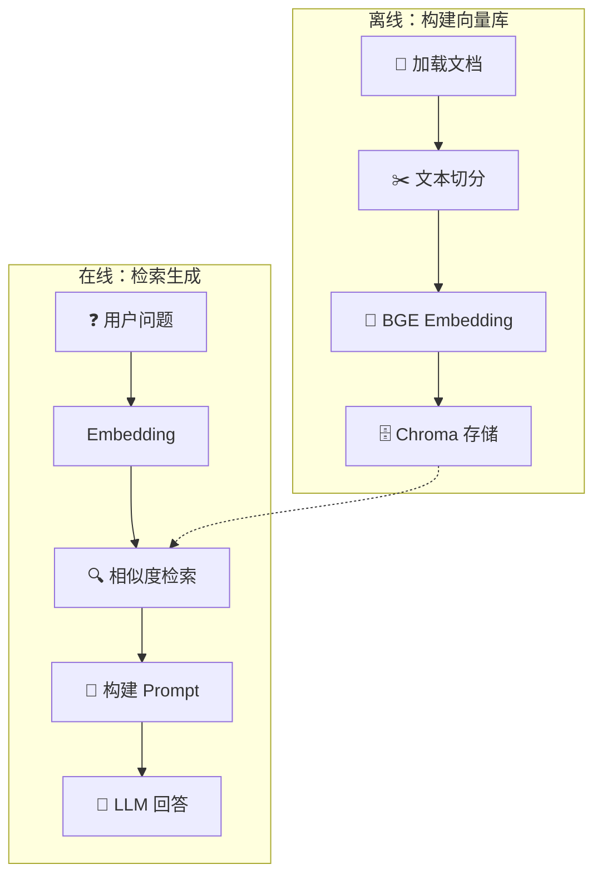

# 🛠️ 项目：构建知识库问答系统

> 搭建一个完整的 RAG 系统，让自己的文档变成可对话的知识库。

---

## 项目目标

选择一个文档集合（你的笔记/技术文档/电子书），构建可以自然语言提问的问答系统。

---

## 架构概览



---

## 完整实现

```python
# pip install chromadb sentence-transformers openai

import os
from typing import List
import chromadb
from sentence_transformers import SentenceTransformer
from openai import OpenAI

# ============================================
# 配置
# ============================================
EMBEDDING_MODEL = "BAAI/bge-small-zh-v1.5"
COLLECTION_NAME = "my_knowledge_base"
CHUNK_SIZE = 512
CHUNK_OVERLAP = 50
TOP_K = 5

# 如果用本地 LLM，替换 base_url
client = OpenAI(
    api_key="your-api-key",  # 或用 vLLM/Ollama
    # base_url="http://localhost:8000/v1"  # 本地模型
)

# ============================================
# 1. 文档加载与切分
# ============================================
def load_documents(directory: str) -> List[dict]:
    """加载目录下所有 .md 文件"""
    docs = []
    for root, _, files in os.walk(directory):
        for file in files:
            if file.endswith('.md'):
                path = os.path.join(root, file)
                with open(path, 'r', encoding='utf-8') as f:
                    docs.append({
                        'text': f.read(),
                        'source': file,
                        'path': path,
                    })
    return docs

def chunk_text(text: str, chunk_size: int, overlap: int) -> List[str]:
    """简单句子切分"""
    sentences = text.replace('\n', ' ').split('。')
    chunks = []
    current_chunk = ""
    
    for sent in sentences:
        if len(current_chunk) + len(sent) < chunk_size:
            current_chunk += sent + "。"
        else:
            if current_chunk:
                chunks.append(current_chunk.strip())
            current_chunk = sent + "。"
    
    if current_chunk:
        chunks.append(current_chunk.strip())
    
    return chunks

# ============================================
# 2. 构建向量库
# ============================================
def build_vector_store(docs_dir: str, persist_dir: str = "./chroma_db"):
    # Embedding 模型
    embed_model = SentenceTransformer(EMBEDDING_MODEL)
    
    # Chroma 客户端
    client = chromadb.PersistentClient(path=persist_dir)
    
    # 删除旧集合（重新构建时）
    try:
        client.delete_collection(COLLECTION_NAME)
    except:
        pass
    
    collection = client.create_collection(
        name=COLLECTION_NAME,
        metadata={"hnsw:space": "cosine"}
    )
    
    # 加载文档
    documents = load_documents(docs_dir)
    print(f"加载了 {len(documents)} 个文档")
    
    # 切分 + Embedding + 存入
    all_ids = []
    all_embeddings = []
    all_texts = []
    all_metadatas = []
    
    for doc in documents:
        chunks = chunk_text(doc['text'], CHUNK_SIZE, CHUNK_OVERLAP)
        embeddings = embed_model.encode(chunks, normalize_embeddings=True)
        
        for i, (chunk, emb) in enumerate(zip(chunks, embeddings)):
            chunk_id = f"{doc['source']}_chunk_{i}"
            all_ids.append(chunk_id)
            all_embeddings.append(emb.tolist())
            all_texts.append(chunk)
            all_metadatas.append({
                'source': doc['source'],
                'chunk_index': i,
                'total_chunks': len(chunks),
            })
    
    # 批量存入
    collection.add(
        ids=all_ids,
        embeddings=all_embeddings,
        documents=all_texts,
        metadatas=all_metadatas,
    )
    
    print(f"已存入 {len(all_ids)} 个文本块")
    return collection, embed_model

# ============================================
# 3. 检索增强生成
# ============================================
def rag_query(
    question: str,
    collection,
    embed_model,
    model_name: str = "gpt-3.5-turbo",
) -> dict:
    # 检索
    query_embedding = embed_model.encode(
        [question], normalize_embeddings=True
    )[0].tolist()
    
    results = collection.query(
        query_embeddings=[query_embedding],
        n_results=TOP_K,
    )
    
    retrieved_docs = results['documents'][0]
    sources = [m['source'] for m in results['metadatas'][0]]
    
    # 构建 Prompt
    context = "\n\n---\n\n".join(retrieved_docs)
    
    system_prompt = """你是一个基于知识库的问答助手。
请根据提供的参考文档回答问题。
如果文档中没有相关信息，请明确说"根据现有资料无法回答"。
回答时请引用具体的文档来源。"""

    user_prompt = f"""参考文档：
{context}

问题：{question}

请基于以上参考文档回答问题，并注明信息来源。"""

    # 调用 LLM
    response = client.chat.completions.create(
        model=model_name,
        messages=[
            {"role": "system", "content": system_prompt},
            {"role": "user", "content": user_prompt},
        ],
        temperature=0.3,
        max_tokens=1024,
    )
    
    answer = response.choices[0].message.content
    
    return {
        'question': question,
        'answer': answer,
        'sources': sources,
        'retrieved_chunks': retrieved_docs,
    }

# ============================================
# 4. 运行
# ============================================
if __name__ == "__main__":
    # 构建向量库（只需运行一次）
    collection, embed_model = build_vector_store("./my_documents")
    
    # 提问测试
    questions = [
        "机器学习有哪些主要类型？",
        "Transformer 的注意力机制是如何工作的？",
    ]
    
    for q in questions:
        result = rag_query(q, collection, embed_model)
        print(f"\n❓ {result['question']}")
        print(f"💬 {result['answer']}")
        print(f"📚 来源: {result['sources']}")
        print("-" * 60)
```

---

## 改进方向

| 改进 | 做法 |
|------|------|
| 混合检索 | 加 BM25 关键词检索 |
| Reranker | 用 bge-reranker 精排 |
| 流式输出 | `stream=True` |
| Web UI | Gradio / Streamlit |
| 对话历史 | 多轮对话上下文管理 |

---

## 总结模板

```markdown
## 项目总结：知识库问答系统

### 文档数量: ___ 个，共 ___ 个文本块
### Embedding 模型: ___
### LLM: ___
### Top-K 检索数: ___

### 效果评估
- 检索相关性: 【主观评价】
- 回答准确性: 【主观评价】
- 幻觉情况: 【多/少/无】

### 改进想法
【记录你的改进方向】
```

---

## → 下一步

→ [[../08.AI智能体/8.1 Agent核心概念|AI Agent：智能体核心]]
