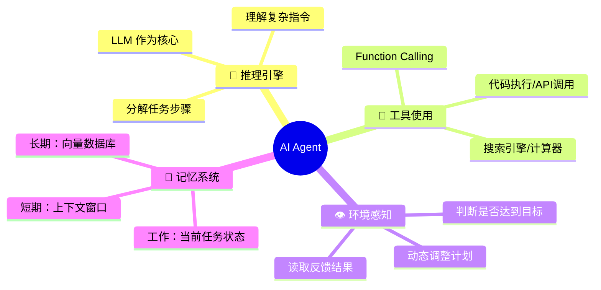
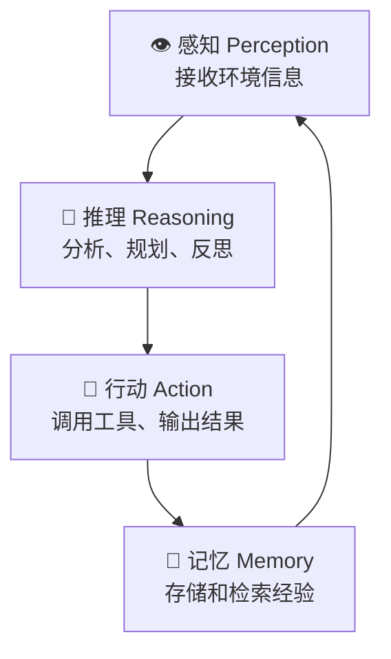
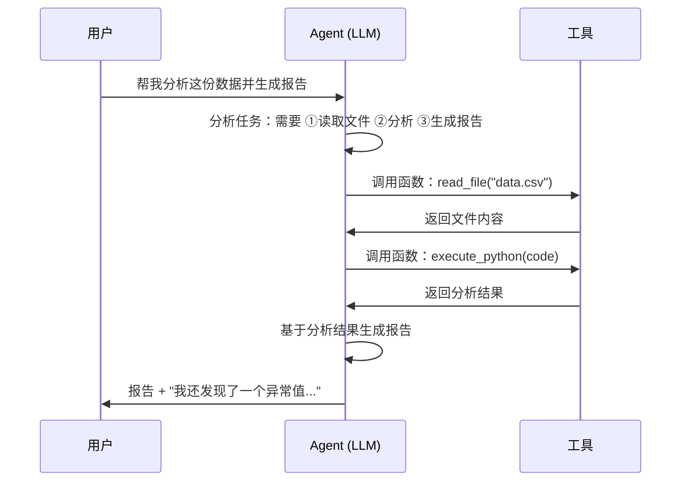

# 8.1 Agent 核心概念

> LLM 不只是聊天 — 它可以思考、规划、使用工具、自主完成复杂任务。

---

## 什么是 AI Agent

```
LLM = 大脑（推理和语言能力）
Agent = 大脑 + 手（工具使用）+ 眼（环境感知）+ 记忆（经验存储）
```



---

## Agent 的四个核心能力



---

## Agent 工作流



---

## Agent vs 传统 Chat

| | 传统 Chat | Agent |
|------|-----------|-------|
| 交互模式 | 一问一答 | 多步自主执行 |
| 知识来源 | 模型记忆 | 模型 + 实时工具 |
| 任务复杂度 | 简单对话 | 多步骤复杂任务 |
| 错误处理 | 一次输出 | 反馈→反思→重试 |
| 运行时长 | 秒级 | 分钟~小时级 |

---

## Agent 的两种模式

### 1. 单 Agent（Single-Agent）

一个 LLM 承担所有角色：推理 + 规划 + 执行。

适合：定义明确、步骤少的任务。

### 2. 多 Agent（Multi-Agent）

多个 LLM Agent 协作，各自有专门角色。

适合：复杂任务、需要不同视角/能力。

---

## Agent 设计的关键决策

| 决策 | 选项 |
|------|------|
| 规划策略 | ReAct / Plan-and-Solve / Tree-of-Thought |
| 工具定义 | 预定义函数 vs 动态工具发现 |
| 记忆方案 | 全上下文 vs 摘要 vs 向量库 |
| 执行方式 | 单次执行 vs 循环迭代 |
| 安全边界 | 沙箱执行 / 人类审批 |

---

## → 接下来

- [[8.2 Function Calling]] — Agent 的手和脚
- [[8.3 ReAct与规划]] — Agent 的思考方式
- 🛠️ [[项目：构建个人AI助手Agent]] — 动手实现
