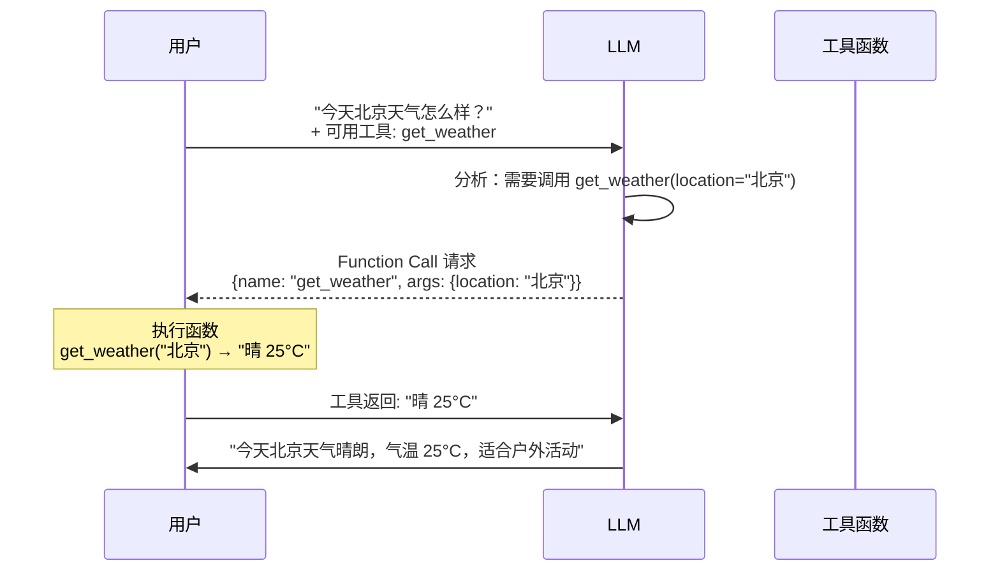

# 8.2 Function Calling（工具调用）

> 让 LLM 能执行操作而不只是说话。Agent 能调用函数、搜索网页、执行代码、操作文件。

---

## Function Calling 原理



> 💡 LLM 不执行函数，只输出标准化的「调用请求」。由框架/应用来实际执行函数。

---

## 定义工具 Schema

```python
# 定义工具（OpenAI 格式）
tools = [
    {
        "type": "function",
        "function": {
            "name": "get_weather",
            "description": "获取指定城市的天气信息",
            "parameters": {
                "type": "object",
                "properties": {
                    "location": {
                        "type": "string",
                        "description": "城市名称，如 北京"
                    },
                    "unit": {
                        "type": "string",
                        "enum": ["celsius", "fahrenheit"],
                        "description": "温度单位"
                    }
                },
                "required": ["location"],
            }
        }
    },
    {
        "type": "function",
        "function": {
            "name": "search_web",
            "description": "搜索互联网获取最新信息",
            "parameters": {
                "type": "object",
                "properties": {
                    "query": {
                        "type": "string",
                        "description": "搜索关键词"
                    }
                },
                "required": ["query"],
            }
        }
    }
]
```

---

## 完整 Function Calling 实现

```python
import json
from openai import OpenAI

client = OpenAI()  # 或本地模型

# 1. 定义工具函数
def get_weather(location: str, unit: str = "celsius") -> str:
    """模拟天气查询"""
    # 实际应该调用天气 API
    return json.dumps({
        "location": location,
        "temperature": 25,
        "condition": "晴",
        "unit": unit
    })

# 2. 工具映射
available_functions = {
    "get_weather": get_weather,
}

# 3. Agent 循环
def run_agent(user_message: str, max_turns: int = 5):
    messages = [{"role": "user", "content": user_message}]
    
    for turn in range(max_turns):
        response = client.chat.completions.create(
            model="gpt-4",
            messages=messages,
            tools=tools,
            tool_choice="auto",  # 让模型决定是否调用工具
        )
        
        msg = response.choices[0].message
        
        # 如果没有工具调用 → 结束
        if not msg.tool_calls:
            return msg.content
        
        # 处理工具调用
        messages.append(msg)
        
        for tool_call in msg.tool_calls:
            func_name = tool_call.function.name
            func_args = json.loads(tool_call.function.arguments)
            
            print(f"🔧 调用 {func_name}({func_args})")
            
            # 执行函数
            func = available_functions[func_name]
            result = func(**func_args)
            
            # 将结果添加到对话
            messages.append({
                "role": "tool",
                "tool_call_id": tool_call.id,
                "content": result,
            })
    
    return "达到最大轮数"

# 测试
response = run_agent("北京和上海今天天气怎么样？哪个更适合出门？")
print(f"\n💬 {response}")
```

---

## 工具设计原则

| 原则 | 说明 |
|------|------|
| **描述清晰** | description 是 LLM 判断该用哪个工具的唯一依据 |
| **参数精简** | 参数越少，LLM 越不容易填错 |
| **错误友好** | 返回的错误信息要足够详细，方便 LLM 重试 |
| **单一职责** | 一个函数只做一件事 |
| **返回结构化** | JSON / 可解析的字符串 |

---

## 工具类型

| 类型 | 示例 |
|------|------|
| 信息检索 | 搜索网页、查询数据库、读取文件 |
| 计算执行 | Python 代码解释器、数学运算 |
| 外部操作 | 发送邮件、操作 API、写入文件 |
| 多模态 | 图片生成、语音合成、图像分析 |

---

## → 接下来

- [[8.3 ReAct与规划]] — Agent 的思考循环
- 🛠️ [[项目：构建个人AI助手Agent]] — 打造你的 AI 助手
