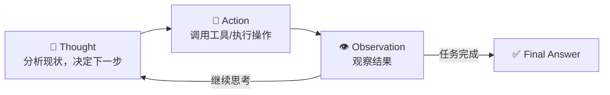
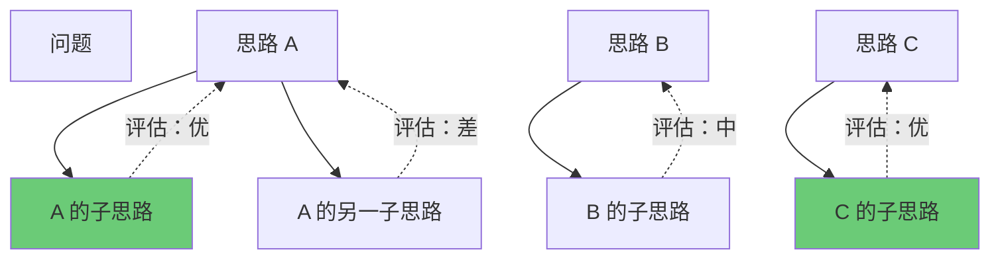

# 8.3 ReAct 与规划

> Agent 不是一次调用 LLM，而是一个「思考→行动→观察」的循环。

---

## ReAct 模式

**Re**asoning + **Act**ing = 推理 + 行动



### 示例

```
用户: OpenAI 的 CEO 是谁？他多大了？

💭 Thought: 我需要先搜 OpenAI 的 CEO 是谁，再查他的年龄。
🔧 Action: search("OpenAI CEO")
👁️ Observation: Sam Altman is the CEO of OpenAI.

💭 Thought: 知道了是 Sam Altman，现在查他的年龄。
🔧 Action: search("Sam Altman age")
👁️ Observation: Sam Altman was born on April 22, 1985. He is 41 years old.

💭 Thought: 我有答案了。
✅ Final Answer: OpenAI 的 CEO 是 Sam Altman（生于1985年，41岁）
```

---

## 规划策略对比

### ReAct（交织式）

一边想一边做，根据反馈动态调整。

✅ 灵活，能纠错  
❌ 可能走弯路

### Plan-and-Solve（先计划再执行）

```
Plan: 
  1. 搜索 OpenAI CEO
  2. 搜索 CEO 的出生日期
  3. 计算年龄
  4. 汇总回答

Execute:
  Step 1 → Step 2 → Step 3 → Step 4
```

✅ 全局最优，步骤清晰  
❌ 执行中发现问题时无法动态调整

### Plan → ReAct（混合式）

先做初步计划，执行中动态调整。⭐ **生产环境最常用。**

---

## 反思与纠错

```python
def react_with_reflection(task, max_iterations=10):
    context = task
    
    for i in range(max_iterations):
        # 思考 + 行动
        thought, action = llm_think(context)
        
        if action.type == "FINISH":
            return action.answer
        
        # 执行工具
        observation = execute_tool(action)
        
        # 反思：检查是否偏离目标或出现错误
        reflection = llm_reflect(task, thought, action, observation)
        
        if reflection.needs_correction:
            context += f"\n[!] {reflection.feedback}"
        
        context += f"\nObservation: {observation}"
    
    return "达到最大迭代次数"
```

### 反思的常见模式

| 模式 | 何时触发 | 怎么做 |
|------|---------|--------|
| 结果为空 | 搜索无结果 | 换关键词重搜 |
| 结果不相关 | 工具返回无关信息 | 调整参数 |
| 陷入循环 | 重复执行相同操作 | 强制前进 |
| 超出预算 | 步数/时间超限 | 基于已有信息回答 |

---

## Tree-of-Thought（思维树）

> 不是线性思考，而是并行探索多条推理路径。



> 💡 Tree-of-Thought 在数学推理、编程竞赛等需要深度思考的任务上效果显著，但计算成本高。

---

## 各策略适用场景

| 策略 | 适用 | 不适用 |
|------|------|--------|
| **ReAct** | 信息检索、工具使用 | 纯计算任务 |
| **Plan-and-Solve** | 步骤明确的任务 | 需要动态调整 |
| **Tree-of-Thought** | 推理/规划难题 | 简单任务（太贵） |
| **Reflection** | 需要纠错的任务 | 确定性任务 |

---

## → 接下来

- [[8.4 多智能体协作]] — 多个 Agent 如何配合
- 🛠️ [[项目：构建个人AI助手Agent]] — ReAct 实践
