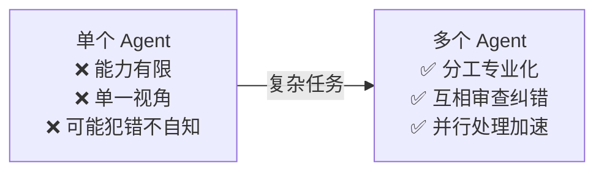
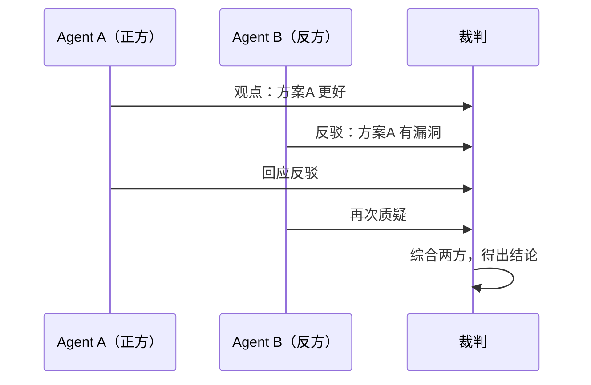
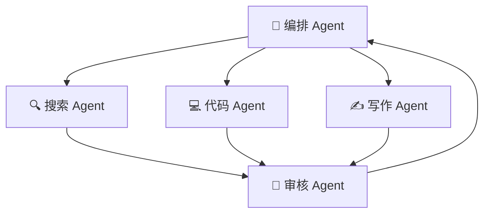

# 8.4 多智能体协作

> 当一个 Agent 不够时，让多个 Agent 分工协作，模拟团队工作模式。

---

## 为什么要多 Agent



---

## 四种协作模式

### 1. 辩论模式（Debate）



### 2. 分工模式（Divide & Conquer）



### 3. 层级模式（Hierarchy）

```
        管理 Agent
       /    |    \
    Agent1 Agent2 Agent3（分配子任务）
```

### 4. 反思模式（Actor-Critic）

```
Actor 执行 → Critic 审查 → 反馈 → Actor 改进 → 循环
```

---

## 多 Agent 通信

```python
class Agent:
    def __init__(self, name, role, llm):
        self.name = name
        self.role = role
        self.llm = llm
        self.memory = []
    
    def receive(self, message, sender):
        """接收其他 Agent 的消息"""
        self.memory.append({
            "from": sender,
            "content": message
        })
    
    def act(self):
        """基于角色和记忆决定行动"""
        prompt = f"""你是{self.name}，角色是{self.role}。
最近的通信记录:
{self._format_memory()}

请决定下一步行动："""
        
        return self.llm.generate(prompt)

class MultiAgentSystem:
    def __init__(self, agents, max_rounds=10):
        self.agents = {a.name: a for a in agents}
        self.max_rounds = max_rounds
    
    def run(self, task):
        # 初始任务发给第一个 Agent
        first_agent = list(self.agents.values())[0]
        first_agent.receive(task, "user")
        
        for round_num in range(self.max_rounds):
            for agent in self.agents.values():
                action = agent.act()
                
                if action.type == "SPEAK":
                    # 向其他 Agent 说话
                    target = self.agents[action.target]
                    target.receive(action.content, agent.name)
                
                elif action.type == "FINISH":
                    return action.result
```

---

## 主流多 Agent 框架

| 框架 | 模式 | 特点 |
|------|------|------|
| **AutoGen** (微软) | 对话式 | 原生多 Agent 对话 |
| **CrewAI** | 角色式 | 角色+任务分工 |
| **LangGraph** | 图式 | 自定义工作流 |
| **MetaGPT** | 软件团队 | 模拟产品经理/架构师/工程师 |

> 📌 详细对比见 [[8.5 Agent框架对比]]

---

## 设计原则

| 原则 | 说明 |
|------|------|
| **明确角色** | 每个 Agent 有清晰的角色和职责 |
| **最小通信** | 减少不必要的 Agent 间对话（消耗 token） |
| **错误隔离** | 一个 Agent 失败不影响整体 |
| **去中心化** | 避免单点瓶颈 Agent |

---

## → 接下来

- [[8.5 Agent框架对比]]
- 🛠️ [[项目：多Agent协作系统]] — 实战多 Agent
