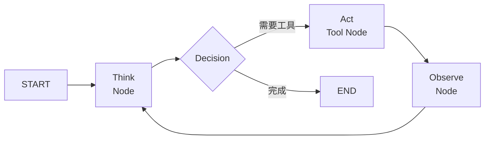
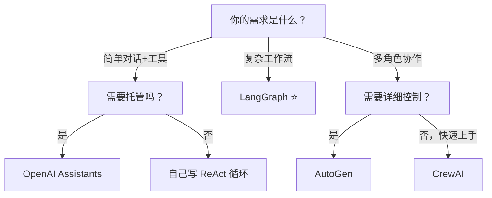

# 8.5 Agent 框架对比

> 不用从零造轮子。选对框架，你只需要专注于 Agent 的行为设计。

---

## 框架总览

| | LangGraph | AutoGen | CrewAI | OpenAI Assistants |
|------|-----------|---------|--------|-------------------|
| **开发者** | LangChain | 微软 | CrewAI | OpenAI |
| **语言** | Python | Python | Python | API（多语言） |
| **开源** | ✅ | ✅ | ✅ | ❌ 托管 |
| **学习曲线** | 🟡 中 | 🟡 中 | 🟢 低 | 🟢 极低 |
| **灵活性** | 🟢 极高 | 🟡 中 | 🟡 中 | 🔴 受限 |
| **状态管理** | 原生状态图 | 对话历史 | 任务状态 | 服务端托管 |

---

## LangGraph — 最灵活



```python
from langgraph.graph import StateGraph, END

# 定义状态图
workflow = StateGraph(AgentState)

# 添加节点
workflow.add_node("think", think_node)
workflow.add_node("act", act_node)
workflow.add_node("observe", observe_node)

# 添加边
workflow.add_edge("think", "act")
workflow.add_conditional_edges("observe", should_continue, {
    "continue": "think",
    "end": END
})

# 编译运行
agent = workflow.compile()
result = agent.invoke({"task": "..."})
```

> ✅ 适合：需要精确控制 Agent 流程的生产级应用

---

## AutoGen — 多 Agent 对话

```python
from autogen import AssistantAgent, UserProxyAgent

# 定义 Agent
assistant = AssistantAgent(
    name="助手",
    llm_config={"config_list": [{"model": "gpt-4"}]},
)

user = UserProxyAgent(
    name="用户代理",
    code_execution_config={"work_dir": "coding"},
)

# 启动对话
user.initiate_chat(
    assistant,
    message="帮我画一个股票价格趋势图，数据从 Yahoo Finance 获取"
)
```

> ✅ 适合：需要多 Agent 之间自然对话协作的任务

---

## CrewAI — 角色分工

```python
from crewai import Agent, Task, Crew

# 定义角色
researcher = Agent(
    role="研究员",
    goal="搜索和整理信息",
    backstory="你是一个经验丰富的研究员",
)

writer = Agent(
    role="撰稿人",
    goal="基于研究结果写报告",
    backstory="你是一个专业的科技写作者",
)

# 定义任务
task1 = Task(description="搜索AI最新进展", agent=researcher)
task2 = Task(description="写一份总结报告", agent=writer)

# 组合
crew = Crew(agents=[researcher, writer], tasks=[task1, task2])
result = crew.kickoff()
```

> ✅ 适合：模拟团队分工的任务

---

## 选择指南



| 场景 | 推荐 |
|------|------|
| 个人学习、理解 Agent 原理 | 自己写 ReAct 循环 |
| 快速搭建原型 | CrewAI / OpenAI Assistants |
| 多 Agent 精细对话 | AutoGen |
| 生产级复杂 Agent | LangGraph |
| 非代码人员 | Dify / Coze（低代码） |

---

## → 接下来

- 🛠️ [[项目：构建个人AI助手Agent]] — 用 ReAct 构建你的第一个 Agent
- 🛠️ [[项目：多Agent协作系统]] — 多 Agent 协作实战
