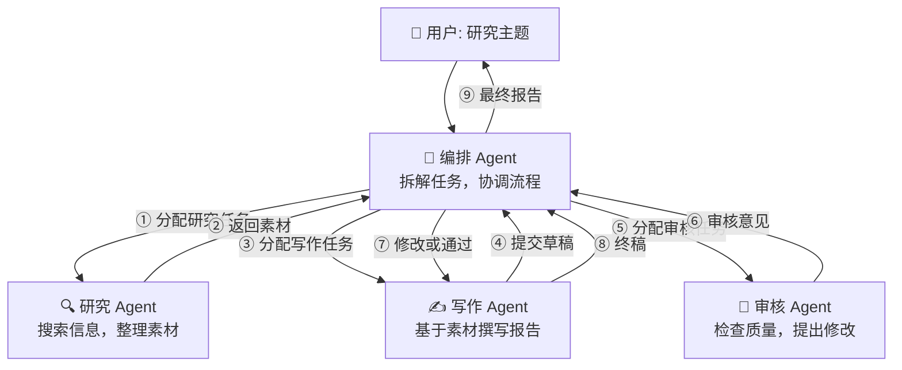

# 🛠️ 项目：多 Agent 协作系统

> 让多个 Agent 分工协作，像一个小团队一样完成任务。

---

## 项目目标

构建一个「研究 + 写作 + 审核」三 Agent 协作系统，输入一个主题，自动产出研究报告。

---

## 系统架构



---

## 实现

```python
from openai import OpenAI
import json

client = OpenAI()

# ============================================
# Agent 基类
# ============================================
class BaseAgent:
    def __init__(self, name, role, system_prompt):
        self.name = name
        self.role = role
        self.system_prompt = system_prompt
        self.messages = [{"role": "system", "content": system_prompt}]
    
    def receive(self, message, sender="unknown"):
        self.messages.append({
            "role": "user",
            "content": f"[来自 {sender}]\n{message}"
        })
    
    def think(self):
        response = client.chat.completions.create(
            model="gpt-4",
            messages=self.messages,
            temperature=0.7,
        )
        reply = response.choices[0].message.content
        self.messages.append({"role": "assistant", "content": reply})
        return reply

# ============================================
# 定义 Agent
# ============================================
researcher = BaseAgent(
    name="研究员小明",
    role="研究员",
    system_prompt="""你是一个专业的研究员。你的职责：
1. 搜索和分析与研究主题相关的信息
2. 整理关键发现、数据和观点
3. 输出结构化的研究素材
注意：你需要模拟搜索，给出详细的研究结果。"""
)

writer = BaseAgent(
    name="写手小红",
    role="撰稿人", 
    system_prompt="""你是一个专业的科技写手。你的职责：
1. 基于研究素材撰写报告
2. 报告结构：摘要 → 背景 → 主要发现 → 分析 → 结论
3. 语言专业但易懂，适合非技术读者
4. 标注数据和引用的来源"""
)

reviewer = BaseAgent(
    name="审核员老张",
    role="质量审核",
    system_prompt="""你是一个严格的质量审核员。你的审查标准：
1. 事实准确性：数据和引用是否正确
2. 逻辑完整性：结论是否有充分论据支持
3. 表达清晰度：是否通俗易懂
4. 如果有问题，给出具体的修改建议
5. 审查通过时回复: PASS"""
)

# ============================================
# 协作流程
# ============================================
def multi_agent_research(topic: str):
    print(f"{'='*60}")
    print(f"📋 研究主题: {topic}")
    print(f"{'='*60}\n")
    
    # 阶段1: 研究
    print("🔍 [阶段1] 研究员工作中...")
    researcher.receive(f"请研究这个主题: {topic}\n请提供详细的素材，包括关键概念、最新进展、重要数据等。")
    research_material = researcher.think()
    print(f"✅ 研究完成\n")
    
    # 阶段2: 写作
    print("✍️ [阶段2] 写手工作中...")
    writer.receive(
        f"基于以下研究素材撰写报告：\n\n{research_material}\n\n"
        f"报告主题: {topic}",
        sender=researcher.name
    )
    draft = writer.think()
    print(f"✅ 初稿完成\n")
    
    # 阶段3: 审核
    max_revisions = 3
    for round_num in range(max_revisions):
        print(f"👀 [阶段3-{round_num+1}] 审核中...")
        reviewer.receive(
            f"请审核以下报告:\n\n{draft}", 
            sender=writer.name
        )
        feedback = reviewer.think()
        
        if "PASS" in feedback:
            print(f"✅ 审核通过！\n")
            break
        else:
            print(f"📝 需要修改: {feedback[:200]}...\n")
            writer.receive(
                f"审核意见:\n{feedback}\n\n请修改报告。", 
                sender=reviewer.name
            )
            draft = writer.think()
            print(f"✅ 第{round_num+1}次修改完成\n")
    
    return {
        "topic": topic,
        "research_material": research_material,
        "final_report": draft,
        "revision_rounds": round_num + 1,
    }

# ============================================
# 运行
# ============================================
if __name__ == "__main__":
    topic = "人工智能在医疗领域的最新应用"
    
    result = multi_agent_research(topic)
    
    print(f"\n{'='*60}")
    print(f"📄 最终报告")
    print(f"{'='*60}")
    print(result["final_report"])
    print(f"\n修改轮次: {result['revision_rounds']}")
```

---

## 扩展：使用 CrewAI

```python
from crewai import Agent, Task, Crew, Process

researcher = Agent(
    role="AI医疗研究员",
    goal="深入调研AI在医疗领域的最新应用",
    backstory="你拥有医疗AI领域10年经验",
    allow_delegation=False,
    verbose=True,
)

writer = Agent(
    role="科技报告撰写专家",
    goal="将研究结果转化为清晰易懂的报告",
    backstory="你是前科技记者",
    allow_delegation=False,
    verbose=True,
)

task1 = Task(
    description="研究AI在医疗诊断、药物发现、手术辅助方面的最新进展",
    agent=researcher,
    expected_output="详细的研究笔记，包含具体案例和数据",
)

task2 = Task(
    description="基于研究笔记撰写一份面向投资人的趋势报告",
    agent=writer,
    expected_output="完整的报告，含摘要、趋势分析、投资建议",
)

crew = Crew(
    agents=[researcher, writer],
    tasks=[task1, task2],
    process=Process.sequential,
    verbose=True,
)

result = crew.kickoff()
print(result)
```

---

## 总结模板

```markdown
## 项目总结：多 Agent 协作系统

### Agent 设置
- 研究员: ___
- 写手: ___
- 审核员: ___

### 协作流程
- 研究 → 写作 → 审核 → 修改（___ 轮）
- 总 Token 消耗: ___

### 效果评估
- 报告质量: 【主观评价】
- 协作效率: 【评价】
```

---

## → 恭喜！

你已经完成了从 ML 基础到 Agent 的完整学习路径！🎉

→ [[../10.资源索引/推荐书籍与课程|继续探索资源]]
