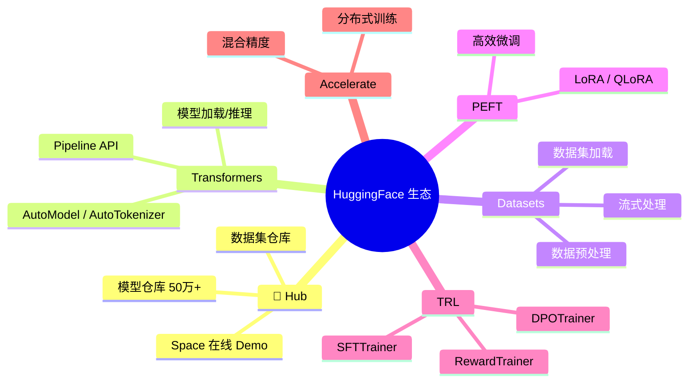

# HuggingFace 生态

> AI 开发的「应用商店」。模型、数据集、训练工具一应俱全。

---

## 生态全景



---

## Transformers 常用工作流

### Pipeline（最简单）

```python
from transformers import pipeline

# 文本生成
gen = pipeline("text-generation", model="gpt2")
print(gen("AI is", max_length=50))

# 情感分析
sent = pipeline("sentiment-analysis")
print(sent("I love this!"))

# 翻译
trans = pipeline("translation", model="Helsinki-NLP/opus-mt-zh-en")
print(trans("你好世界"))
```

### AutoModel 标准流程

```python
from transformers import AutoTokenizer, AutoModelForCausalLM

model_name = "Qwen/Qwen2-7B-Instruct"

# 加载
tokenizer = AutoTokenizer.from_pretrained(model_name)
model = AutoModelForCausalLM.from_pretrained(
    model_name,
    torch_dtype="auto",
    device_map="auto",
)

# 推理
messages = [{"role": "user", "content": "你好"}]
text = tokenizer.apply_chat_template(messages, tokenize=False)
inputs = tokenizer(text, return_tensors="pt").to(model.device)
outputs = model.generate(**inputs, max_new_tokens=256)
response = tokenizer.decode(outputs[0], skip_special_tokens=True)
```

---

## Datasets

```python
from datasets import load_dataset

# 加载数据集
dataset = load_dataset("imdb")
dataset = load_dataset("json", data_files="my_data.jsonl")

# 预处理
def preprocess(examples):
    return tokenizer(examples["text"], truncation=True)

dataset = dataset.map(preprocess, batched=True)

# 流式处理（大数据）
dataset = load_dataset("c4", "en", streaming=True, split="train")
sample = next(iter(dataset))
```

---

## PEFT (LoRA)

```python
from peft import LoraConfig, get_peft_model

config = LoraConfig(
    r=16,
    lora_alpha=32,
    target_modules=["q_proj", "v_proj"],
    lora_dropout=0.05,
)

model = get_peft_model(model, config)
model.print_trainable_parameters()
# trainable params: 8.4M || all params: 7.6B || trainable%: 0.11%
```

---

## TRL (训练)

```python
from trl import SFTTrainer

trainer = SFTTrainer(
    model=model,
    tokenizer=tokenizer,
    train_dataset=dataset,
    max_seq_length=1024,
    args=TrainingArguments(
        output_dir="./output",
        per_device_train_batch_size=4,
        gradient_accumulation_steps=4,
        learning_rate=2e-4,
        num_train_epochs=3,
    ),
)
trainer.train()
```

---

## 推荐中文模型

| 模型 | 参数 | HuggingFace ID |
|------|------|----------------|
| Qwen2.5 | 0.5B-72B | `Qwen/Qwen2.5-7B-Instruct` |
| DeepSeek | 7B-67B | `deepseek-ai/DeepSeek-V2` |
| Yi | 6B-34B | `01-ai/Yi-1.5-9B-Chat` |
| ChatGLM | 6B | `THUDM/chatglm3-6b` |
| MiniCPM | 2.4B | `openbmb/MiniCPM-2B` |
| InternLM | 7B-20B | `internlm/internlm2-chat-7b` |
