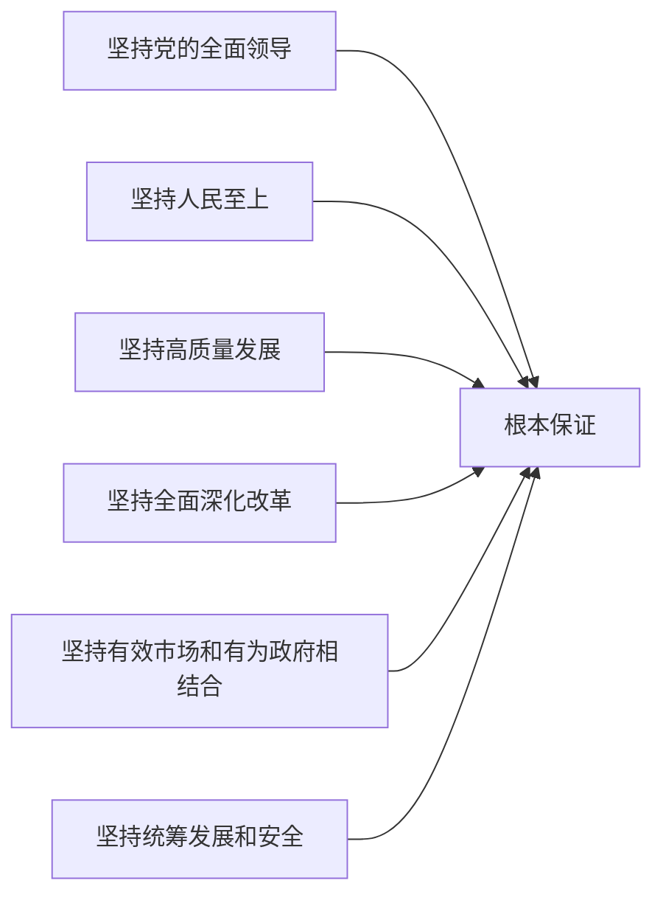

# 03-"十五五"规划建议要点

> 全会审议通过《中共中央关于制定国民经济和社会发展第十五个五年规划的建议》，共 **15个部分、61条**，分为三大板块。

---

## 全文结构

### 第一板块：总论
| 部分 | 内容 |
|:----:|------|
| 一 | "十五五"时期是基本实现社会主义现代化的关键时期 |
| 二 | "十五五"时期经济社会发展的指导方针和主要目标 |

### 第二板块：分论（战略任务）
| 部分 | 主题 |
|:----:|------|
| 三 | 建设现代化产业体系，巩固壮大实体经济根基 |
| 四 | 加快高水平科技自立自强，引领发展新质生产力 |
| 五 | 建设强大国内市场，加快构建新发展格局 |
| 六 | 加快构建高水平社会主义市场经济体制 |
| 七 | 扩大高水平对外开放 |
| 八 | 加快农业农村现代化，扎实推进乡村全面振兴 |
| 九 | 优化区域经济布局，促进区域协调发展 |
| 十 | 激发全民族文化创新创造活力 |
| 十一 | 加大保障和改善民生力度，扎实推进共同富裕 |
| 十二 | 加快经济社会发展全面绿色转型，建设美丽中国 |
| 十三 | 推进国家安全体系和能力现代化 |
| 十四 | 如期实现建军一百年奋斗目标 |

### 第三板块：保障
| 部分 | 内容 |
|:----:|------|
| 十五 | 全党全国各族人民团结起来为实现"十五五"规划而奋斗 |

---

## 六大原则

1. **坚持党的全面领导** — 根本保证
2. **坚持人民至上** — 根本立场
3. **坚持高质量发展** — 主题主线
4. **坚持全面深化改革** — 根本动力
5. **坚持有效市场和有为政府相结合** — 体制机制
6. **坚持统筹发展和安全** — 战略方针

---

## 七大主要目标

| 目标 | 关键词 |
|:----|:------:|
| ① 高质量发展取得显著成效 | 🟢 质效提升 |
| ② 科技自立自强水平大幅提高 | 🔬 创新驱动 |
| ③ 进一步全面深化改革取得新突破 | 🔧 制度完善 |
| ④ 社会文明程度明显提升 | 📚 文化繁荣 |
| ⑤ 人民生活品质不断提高 | ❤️ 民生福祉 |
| ⑥ 美丽中国建设取得新的重大进展 | 🌿 绿色发展 |
| ⑦ 国家安全屏障更加巩固 | 🛡️ 安全保障 |

**远期展望**：到2035年，人均GDP达到中等发达国家水平，基本实现社会主义现代化。

---

## 十四个重点战略领域

### 1. 现代化产业体系
- 着力点：**实体经济**
- 方向：**智能化、绿色化、融合化**
- 骨干：**先进制造业**
- 路径：优化提升传统产业 + 培育壮大新兴产业和未来产业

### 2. 高水平科技自立自强
- 加强 **原始创新** 和 **关键核心技术攻关**
- 重点领域：集成电路、工业母机、高端仪器、基础软件、先进材料、生物制造
- 推进 **"人工智能+"** 行动
- 教育科技人才一体发展

### 3. 强大国内市场
- 扩大内需战略基点
- 促进消费和投资良性互动
- 构建全国统一大市场，综合整治 **"内卷式"竞争**
- 畅通资本、数据、技术等要素流动

### 4. 高水平社会主义市场经济体制
- 深化国资国企改革
- 促进民营经济发展壮大
- 完善市场经济基础制度

### 5. 高水平对外开放
- 稳步扩大 **制度型开放**
- 推动贸易创新发展
- 高质量共建"一带一路"

### 6. 农业农村现代化
- 巩固拓展脱贫攻坚成果
- 推进乡村全面振兴
- 提升农业综合生产能力
- 建设宜居宜业和美乡村

### 7. 区域协调发展
- 西部大开发、东北振兴、中部崛起、东部现代化
- 京津冀、长三角、粤港澳大湾区动力源
- 雄安新区、成渝双城经济圈

### 8. 文化繁荣
- 推进文化强国建设
- 提升中华文明传播力影响力
- 繁荣文化事业和文旅产业

### 9. 民生保障
- 高质量充分就业
- 完善收入分配制度
- 办好人民满意的教育
- 健全社会保障体系
- 推动房地产高质量发展
- 促进人口高质量发展（婚嫁、生育、托幼等）

### 10. 绿色转型
- 碳达峰碳中和为牵引
- 加快建设新型能源体系
- 协同推进降碳、减污、扩绿、增长

### 11. 国家安全
- 健全国家安全体系
- 捍卫政治安全
- 提高公共安全治理水平
- 完善社会治理体系

### 12. 国防和军队现代化
- 建军一百年奋斗目标
- 机械化信息化智能化融合发展

### 13. 全面从严治党
- 坚持和加强党的全面领导
- 完善落实"两个维护"制度机制

### 14. 港澳台与外交
- 全面准确贯彻"一国两制"方针
- 推动构建人类命运共同体

---

> **关联笔记**：[[20四中全会学习资料/04-新质生产力与高质量发展]] | [[20四中全会学习资料/06-民生保障与基层治理]]
